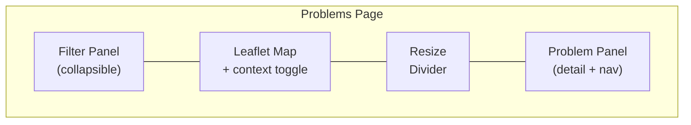
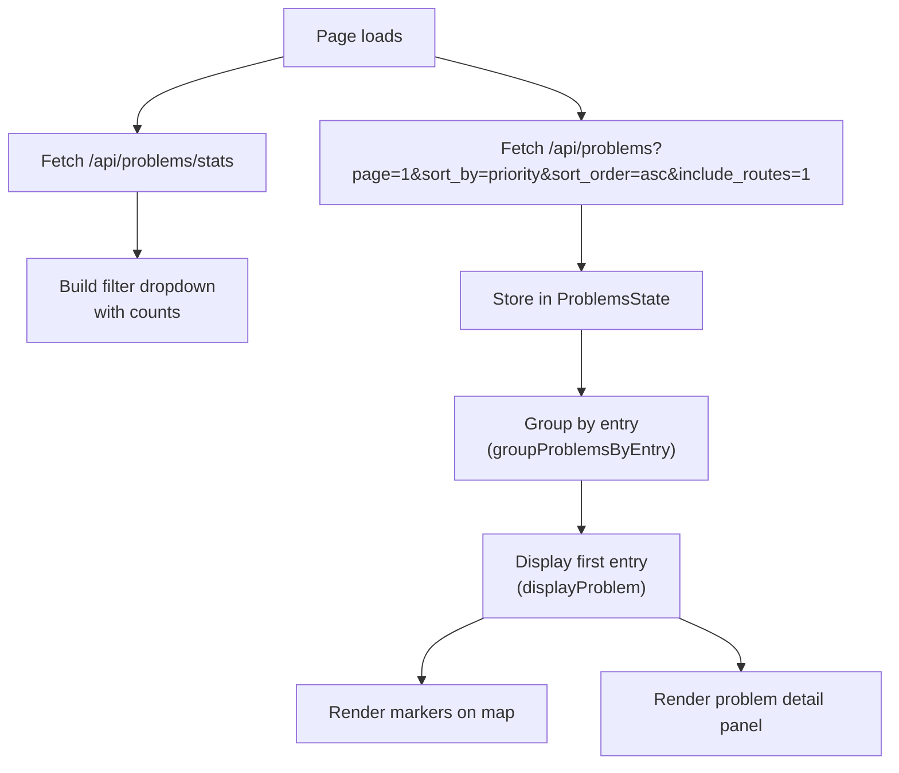

# Problems Page

The Problems page (`/problems`) surfaces data quality issues detected during the matching pipeline ([Section 4](4.%20Problems.md)) and presents them for review. Users can browse, filter, and navigate through problems while viewing the affected stops on an interactive map.

## UI Layout

The page is divided into three sections arranged horizontally:

| Section | Purpose |
|---------|---------|
| **Filter Panel** | Problem type, priority, and operator filters. Collapsible to save space. |
| **Map** | Shows markers for the current problem's ATLAS and OSM stops, with optional context markers for nearby stops. |
| **Problem Panel** | Displays problem details, navigation buttons (Prev/Next), and keyboard shortcut hints. |

## Problem Types

Problems are grouped by type. Each type has an associated priority level assigned during detection.

| Type | Icon | Description | Priorities |
|------|------|-------------|------------|
| **Distance** | `fa-ruler` | ATLAS and OSM stops are matched but far apart | P1, P2, P3 |
| **Unmatched** | `fa-map-marker-alt` | ATLAS stop has no OSM match (or vice versa) | P1, P2 |
| **Attributes** | `fa-tags` | Matched pair has mismatched attributes (name, operator, etc.) | P1, P2, P3 |
| **Contradicts Route Matching** | `fa-route` | The matched pair conflicts with available route evidence | P1, P2, P3 |
| **Duplicates** | `fa-clone` | Multiple stops share the same identity (UIC ref + local ref or designation) | P2 (ATLAS-side), P3 (OSM-side) |

## Filtering & Sorting

### Available Filters

| Filter | Control | Effect |
|--------|---------|--------|
| **Problem type** | Dropdown with counts | Restricts to one type (`distance`, `unmatched`, `attributes`, `contradicts_route_matching`, `duplicates`) or all |
| **Priority** | Circle pills (All, P1, P2, P3) | Restricts by priority level |
| **Operator** | Multi-select dropdown | Restricts by ATLAS operator (`atlas_business_org_abbr`) |

Priority, operator, and problem-type filters are enforced server-side.

### Default Ordering

The Problems page now loads in **priority-first order** by default:

| Order | Behavior |
|------|----------|
| **Across entries** | `/api/problems` defaults to `sort_by=priority&sort_order=asc`, so entries with at least one P1 issue appear before P2, then P3 |
| **Within an entry** | Issues for the same stop are ordered by ascending priority before secondary tie-breakers |
| **Duplicate groups** | Grouped duplicates are ordered by their derived group priority (minimum member priority), then by stable identifiers |

This ordering is applied at query time. The app does **not** rely on database insertion order, because insert order is not a stable or sufficient guarantee once filtering, grouping, and pagination are involved.

### Explicit Sorting

The backend accepts explicit sort parameters on `/api/problems`:

| Sort | Description |
|------|-------------|
| Largest distance | Descending by `distance_m` |
| Smallest distance | Ascending by `distance_m` |
| By priority | Ascending by priority value (`1` first) |

In practice, the Problems page currently always requests priority-first ordering for its main list view.

### Active Filter Chips

Active filters are shown as removable chips below the filter panel using `FilterChipUtils.renderProblemChips`.

## Data Flow

### Pagination & Prefetch

Problems are loaded in pages of 100. When the user navigates within 20 entries of the end of the loaded list, the next page is automatically prefetched via `prefetchNextPageIfNeeded()`.

### Entry Grouping

Problems are grouped into **entries** by location. Multiple problems at the same stop appear as a single entry with multiple issues that the user can scroll through. The grouping key is:
- For duplicates groups: `group_{group_id}`
- For other problems: `{stop_id}_{lat}_{lon}`

## Navigation

| Action | Trigger |
|--------|---------|
| Next entry | Click **Next** button, press `→` or `Space` |
| Previous entry | Click **Prev** button, press `←` |
| Scroll issues within entry | `↑` / `↓` arrows |
| Toggle shortcut help | Press `?` |

When multiple issues exist in one entry, an intersection observer tracks which issue is scrolled into view and highlights the corresponding map markers.

## Duplicates Grouping

When the **Duplicates** filter is active, the backend performs special grouping logic instead of returning individual problems.

### OSM-side Groups (Priority 3)
Grouped by `(uic_ref, osm_local_ref)`. All OSM nodes sharing the same UIC reference and local reference are grouped together.

### ATLAS-side Groups (Priority 2)
Grouped by `(uic_ref, atlas_designation)`. All ATLAS stops sharing the same UIC reference and designation are grouped together.

Each group contains a `members` array with individual stop data, and a centroid coordinate for map positioning.

For ordering, each duplicate group also exposes a derived group-level `priority`, computed as the minimum member priority. This lets the duplicates-only view participate in the same priority-first ordering as the rest of the page.

When viewing duplicates in the **All Problems** view, individual entries are shown with their stop details (source, identifier, name, coordinates).

## Context Markers

The **"See other markers"** toggle loads nearby ATLAS and OSM stops within ~2 km of the current problem. These context markers are displayed at reduced opacity (0.6) and include connection lines for matched pairs. The context data is fetched from `/api/data` with bounding box parameters.

Context filtering now excludes the current problem strictly by explicit identities, not by coordinate overlap:

- Single problems are excluded by matching `id`, `sloid`, or `osm_node_id`.
- Duplicate groups are first flattened to their `members`, then excluded using member identities.
- Nested `osm_matches` payloads are also checked when present.

The older coordinate fallback was removed because colocated duplicate stops are legitimate data and should remain visible as separate context markers.

## API Endpoints

| Endpoint | Method | Purpose |
|----------|--------|---------|
| `/api/problems` | GET | Paginated problem list with filters and duplicate-group aggregation |
| `/api/problems/stats` | GET | Problem counts by type, with placeholder `solved`/`unsolved` buckets |
| `/api/data` | GET | Context markers (nearby stops) |

### `/api/problems` Parameters

| Parameter | Default | Description |
|-----------|---------|-------------|
| `page` | 1 | Page number |
| `limit` | 100 | Items per page (max 1000) |
| `problem_type` | `all` | Filter: `all`, `distance`, `unmatched`, `attributes`, `contradicts_route_matching`, `duplicates` |
| `sort_by` | `priority` | Sort: `priority`, `distance`, `default` |
| `sort_order` | `asc` | Order: `asc`, `desc` |
| `atlas_operator` | — | Comma-separated operator abbreviations |
| `priority` | — | Priority level: `1`, `2`, `3` |
| `include_routes` | `0` | Include route evidence arrays in each result; the Problems page requests `1` |

`/api/problems/stats` returns `solved` and `unsolved` buckets, but in the current backend they are placeholders: `solved` is always `0` and `unsolved` mirrors the total count.

## Code Reference

### Frontend Modules

| File | Module | Role |
|------|--------|------|
| `static/js/pages/problems-state.js` | `ProblemsState` | Centralized state (IIFE with getter/setter API) |
| `static/js/pages/problems-data.js` | `ProblemsData` | Data fetching, filtering, pagination, navigation |
| `static/js/pages/problems-map.js` | `ProblemsMap` | Map initialization, context loading, resize, filter panel toggle |
| `static/js/pages/problems-ui.js` | `ProblemsUI` | Problem rendering, nav buttons, scroll indicators |
| `static/js/pages/problems.js` | — | Coordinator: initializes all modules, binds event handlers |

### Backend

| File | Role |
|------|------|
| `backend/blueprints/problems.py` | `/api/problems` and `/api/problems/stats` endpoints |
| `backend/serializers/stops.py` | `format_stop_data()` — serializes `StopsMatched` to JSON |

### Template

`templates/pages/problems.html` — Jinja2 template with filter panel, map container, and problem section. Loads all JS modules in dependency order.

## Related Documentation

- [4. Problems](4.%20Problems.md) — Problem detection and prioritization pipeline
- [4.1 Stop Problems](4.1%20Stop%20Problems.md) — Stop-level problem predicates (distance, attributes, unmatched, duplicates)
- [6. Web app](6.%20Web%20app.md) — Web application overview
- [6.1 Map Data Loading](6.1%20Map%20Data%20Loading%20and%20Rendering.md) — Map rendering pipeline (shared components)
