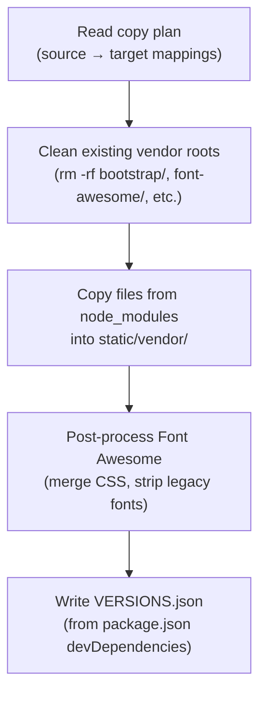

# 6.5 Frontend Asset Management

All third-party frontend libraries are served locally from `static/vendor/` instead of being loaded from public CDNs at runtime. This page documents the motivation, the vendoring pipeline, the optimization strategy, and the maintenance workflow.

## Motivation

| Concern | CDN approach | Local vendor approach |
|---|---|---|
| **Privacy** | Browser contacts third-party domains (jsdelivr, cdnjs, etc.) on every page load | All requests stay on our domain |
| **Reliability** | UI breaks if CDN is blocked, rate-limited, or down | No external dependency at runtime |
| **Reproducibility** | CDN URLs can silently change or disappear | Exact versions tracked in `package.json` and committed to the repo |
| **Auditability** | Hard to diff or review what changed | Changes to vendored files are visible in Git |

## Vendored Libraries

The following libraries are installed via `npm` and selectively copied into `static/vendor/` by the sync script (`scripts/sync_vendor_assets.mjs`):

| Library | Version | What is copied | Used by |
|---|---|---|---|
| Bootstrap | 5.3.3 | `bootstrap.min.css`, `bootstrap.bundle.min.js` | All pages (layout, modals, dropdowns) |
| Font Awesome | 5.15.3 | Merged `all.min.css` + solid/regular woff2 webfonts | All pages (icons) |
| Leaflet | 1.9.4 | `leaflet.css`, `leaflet.js`, marker images | Map pages (index, problems, routes) |
| Mermaid | 10.9.1 | `mermaid.min.js` | Docs page only |
| MathJax | 3.2.2 | `tex-mml-chtml.js` + CHTML font assets | Docs page only |

Versions are the source of truth in `package.json` under `devDependencies`. The sync script also generates `static/vendor/VERSIONS.json` as a machine-readable manifest of currently vendored versions.

## Directory Structure

```text
static/
    vendor/
        VERSIONS.json
        bootstrap/
            css/bootstrap.min.css
            js/bootstrap.bundle.min.js
        font-awesome/
            css/all.min.css
            webfonts/
                fa-solid-900.woff2
                fa-regular-400.woff2
        leaflet/
            leaflet.css
            leaflet.js
            images/
        mermaid/
            mermaid.min.js
        mathjax/
            es5/
                tex-mml-chtml.js
                output/chtml/fonts/
                    tex.js
                    woff-v2/
```

> [!NOTE]
> The entire `static/vendor/` directory is committed to the repository. 
## Template Integration

Templates reference local assets via Flask's `url_for('static', ...)` or relative paths under `/static/vendor/`:

| Template | Libraries loaded |
|---|---|
| `templates/layouts/base.html` | Bootstrap CSS/JS, Font Awesome CSS |
| `templates/pages/index.html`, `problems.html`, `routes.html` | Leaflet CSS/JS |
| `templates/pages/docs.html` | Mermaid JS, MathJax JS |
| `templates/layouts/printable.html` | Bootstrap CSS, Font Awesome CSS |

### PDF rendering caveat

PDF generation uses WeasyPrint with a filesystem `base_url`. Absolute web paths like `/static/...` do not resolve correctly in that context. To handle this:

- `templates/layouts/printable.html` uses a `pdf_assets_prefix` variable (default: `/static/vendor/`).
- PDF generation code passes `pdf_assets_prefix='static/vendor/'` so WeasyPrint resolves local files relative to the repository root.
- Affected call sites: `backend/blueprints/reports.py` and `backend/services/stats_export.py`.

## Sync Script Pipeline

The sync script (`scripts/sync_vendor_assets.mjs`) performs the following steps:



### NPM scripts

| Script | Command | Purpose |
|---|---|---|
| `vendor:sync` | `node scripts/sync_vendor_assets.mjs` | Copy and optimize vendor assets |
| `vendor:check-cdn` | `node scripts/check_no_cdn_templates.mjs` | Fail if templates reference external CDN URLs |

### VS Code task

The task **"Assets: Sync Local Vendor Libraries"** in `.vscode/tasks.json` runs `npm run vendor:sync`.

### CI integration

The `vendor:check-cdn` script runs automatically in GitHub Actions as part of the `javascript-tests` job. This ensures that any PR introducing an external CDN reference will fail CI — no manual verification needed locally.

## Minimization Strategy

### General approach

1. Only minified distribution files are copied (`*.min.js`, `*.min.css`).
2. Only the specific files required by the application are copied, not full library source trees.
3. The copy plan is explicit and scripted — no implicit glob patterns.

### Font Awesome trimming

The sync script applies automatic optimization to Font Awesome during copy:

1. **No brands**: Only `fas` (solid) and `far` (regular) icon styles are used. Brand icons and their ~1 MB of webfonts are excluded entirely.
2. **woff2 only**: Legacy font formats (eot, woff, ttf, svg) are stripped. Only woff2 is kept, which is supported by all modern browsers.
3. **Merged CSS**: The modular upstream CSS files (`fontawesome.min.css`, `solid.min.css`, `regular.min.css`) are merged into a single `all.min.css` with rewritten `@font-face` rules pointing to woff2 only.

**Result**: Font Awesome webfonts reduced from ~2.9 MB (15 files) to ~91 KB (2 files) — a **97% reduction**.

### MathJax subset

MathJax is a large library (~60 MB unpacked). Only the minimal runtime subset is copied:

- `tex-mml-chtml.js` — the entry point for TeX → MathML → CHTML rendering.
- `output/chtml/fonts/tex.js` — the CHTML font metrics module.
- `output/chtml/fonts/woff-v2/*` — the actual glyph files for math rendering.

This is the exact set of files loaded by the CHTML output pipeline at runtime. Copying more would be wasteful; copying less would break formula rendering.

### Why we do not apply further trimming

| Technique | Why not applied |
|---|---|
| PurgeCSS for Bootstrap | Dynamic templates and JS-injected classes (`classList.add(...)`) make CSS purging error-prone |
| Bootstrap custom build | Adds Sass compilation to the build pipeline for modest gains |
| Font Awesome glyph subsetting | Requires `fonttools`/`pyftsubset` and a maintained icon allowlist; fragile for ~35 icons |
| Leaflet custom build | Monolithic library; no tree-shakeable module system |

The current setup prioritizes **stability and maintainability** while still achieving significant reductions through selective copy and automated Font Awesome trimming.

## What Is Still External (By Design)

Not all external URLs are CDN asset references. The following remain external by design:

- **Map tile services** (OpenStreetMap, ArcGIS, etc.) used at runtime by Leaflet tile layers.

These are functional integrations (fetching live map imagery), not static dependency delivery.

## Update Procedure

When updating a frontend library version:

1. Update the version in `package.json`.
2. Run `npm install`.
3. Run `npm run vendor:sync`.
4. Validate pages manually (map pages, docs page, PDF reports).
5. Commit `package.json`, `package-lock.json`, and the updated `static/vendor/` files.

> [!IMPORTANT]
> Always commit the updated vendor files together with the `package.json` change. The vendor directory is the deployed artifact — `npm install` is not run in production.

## FAQ

**Q: Why npm instead of manual curl/wget?**
Versioning, repeatability, and easier code review. The source package version and copied artifact are both traceable via Git.

**Q: Can we use yarn instead?**
Yes. The workflow is package-manager agnostic, but all scripts and documentation currently reference `npm`.

**Q: Why include `output/chtml/fonts/` files for MathJax?**
`tex-mml-chtml.js` uses the CHTML output pipeline, which dynamically resolves font assets under `output/chtml/fonts/`. Without these files, mathematical formulas fail to render.

**Q: Why keep Font Awesome webfonts at all?**
`all.min.css` declares `@font-face` rules that reference woff2 files. Without them, all icons render as empty boxes. The sync script trims this to only `fas` (solid) and `far` (regular), excluding brands and legacy formats.

**Q: Should we commit `static/vendor/`?**
Yes. This repository intentionally vendors runtime frontend dependencies. This ensures deterministic deployments and avoids requiring `npm install` in production containers.
