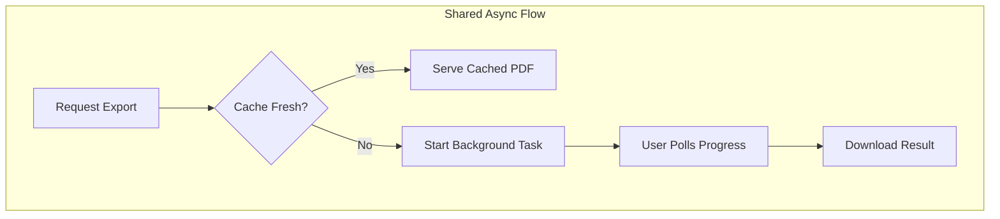

# Generate Reports and PDFs

Report export, statistical summaries, and documentation PDFs are available to export within the application. All PDF generation uses a unified asynchronous pattern with progress tracking to avoid blocking the user interface.

## Insights Reports

These reports are generated from the live PostGIS database based on user-selected filters. They are available from the **Download reports** tab on the `/insights` page.

### Report Categories

| Category | Description |
|----------|-------------|
| **Distance** | Matched pairs ordered by distance |
| **Unmatched** | Stops without matches (ATLAS, OSM, or both) |
| **Problems** | Detected issues with type/priority/status filters |

### Configuration Options

| Option | Values |
|--------|--------|
| Operator | All / Selected |
| Entries | All / Up to N |
| Sort | Operator A↔Z, Distance ↑↓, Priority ↑↓ |
| Format | PDF / CSV |

For unmatched reports, the UI can also restrict the source set to ATLAS, OSM, or both, and PDF/CSV exports can optionally include coordinate columns.

### Problem Filters

- **Types**: Distance, Unmatched, Attributes, Duplicates
- **Priority**: P1 (High), P2 (Medium), P3 (Low)
- **Status**: Solved, Unsolved

### API Endpoints

| Endpoint | Method | Purpose |
|----------|--------|---------|
| `/api/generate_report_async` | POST | Start generation and return a `task_id` (supports `report_type=summary` for Stats) |
| `/api/report_progress/{task_id}` | GET | Check progress |
| `/api/download_report/{task_id}` | GET | Download generated file |
| `/api/cancel_report/{task_id}` | POST | Cancel a job and clean up files |
| `/api/docs/generate_pdf_async` | POST | Start documentation generation |
| `/api/docs/pdf_progress/{task_id}` | GET | Check docs progress |
| `/api/docs/download_pdf/{task_id}` | GET | Download docs file |

---

---

## System PDFs & Partial Exports

To ensure accuracy while keeping the system lightweight, technical and statistical PDFs are generated in the background by the backend `weasyprint` worker. 

If standard outputs are requested (like the full documentation suite or the global stats summary), the worker performs an intelligent cache check before firing up the rendering engine:

| PDF Type | Base File Trigger | Cache Dependency | Staleness Policy |
| :--- | :--- | :--- | :--- |
| **Stats Summary** | `report_type: summary` | `data/stats.json` | Reuses cache unless `stats.json` is modified. |
| **Documentation** | `included_sections: null`| `documentation/*.md`, `stats.json` | Reuses cache unless stats or any markdown file changes. |

### Partial Documentation Export

The documentation UI provides a checklist to extract specific sections. If you select a subset of sections:
- The title/cover page will be automatically excluded.
- The output will skip the standard caching mechanism and generate a unique temporary file for download.

## Output Formats

- **PDF**: Server-rendered HTML converted with `weasyprint`.
- **CSV**: Standard UTF-8 CSV written with Python's `csv` module (Insights only).

## Limits

| Limit | Value |
|-------|-------|
| Async generation start | 10/hour |
| Async progress polling | 60/minute |
| Async download | 20/minute |

Async task state is currently stored in global dictionaries in the `async_export` module and cleaned up automatically.

## Related Documentation

- [6. Web app](6.%20Web%20app.md) – Application overview
- [4. Problems](4.%20Problems.md) – Problem detection
- [7. System Architecture](7.%20System%20Architecture.md) – Technical environment

