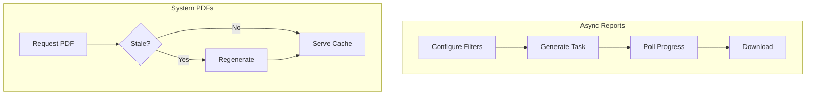

# Generate Reports and PDFs

Report export and system documentation/stats PDFs are available within the application. While Insights reports are dynamic and async, standard system PDFs follow a cached on-demand generation pattern.

## Insights Reports (Async)

These reports are generated from the live PostGIS database based on user-selected filters. They are available from the **Download reports** tab on the `/insights` page.

### Report Categories

| Category | Description |
|----------|-------------|
| **Distance** | Matched pairs ordered by distance |
| **Unmatched** | Stops without matches (ATLAS, OSM, or both) |
| **Problems** | Detected issues with type/priority/status filters |

### Configuration Options

| Option | Values |
|--------|--------|
| Operator | All / Selected |
| Entries | All / Up to N |
| Sort | Operator A↔Z, Distance ↑↓, Priority ↑↓ |
| Format | PDF / CSV |

For unmatched reports, the UI can also restrict the source set to ATLAS, OSM, or both, and PDF/CSV exports can optionally include coordinate columns.

### Problem Filters

- **Types**: Distance, Unmatched, Attributes, Duplicates
- **Priority**: P1 (High), P2 (Medium), P3 (Low)
- **Status**: Solved, Unsolved

### API Endpoints (Async)

| Endpoint | Method | Purpose |
|----------|--------|---------|
| `/api/generate_report_async` | POST | Start async generation and return a `task_id` |
| `/api/report_progress/{task_id}` | GET | Check async progress |
| `/api/download_report/{task_id}` | GET | Download an async-generated file |
| `/api/cancel_report/{task_id}` | POST | Cancel an async job and clean up any temp file |
| `/api/generate_report` | GET | Legacy synchronous export endpoint (deprecated) |

> [!WARNING]
> **Known bug (legacy sync endpoint):** `/api/generate_report` still calls `pdfkit.from_string(...)` but `pdfkit` is no longer imported. Use the async flow instead.

---

## System PDFs (On-Demand)

To ensure accuracy while keeping the system lightweight, technical and statistical PDFs are generated on-demand by the `app` runtime rather than during the build or boot stage. They are cached on disk and only regenerated when source data changes.

| PDF Type | Trigger | Source Data | Staleness Policy |
| :--- | :--- | :--- | :--- |
| **Stats Summary** | `GET /api/download_stats_summary_pdf` | `data/stats.json` | Auto-regenerates if `stats.json` is newer than the PDF. |
| **Documentation** | `GET /api/docs/download_pdf` | `documentation/*.md`, `stats.json` | Auto-regenerates if stats or any markdown file is newer. |

> [!NOTE]
> **Implementation Note:** Documentation and Stats PDFs are lazy-loaded on first request. The Staleness Check ensures these caches are automatically invalidated as soon as the underlying data or content changes. This keeps the "Technical Documentation" PDF in sync with both manual edits and the latest pipeline results.

## Output Formats

- **PDF**: Server-rendered HTML converted with `weasyprint`.
- **CSV**: Standard UTF-8 CSV written with Python's `csv` module (Insights only).

## Limits

| Limit | Value |
|-------|-------|
| Legacy synchronous export | 20/day |
| Async generation start | 10/hour |
| Async progress polling | 60/minute |
| Async download | 20/minute |

Async report state for Insights is currently stored in process memory (`report_progress` and `completed_reports`) and cleaned up by a background thread.

## Related Documentation

- [6. Web app](6.%20Web%20app.md) – Application overview
- [4. Problems](4.%20Problems.md) – Problem detection
- [7. System Architecture](7.%20System%20Architecture.md) – Technical environment

