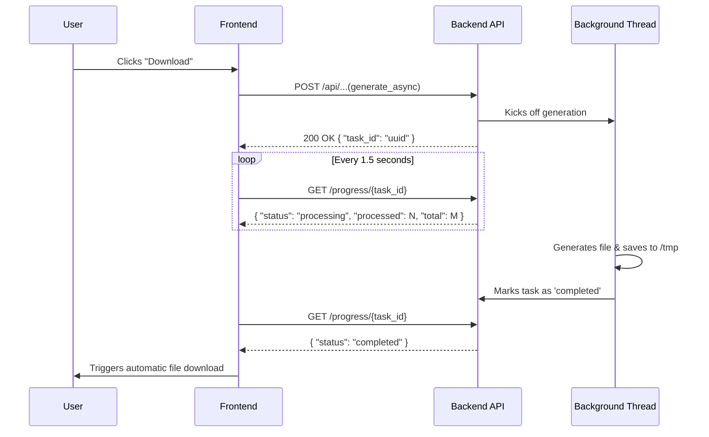

# 6.5 Generate Reports and PDFs

The application provides three primary export features: data-driven **Insights Reports**, a visual **Stats Summary PDF**, and rendered **Documentation Bundles**.

To prevent long-running exports from blocking the user interface or server threads, all three download types share a unified asynchronous polling architecture.

## 1. Unified Asynchronous Flow

All exports are orchestrated by `static/js/pages/report.js` (`startAsyncTask`) and Flask background threads. Instead of keeping the HTTP request open while the file generates, the server immediately returns a Task ID, and the client polls for progress.

## 2. Export Types

### A. Insights Reports (Data Tabular Exports)
Generated from the live PostGIS database based on user-selected filters from the `/insights` page.

*   **Endpoint:** `/api/generate_report_async`
*   **Payload:** Includes `report_type` (distance, unmatched, problems), `format` (csv, pdf), `limit`, and active filters.
*   **Characteristics:**
    *   **Live Queries:** Directly queries the database and formats results into tabular structures.
    *   **No Caching:** Strictly reflects the live database state, so results are always compiled on request.
    *   **Memory Constraints:** PDF formats enforce strict row limits (max 2,000 entries) to prevent WeasyPrint from exhausting server memory, while CSVs allow up to 10,000 entries.

### B. Global Stats Summary PDF
A print-oriented visual report of the main dashboard and statistical metrics.

*   **Endpoint:** `/api/generate_report_async`
*   **Payload:** `{ "report_type": "summary", "format": "pdf" }`
*   **Characteristics:**
    *   **Data Source:** Generated entirely from the precomputed `data/stats.json`.
    *   **Caching Strategy:** Since the stats are static between scheduler runs, the backend caches the first generated PDF. It compares the modification time of `stats.json` against the cached PDF. If up-to-date, it skips rendering and immediately returns the cached file, dropping generation time from ~4 seconds to near-instant.

### C. Documentation Bundles
Converts the repository's Markdown documentation into a single, merged PDF with dynamic cross-linking and rendered Mermaid diagrams.

*   **Endpoint:** `/api/docs/generate_pdf_async`
*   **Payload:** `{ "included_sections": ["1", "2"], "include_cover": false }`
*   **Characteristics:**
    *   **Generation Process:** Parses Markdown files into HTML using Mistune, injects SVGs for Mermaid blocks, and prints the combined structure into a PDF via WeasyPrint.
    *   **Full Export (Cached):** Checks the modification times of all `.md` files and `stats.json`. If nothing has changed since the last generation, it serves a cached global PDF.
    *   **Partial Export (Uncached):** When users select a subset of chapters via checkboxes, the backend receives the target array (e.g., `["1", "2"]`). It bypasses the general cache, generates a custom transient PDF (`docs_custom_{task_id}.pdf`) containing exactly those selected sections, and excludes the cover page.

## 3. Background Task Management & Rate Limits

To ensure server stability during heavy generation loads:
*   **File Janitor:** A background cleanup thread runs automatically to delete expired PDF/CSV files and stale task references from the `/tmp` directory. 
*   **Rate Limits:** Endpoints are rate-limited per IP (e.g., 10 report generations per hour, 60 progress polls per minute) to prevent queue exhaustion and abuse of the WeasyPrint renderer.
