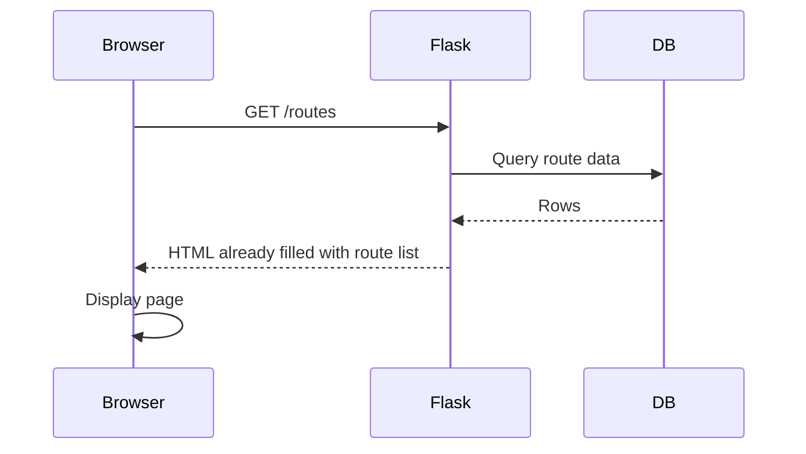
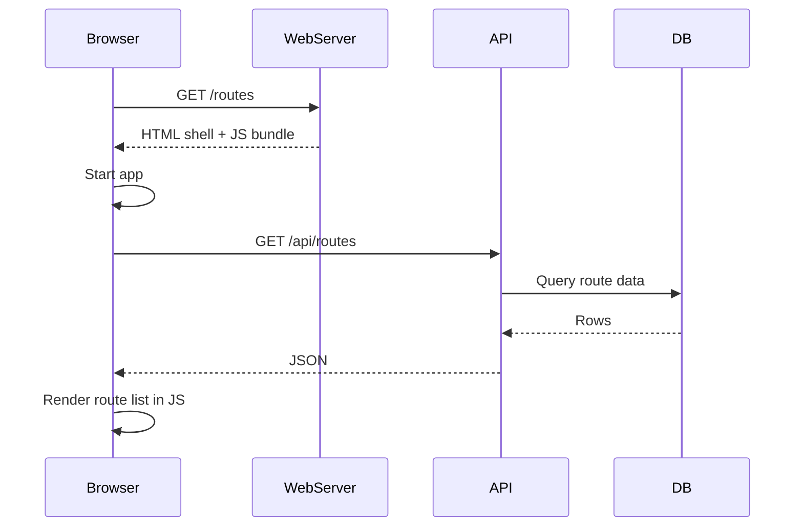
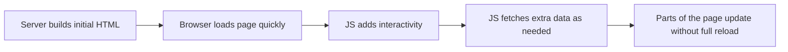
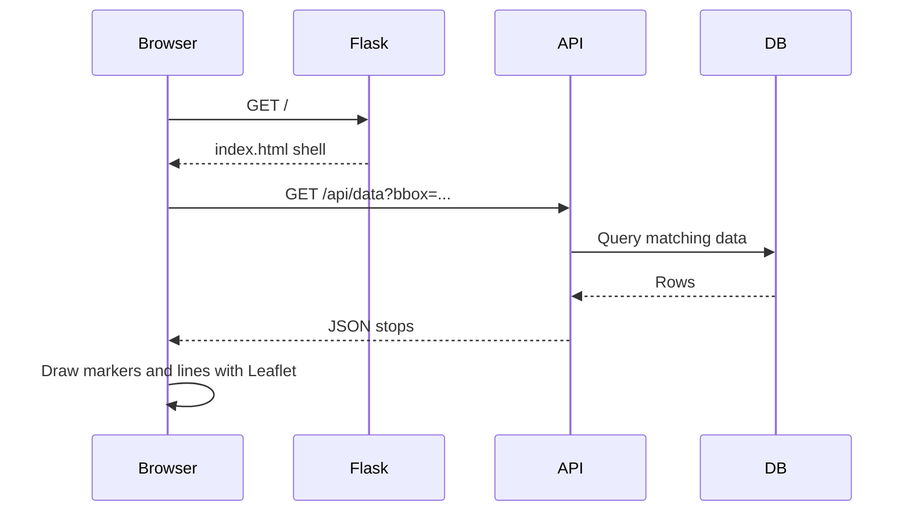
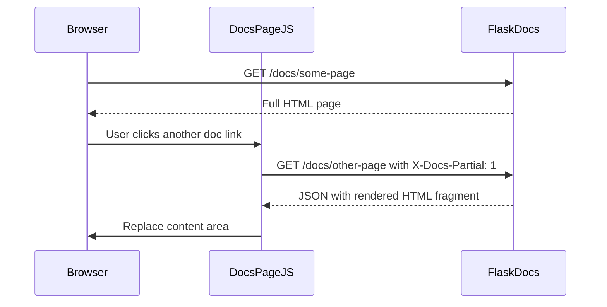
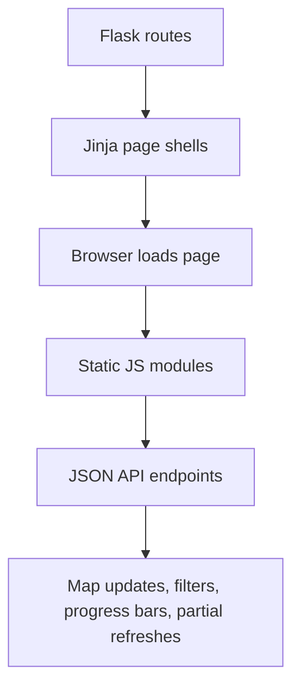
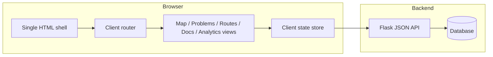

# 6.6 Rendering Model: SSR, CSR, and Our Hybrid Approach

This document explains the difference between server-side rendering (SSR) and client-side rendering (CSR), then maps those ideas onto this repository.

Short version: this project is **server-rendered first, with selective client-side rendering layered on top**. In practice that means **hybrid rendering**.

## The Basic Idea

### Server-Side Rendering (SSR)

With SSR, the server builds HTML before sending the response to the browser.

Typical properties of SSR:

- The first response already contains meaningful HTML.
- Pages can work even before JavaScript runs.
- Routing is usually owned by the server.
- Templates often receive data directly from backend code.

### Client-Side Rendering (CSR)

With CSR, the server often sends a mostly empty HTML shell plus JavaScript. The browser then fetches data and builds most of the UI itself.

Typical properties of CSR:

- Initial HTML is often thin.
- JavaScript is responsible for rendering most visible content.
- The browser often owns routing and view transitions.
- Backend endpoints are more purely JSON/API oriented.

### Hybrid Rendering

Many real apps do both.

That is the category this repository fits into.

## Where This Repository Fits

### High-level classification

This repository is **not a pure CSR single-page app**.

It is also **not pure SSR** in the strict sense, because some of the most important page content is fetched after load through JSON APIs and rendered in browser JavaScript.

The best description is:

> **Flask multi-page app with server-rendered page shells and progressive client-side enhancement.**

Or more simply:

> **Mostly SSR at the page level, hybrid at the feature level.**

## Why It Is Not Pure CSR

Several strong signals show that the server still owns the main page structure:

- Flask routes directly call `render_template(...)` for major pages like `/`, `/problems`, `/analytics`, and `/routes`.
- Jinja templates in `templates/pages/` generate the initial HTML sent to the browser.
- Navigation between top-level pages is standard server routing, not a front-end SPA router.
- Some pages already include real content on first response, especially the routes list, analytics view, and documentation content.

Representative server-rendered entry points:

- `backend/app.py` renders `/`, `/problems`, and `/analytics`
- `backend/blueprints/routes.py` renders `/routes`
- `backend/blueprints/docs.py` renders `/docs/<page>`

## Why It Is Not Pure SSR

Several important features are rendered or updated in the browser after the page shell loads:

- The main map view fetches viewport data from `/api/data` and updates markers dynamically.
- The problems page fetches `/api/problems` and redraws the UI in JavaScript.
- Report generation is launched from the browser and then polled asynchronously.
- Route cards render the list server-side, but each embedded map fetches its stop data lazily from `/api/data`.
- The docs page can fetch partial content and swap it into the DOM without a full page reload.

That moves the app beyond classic template-only SSR.

## Page-by-Page View

| Area | Initial render | After load | Classification |
| --- | --- | --- | --- |
| Main map (`/`) | Flask/Jinja renders shell, filters, layout | JS fetches `/api/data`, `/api/random_stop`, `/api/stop_by_id`, `/api/global_stats` and paints map | Hybrid, leaning client-heavy inside an SSR shell |
| Problems (`/problems`) | Flask/Jinja renders shell and controls | JS fetches `/api/problems` and `/api/data`, updates problem panels and map | Hybrid |
| Routes (`/routes`) | Flask/Jinja renders route list and pagination with real DB-backed content | JS lazily fetches map points per route card from `/api/data` | Mostly SSR with client-side enhancement |
| Analytics (`/analytics`) | Flask/Jinja renders analytics/report page structure; stats view includes real server-side values | JS handles async export flow and progress polling | Mostly SSR with interactive CSR features |
| Docs (`/docs/...`) | Flask renders initial doc page and sidebar | Browser can request partial doc payloads and replace content in-page | Hybrid, but still server-authored content |

## Concrete Examples From This Codebase

### 1. Main map page: server shell, client-rendered data layer

The root page is created on the server, but the map data itself is not baked into the initial HTML response.

That means the page itself is SSR, but the central visual payload is CSR-style.

### 2. Routes page: strong SSR example

The routes page is the clearest SSR example in the app:

- Flask queries route data before responding.
- The rendered HTML already contains route cards, text, pagination, and filter state.
- JavaScript is mainly used to enhance each card with an interactive map preview.

So this page is **closer to classic SSR** than the main map page.

### 3. Docs page: SSR plus partial in-page navigation

The docs page is interesting because the content is authored as Markdown and converted on the server, but the browser can later request a partial JSON payload and swap in updated HTML.

This is still not a front-end SPA. The server still generates the authoritative HTML content.

## A Useful Mental Model For This Project

Think of the app in two layers:

In other words:

- **Flask owns page delivery.**
- **JavaScript owns rich interaction inside the page.**
- **JSON APIs feed dynamic parts after initial render.**

That is a hybrid architecture.

## If This Project Were Fully Client-Side Rendered Instead

If the project were pushed much further toward CSR, the architecture would look different in a few important ways.

### 1. The server would stop rendering most page HTML

Instead of:

- Flask returning `pages/index.html`
- Flask returning `pages/problems.html`
- Flask returning `pages/routes.html`

You would more likely have:

- one app shell such as `index.html`
- one front-end entry bundle
- front-end routing deciding whether to show map, problems, routes, docs, or analytics

### 2. More data would move through JSON APIs

Today, some pages receive ready-to-display HTML from Flask templates.

In a CSR design, the browser would probably fetch data like:

- route lists
- pagination metadata
- documentation page content
- analytics summaries
- filter options

Then the browser would build the DOM itself for all of those views.

### 3. Client routing would become a first-class concern

Instead of navigating between server routes like `/routes` or `/docs/...` and receiving full HTML pages, a CSR app would typically use a client router.

That means the browser would intercept navigation and decide which view component to mount.

### 4. The front-end state model would get heavier

A fully client-rendered app usually needs stronger browser-side state management for:

- current route
- loaded datasets
- cache invalidation
- loading/error states
- pagination state
- search/filter synchronization with the URL

This repository already has some of that state in plain JavaScript modules, but a full CSR shift would likely make it much more central.

### 5. SEO and no-JS behavior would depend more on extra work

In this internal/data-oriented application, SEO is probably not the main concern. Still, SSR naturally makes the first response more complete and less dependent on JavaScript.

A CSR version would rely more heavily on:

- JavaScript boot success
- API availability during page startup
- careful loading states for every screen

## What A More CSR-Oriented Version Might Look Like

Compared with the current app, the browser would own more of the rendering and navigation lifecycle.

## What A More SSR-Oriented Version Might Look Like

If the app moved in the opposite direction, more page content would be prepared on the server before response time.

For example:

- the problems page could render the first problem list server-side
- the docs page could always full-reload instead of partial swapping
- route-map preview data could be embedded into the HTML instead of fetched later
- even some map data could be bootstrapped server-side for the initial viewport

That would reduce browser-side rendering work, but it would also make highly interactive map/filter workflows more awkward or heavier on full-page reloads.

## So What Should We Call This App?

The most accurate short descriptions are:

- **Server-rendered Flask app with client-side enhancement**
- **Hybrid SSR/CSR application**
- **Multi-page app, not SPA, with dynamic browser-rendered features**

If you want a single sentence:

> This project is primarily a server-rendered Flask application, but several important features behave like client-side rendering after the initial page load, so the overall architecture is hybrid.

## Practical Rule Of Thumb

When you want to classify a page in this repository, ask two questions:

1. Does the first HTTP response already contain meaningful page HTML?
2. After that, does JavaScript fetch important data and render or replace parts of the UI?

If the answer is:

- `yes` then `no`: mostly SSR
- `no` then `yes`: mostly CSR
- `yes` then `yes`: hybrid

For this repository, the answer is usually:

- `yes` for the page shell
- `yes` again for many interactive features

So the result is **hybrid**.