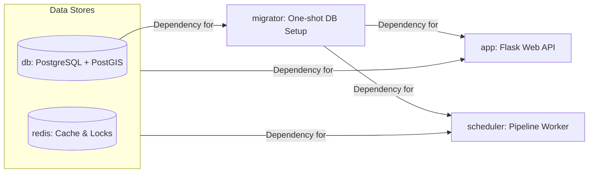

# 7. System Architecture

This section describes the implemented container architecture, migration flow, and runtime ownership boundaries.

- **[7.1 Dependency Management & Build Strategy](7.1%20Dependency%20Management%20&%20Build%20Strategy.md)**
- **[7.2 Security and Rate Limits](7.2%20Security%20and%20Rate%20Limits.md)**
- **[7.3 Background Scheduler](7.3%20Background%20Scheduler.md)**

## Compose Services

`docker-compose.yml` defines these primary services to isolate workflows:

- `app`: Flask web API/UI. Depends on successful `migrator` completion. Exposes port 5001.
- `scheduler`: APScheduler worker running the geospatial pipeline in the background. Depends on successful `migrator` completion.
- `db`: PostgreSQL + PostGIS container.
- `redis`: Shared cache/status/lock backend for rate limiting and pipeline coordination.
- `migrator`: Fast, one-shot migration service (`flask db upgrade`). Starts, applies migrations, and dies.

Also defined for local test workflows:
- `test`: Uses a merged `test-stage` image for full-suite pytest execution.

## Migration Ownership

Migrations are owned solely by a dedicated one-shot container:
- Service: `migrator`
- Command: `python matching_and_import_db/database/init.py && flask db upgrade`

*Why a dedicated container?* By isolating migrations, we prevent race conditions where multiple scaled containers try to alter the database simultaneously. It ensures the DB schema is safely updated and 100% ready before the `app` or `scheduler` are even allowed to boot.

`app` and `scheduler` start only after the migration container succeeds via `depends_on: condition: service_completed_successfully`.

`entrypoint.sh` logic ensures:
- `AUTO_MIGRATE=false` (default): Web app skips migration logic as the migrator container handles it.
- `AUTO_MIGRATE=true`: Allows app to run migration explicitly in local dev overrides.

## Scheduler and Status Behavior

- Service module: `matching_and_import_db/scheduler/service.py`
- Runner: `matching_and_import_db/scheduler/job_runner.py`
- Shared status/lock backend: `backend/services/pipeline_status.py`

Default configuration:
- Timezone: `Europe/Zurich`
- Executed at: `02:00` daily.

For more details on orchestration, locking, and configuration, see **[7.3 Background Scheduler](7.3%20Background%20Scheduler.md)**.

The pipeline status can be queried at `GET /api/system/pipeline_status` providing fields like `status`, `phase`, `message`, `eta_seconds`, and `next_run_at`.
To prevent conflicts, the Scheduler uses a distributed Redis lock to prevent overlapping runs.

## Ownership Boundaries & PDF Generation

To ensure accuracy while keeping the system lightweight, PDFs are generated on-demand by the `app` runtime rather than during the build or boot stage.

| PDF Type | Trigger | Source Data | Staleness Policy |
| :--- | :--- | :--- | :--- |
| **Stats Summary** | `GET /api/download_stats_summary_pdf` | `data/stats.json` | Auto-regenerates if `stats.json` is newer than the PDF. |
| **Documentation** | `GET /api/docs/download_pdf` | `documentation/*.md`, `stats.json` | Auto-regenerates if stats or any markdown file is newer. |
| **Insights Reports** | `/api/generate_report_async` | Live DB (PostGIS) | Always dynamic (generated async from current DB state). |

> [!NOTE]
> **Implementation Note:** Documentation and Stats PDFs are lazy-loaded on first request and cached on disk. The Staleness Check ensures these caches are automatically invalidated as soon as the underlying data or content changes. This keeps the "Technical Documentation" PDF in sync with both the manual edits and the latest pipeline results.

## Operational Notes
- `app`, `scheduler`, and `test` containers all mount the local directory to `/app` to allow live-reloading during development.
