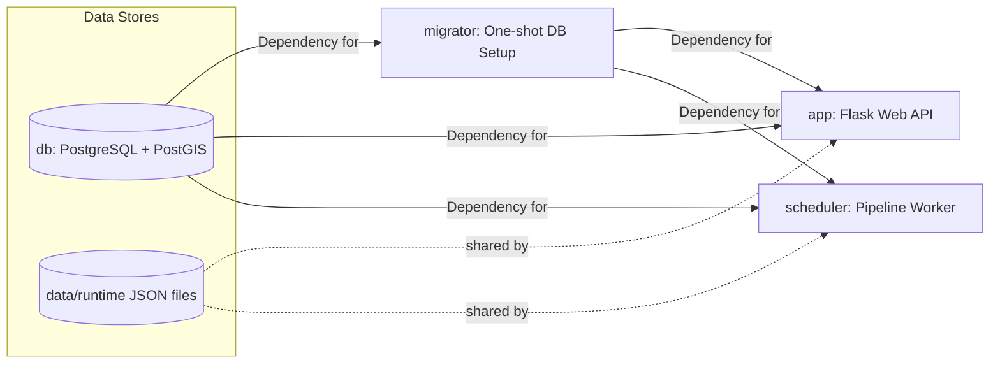

# 7. System Architecture and Operations

This chapter describes the container layout, migration ownership, scheduler ownership, and shared runtime state used by the application.

## Compose Services

`docker-compose.yml` defines these primary services:

- `app`: Flask web API/UI. Depends on successful `migrator` completion. Exposes port 5001.
- `scheduler`: APScheduler worker running preprocessing, matching, payload precompute, and import orchestration in the background. Depends on successful `migrator` completion.
- `db`: PostgreSQL + PostGIS container.
- `migrator`: Fast, one-shot migration service (`flask db upgrade`). Starts, applies migrations, and exits.
- `test`: Merged test image for full-suite pytest runs.

## Runtime Ownership

The services have deliberately separate responsibilities.

| Service | Owns |
|---------|------|
| `migrator` | schema setup and Alembic upgrade |
| `scheduler` | source freshness probing, preprocessing, matching, import precompute, and blocking DB refresh |
| `app` | read-only API/UI access to imported data plus pipeline-status polling |
| `db` | durable import state |
| `data/runtime` | shared JSON files for pipeline status, locking, and async-export state |

The `app` container does not run the data pipeline. It only reads imported data and shared pipeline status.

## Migration Ownership

Migrations are owned solely by the dedicated one-shot container:

- service: `migrator`
- command: `python matching_and_import_db/database/init.py && flask db upgrade`

By isolating migrations, the stack avoids race conditions where multiple containers try to change the schema at the same time.

`app` and `scheduler` start only after the migration container succeeds via `depends_on: condition: service_completed_successfully`.

`entrypoint.sh` performs a final application-level connection check to ensure PostgreSQL is accepting connections before the web service boots.

## Scheduler and Shared State

Pipeline execution state is independent from rate limiting.

- rate limiting uses `RATELIMIT_STORAGE_URI`
- shared runtime state uses the file backend selected by Docker Compose

The shared runtime-state backend stores:

- run status
- current phase and human-readable message
- next scheduled run timestamp
- the distributed run lock
- async export progress and completed-file metadata

This is what lets the scheduler, app, and browser agree on whether a pipeline run is active and whether the maintenance overlay should be shown.

The app and scheduler both mount `./data` at `/app/data`, so the default
`STATE_DIR=data/runtime` resolves to the same host directory. Pipeline status is
stored in `pipeline_status.json`; the active lock uses `pipeline_lock.json`;
async-export state uses `tasks_progress.json` and `tasks_completed.json`.
File writes are atomic, and lock operations use `fcntl.flock()`.

## Operational Notes

- **Production (`docker-compose.yml`)** uses pre-built images from GitHub Container Registry and avoids source-code bind mounts.
- **Development (`docker-compose.override.yml`)** restores image `build:` targets and mounts the local directory (`.:/app`) for live editing.

## Subpages

- [7.1 Dependency Management & Build Strategy](7.1%20Dependency%20Management%20&%20Build%20Strategy.md): Python dependency split, Dockerfile stages, and build matrix
- [7.2 Security and Rate Limits](7.2%20Security%20and%20Rate%20Limits.md): Flask-Talisman, CSP, and rate limiting configuration
- [7.3 Background Scheduler](7.3%20Background%20Scheduler.md): APScheduler service, job runner phases, lock handling, and refresh modes
- [7.4 Atlas-Cached Import Optimization](7.4%20Atlas-Cached%20Import%20Optimization.md): Table-reuse behavior for unchanged ATLAS/GTFS inputs
- [7.5 Frontend Asset Management](7.5%20Frontend%20Asset%20Management.md): Vendored frontend libraries, Font Awesome optimization, and sync pipeline
