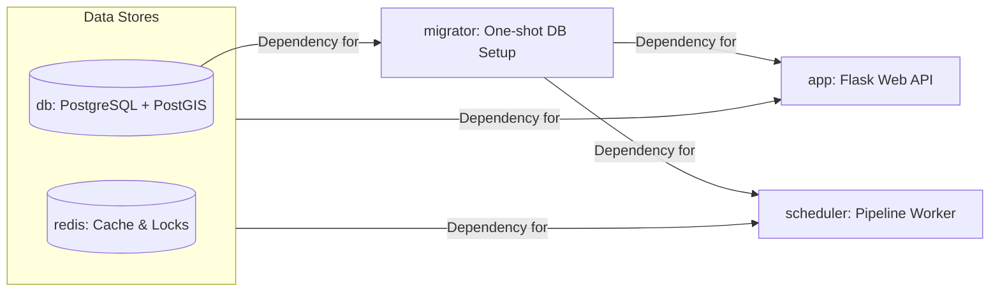

# 7. System Architecture

This section describes the implemented container architecture, migration flow, and runtime ownership boundaries and GITHUB ACTIONS.

## Compose Services

`docker-compose.yml` defines these primary services to isolate workflows:

- `app`: Flask web API/UI. Depends on successful `migrator` completion. Exposes port 5001.
- `scheduler`: APScheduler worker running the data pipeline in the background. Depends on successful `migrator` completion.
- `db`: PostgreSQL + PostGIS container.
- `redis`: Shared cache/status/lock backend for rate limiting and pipeline coordination.
- `migrator`: Fast, one-shot migration service (`flask db upgrade`). Starts, applies migrations, and dies.

Also defined for local test workflows:
- `test`: Uses a merged `test-stage` image for full-suite pytest execution.

## Migration Ownership

Migrations are owned solely by a dedicated one-shot container:
- Service: `migrator`
- Command: `python matching_and_import_db/database/init.py && flask db upgrade`

By isolating migrations, we prevent race conditions where multiple app containers try to alter the database simultaneously. It ensures the DB schema is safely updated and 100% ready before the `app` or `scheduler` are even allowed to boot.

`app` and `scheduler` start only after the migration container succeeds via `depends_on: condition: service_completed_successfully`.

`entrypoint.sh` logic ensures the application waits for the database to be ready before starting.

## Scheduler and Status Behavior

- Service module: `matching_and_import_db/scheduler/service.py`
- Runner: `matching_and_import_db/scheduler/job_runner.py`
- Shared status/lock backend: `backend/services/pipeline_status.py`

Default configuration:
- Timezone: `Europe/Zurich`
- Executed at: `02:00` daily.

For more details on orchestration, locking, and configuration, see **[7.3 Background Scheduler](7.3%20Background%20Scheduler.md)**.

The pipeline status can be queried at `GET /api/system/pipeline_status` providing fields like `status`, `phase`, `message`, `eta_seconds`, and `next_run_at`.
To prevent conflicts, the Scheduler uses a distributed Redis lock to prevent overlapping runs.

## Operational Notes
- Production vs Development is strictly separated via Compose.
- **Production (`docker-compose.yml`)**: Uses pre-built images from GitHub Container Registry (`ghcr.io/opentdatach/stop_sync_osm_atlas-*`) and avoids source code bind mounts to prevent accidental overwrites and improve security.
- **Development (`docker-compose.override.yml`)**: Restores image `build:` targets and mounts the local directory (`.:/app`) to allow live-reloading of modifications on your host machine.
- For more details on the deployment pipeline, see **[7.4 Deployment & GitHub Actions](7.4%20Deployment%20&%20GitHub%20Actions.md)**.
