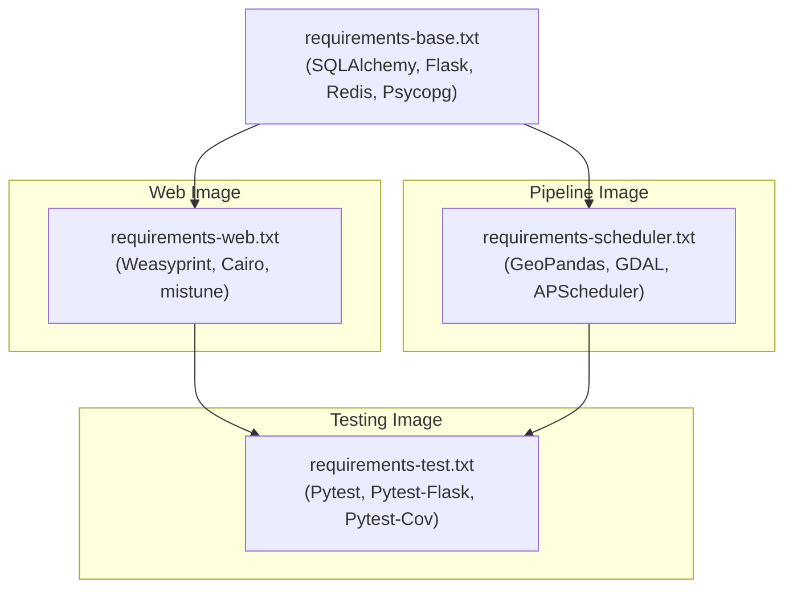
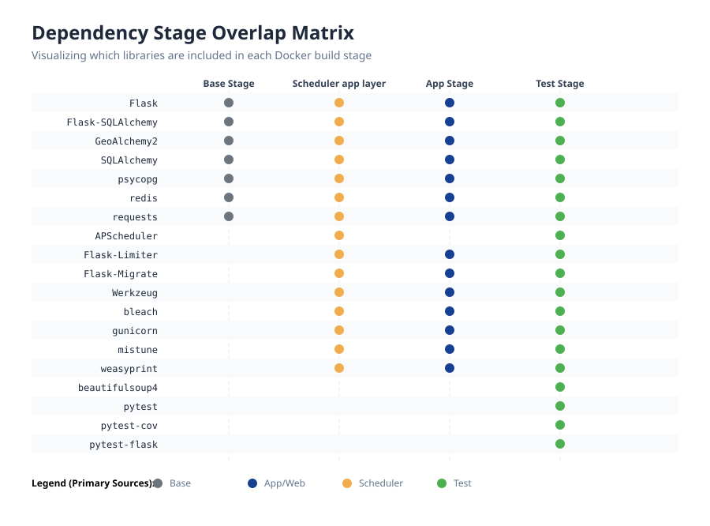

# 7.1 Dependency Management & Build Strategy

To optimize image sizes, improve load times, and isolate dependencies, the architecture utilizes a multi-stage Dockerfile and heavily modularized requirement files.

## Dependency Split

Dependencies are strictly split by runtime responsibility. This ensures that the web application stays slim (avoiding heavy pandas, geopandas binaries, etc) and the scheduler avoids unnecessary web-routing libraries.

## Dependency Overlap Matrix

The following matrix visualizes the specific libraries included in each build stage. Note how `base` is inherited by all stages, and `test` aggregates everything to ensure a complete integration environment.

*Generated via `documentation/scripts/generate_dependency_overlap.py`*

<!-- DEPENDENCIES_START -->
- `requirements-base.txt`: Shared core backend foundations requested by all containers (`Flask-SQLAlchemy>=3.1.1,<4.0`, `Flask>=3.1.3,<4.0`, `GeoAlchemy2>=0.19.0,<1.0`, `psycopg[binary]>=3.3.3,<4.0`, `redis>=7.4.0,<8.0`, `requests>=2.33.1,<3.0`, `SQLAlchemy>=2.0.49,<3.0`).
- `requirements-web.txt`: Web-only stack for the API and UI (`bleach>=6.3.0,<7.0`, `Flask-Limiter>=4.1.1,<5.0`, `Flask-Migrate>=4.1.0,<5.0`, `Flask-Talisman>=1.1.0,<2.0`, `gunicorn>=25.3.0,<26.0`, `mistune>=3.2.0,<4.0`, `weasyprint>=68.1,<69.0`, `Werkzeug>=3.1.8,<4.0`).
- `requirements-scheduler.txt`: Heavy geospatial stack required for the data pipeline (`APScheduler>=3.11.2,<4.0`, `geopandas>=1.1.3,<2.0`, `numpy>=2.4.4,<3.0`, `pandas>=3.0.2,<4.0`, `scipy>=1.17.1,<2.0`, `shapely>=2.1.2,<3.0`).
- `requirements-test.txt`: Testing frameworks (`pytest-cov>=7.1.0,<8.0`, `pytest-flask>=1.3.0,<2.0`, `pytest>=9.0.3,<10.0`).
<!-- DEPENDENCIES_END -->

## Dockerfile Stages

The `Dockerfile` resolves four distinct logical build targets:

1. **`base` Stage**
   - Establishes normal Python environment.
   - Installs `requirements-base.txt`.

2. **`app-stage` Stage**
   - Used by the `app` service.
   - Installs UI/PDF system level libraries (Cairo/Pango).
   - Installs `requirements-web.txt`.

3. **`scheduler-stage` Stage**
   - Used by the `scheduler` service.
   - Installs heavy C++ geospatial system libraries (GDAL/GEOS/PROJ).
   - Installs `requirements-scheduler.txt`.

4. **`test-stage` Stage**
   - Used by the `test` service.
   - Starts from `app-stage`, but forcibly adds the scheduler geospatial libraries.
   - Installs both `requirements-scheduler.txt` and `requirements-test.txt`.
   - This merged image allows integration tests to test both web routes and pipeline functions simultaneously.

> [!NOTE]
> **Automated safeguards for doc drift**: GitHub Actions automatically updates the matrix and lists on every push. Additionally, `tests/test_dependency_docs_sync.py` validates that dependency lists in this document remain synchronized with all `requirements-*.txt` files.

