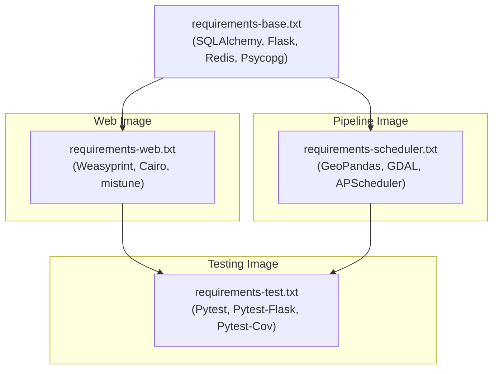

# 7.1 Dependency Management & Build Strategy

To optimize image sizes, improve load times, and isolate dependencies, the architecture utilizes a multi-stage Dockerfile and heavily modularized requirement files.

## Dependency Split

Dependencies are strictly split by runtime responsibility. This ensures that the web application stays slim (avoiding heavy pandas, geopandas binaries, etc) and the scheduler avoids unnecessary web-routing libraries.

## Dependency Overlap Matrix

The following matrix visualizes the specific libraries included in each build stage. Note how `base` is inherited by all stages, and `test` aggregates everything to ensure a complete integration environment.

*Generated via `documentation/scripts/generate_dependency_overlap.py`*

<!-- DEPENDENCIES_START -->
- `requirements-base.txt`: Shared core backend foundations requested by all containers (`Flask`, `Flask-SQLAlchemy`, `GeoAlchemy2`, `SQLAlchemy`, `psycopg`, `redis`, `requests`).
- `requirements-web.txt`: Web-only stack for the API and UI (`Flask-Limiter`, `Flask-Migrate`, `Flask-Talisman`, `Werkzeug`, `bleach`, `gunicorn`, `mistune`, `weasyprint`).
- `requirements-scheduler.txt`: Heavy geospatial stack required for the data pipeline (`APScheduler`, `geopandas`, `numpy`, `pandas`, `scipy`, `shapely`).
- `requirements-test.txt`: Testing frameworks (`pytest`, `pytest-cov`, `pytest-flask`).
<!-- DEPENDENCIES_END -->

## Dockerfile Stages

The `Dockerfile` resolves four distinct logical build targets:

1. **`base` Stage**
   - Establishes normal Python environment.
   - Installs `requirements-base.txt`.

2. **`app-stage` Stage**
   - Used by the `app` service.
   - Installs UI/PDF system level libraries (Cairo/Pango).
   - Installs `requirements-web.txt`.

3. **`scheduler-stage` Stage**
   - Used by the `scheduler` service.
   - Installs heavy C++ geospatial system libraries (GDAL/GEOS/PROJ).
   - Installs `requirements-scheduler.txt`.

4. **`test-stage` Stage**
   - Used by the `test` service.
   - Starts from `app-stage`, but forcibly adds the scheduler geospatial libraries.
   - Installs both `requirements-scheduler.txt` and `requirements-test.txt`.
   - This merged image allows integration tests to test both web routes and pipeline functions simultaneously.

> [!NOTE]
> **Automated safeguards for doc drift**: GitHub Actions automatically updates the matrix and lists on every push. Additionally, `tests/test_dependency_docs_sync.py` validates that dependency lists in this document remain synchronized with all `requirements-*.txt` files.

