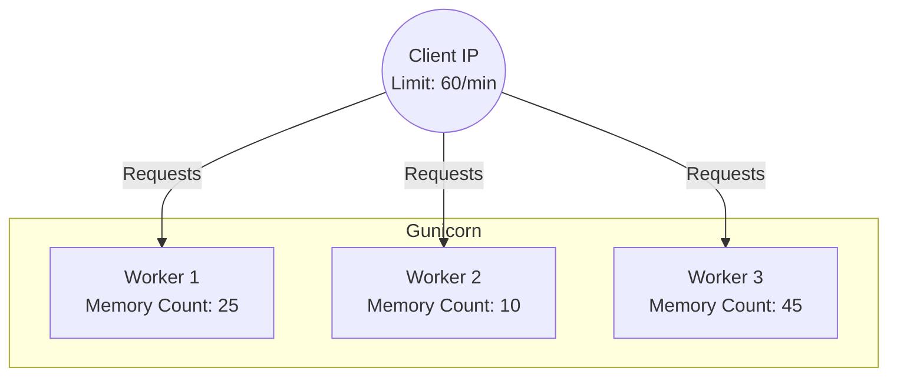
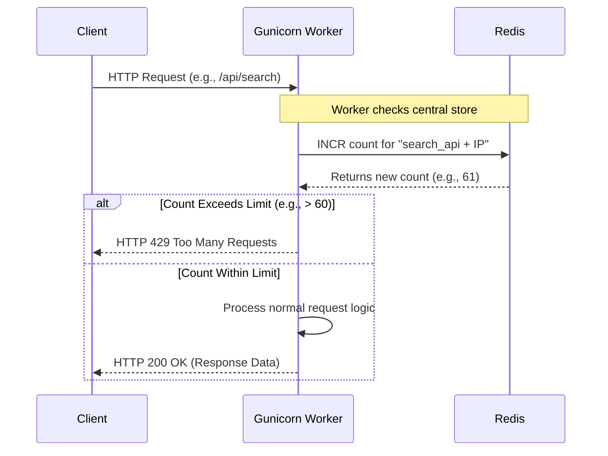
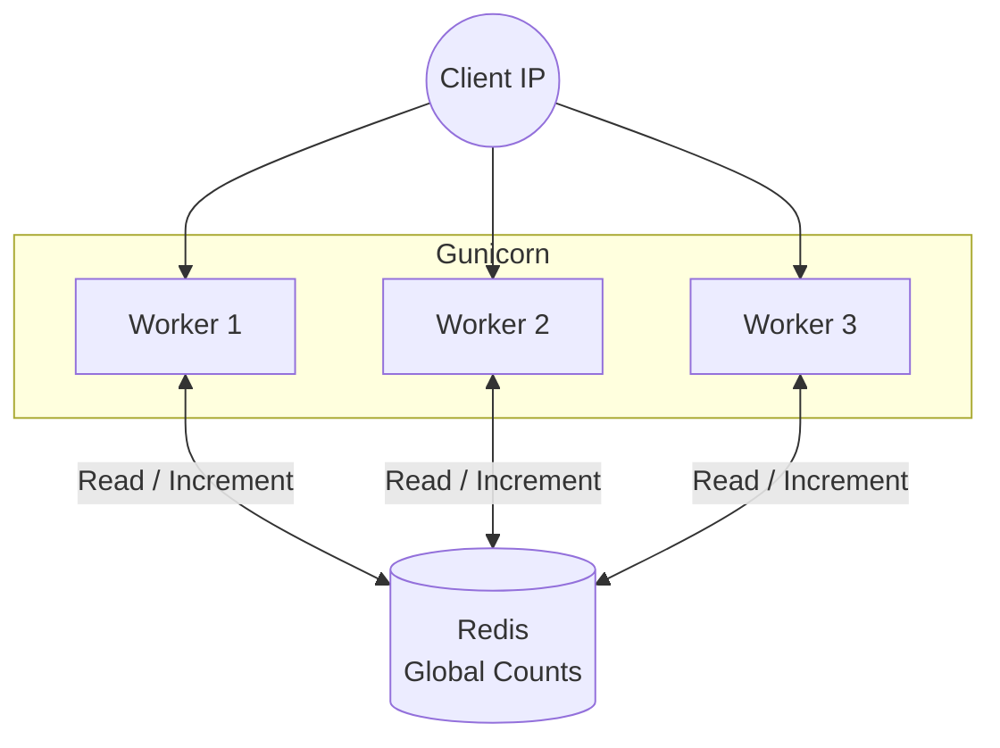

# Security and Rate Limits

This document outlines the application's current API rate limits and active Flask security controls.

## 1. Current Rate Limits

The backend API is shielded by `Flask-Limiter` to prevent abuse and ensure fair usage across our infrastructure. Limits are enforced based on the client's IP address (`get_remote_address`).

### Storage Backend

`Flask-Limiter` is configured with `RATELIMIT_STORAGE_URI`, defaulting to `memory://`. This rate-limit state is separate from pipeline state.

Pipeline scheduling status, run locking, and async-export progress do not reuse
`RATELIMIT_STORAGE_URI`. Docker Compose sets `STATE_BACKEND=file` and stores
that shared state as JSON under `STATE_DIR` (`data/runtime` by default).

### Global Default

- **All unannotated endpoints:** `500 per minute` (defined in `backend/extensions.py`). "Unannotated endpoints" refer to any API routes in the application that do **not** have a specific, custom rate limit applied directly to them via a decorator.

### Specific Endpoints
Certain expensive or easily abusable endpoints have stricter throttles:

| Endpoint(s) | Limit | Location |
|---|---:|---|
| `/api/data` | 30/minute | `backend/blueprints/data.py` |
| `/api/atlas_operators`, `/api/osm_operators`, `/api/osm_route_operators`, `/api/route_stops` | 60/minute | `backend/blueprints/data.py` |
| `/api/stop_popup` | 120/minute | `backend/blueprints/data.py` |
| `/api/search`, `/api/top_matches`, `/api/stop_by_id` | 60/minute | `backend/blueprints/search.py` |
| `/api/random_stop` | 30/minute | `backend/blueprints/search.py` |
| `/api/problems`, `/api/problems/stats` | 120/minute | `backend/blueprints/problems.py` |
| `/api/global_stats` | 30/minute | `backend/blueprints/stats.py` |
| `/api/system/pipeline_status` | 120/minute | `backend/blueprints/system.py` |
| `/api/generate_report_async` | 10/hour | `backend/blueprints/reports.py` |
| `/api/report_progress/<task_id>` | 240/minute | `backend/blueprints/reports.py` |
| `/api/download_report/<task_id>` | 20/minute | `backend/blueprints/reports.py` |
| `/api/cancel_report/<task_id>` | 60/minute | `backend/blueprints/reports.py` |
| `/api/generate_report` | 20/day | `backend/blueprints/reports.py` |

Documentation-PDF endpoints currently have no custom decorator and therefore use the 500/minute default.

---

## 2. Optional Shared Rate-Limit Storage

The codebase is structured so a shared rate-limit storage backend can be plugged in without changing endpoint decorators. The default `memory://` backend remains process-local.

This is intentionally separate from the scheduler/app coordination store,
which Docker Compose shares through JSON files in `data/runtime`.

### Why In-Memory Storage Is Only a Development Default
With in-memory storage, each worker process maintains a separate bucket of request counts.


*In the scenario above, the client has actually made 80 requests (25 + 10 + 45), violating the 60/min limit. However, because no single worker has hit 60 internally, none of the workers will block the client.*

When `RATELIMIT_STORAGE_URI` is configured with a Redis URL, the request flow becomes:

1. The Gunicorn worker handling a request connects to Redis.
2. The worker increments a counter specific to the `[Endpoint] + [Client IP]` key.
3. If the returned counter exceeds the allowed limit, the worker immediately rejects the request with a **HTTP 429 Too Many Requests**.





In that configuration, Redis provides a unified counter store across workers through atomic increments and expirations.

## 3. HTTPS Redirection and Browser Security Headers

This application is primarily a public-facing informational dashboard with no user accounts, authentication, or sensitive personal data. Because of this, we do not enforce strict browser security headers (such as a Content Security Policy via `flask-talisman`). 

HTTPS redirection is optional rather than unconditional. When `FORCE_HTTPS=true`, a `before_request` hook in `backend/app.py` checks `X-Forwarded-Proto` and the request's native security state, then issues a 301 redirect to `https://` for HTTP requests. A reverse proxy must overwrite untrusted forwarded headers and terminate or forward TLS correctly. When `FORCE_HTTPS` is unset or false, the Flask app does not redirect HTTP itself.

---

## 4. Security Risks and Attack Vectors


The search endpoint in `backend/blueprints/search.py`  applies explicit input and query guardrails before hitting expensive text scans:

```python
# snippet from search.py
query_str = _normalize_search_query(request.args.get('q', ''))
if len(query_str) < 3:
    return jsonify({"osm": [], "atlas": []})
if len(query_str) > 50:
    return jsonify({"error": "..."}), 400

escaped_query = _escape_like_literal(query_str)
search_pattern = f"%{escaped_query}%"

# PostgreSQL-only guardrail
db.session.execute(text("SET LOCAL statement_timeout = 1500"))

# each query is capped
matched_query.limit(200)
unmatched_query.limit(200)
```
**What is enforced:**
1. **Query length bounds:** short probes (`< 3`) are ignored and long payloads (`> 50`) are rejected with `HTTP 400`.
2. **Wildcard escaping:** user input is escaped before `ILIKE`, so `%` and `_` are treated as literals instead of attacker-controlled wildcard operators.
3. **Query timeout circuit breaker:** PostgreSQL search statements use a local `statement_timeout` to prevent long-running scans from monopolizing workers.
4. **Result-size caps:** both matched and unmatched search branches are hard-limited (`200` each), reducing memory and serialization pressure.
