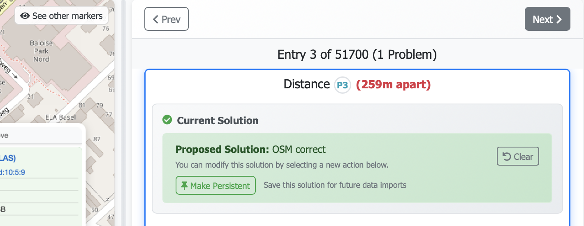
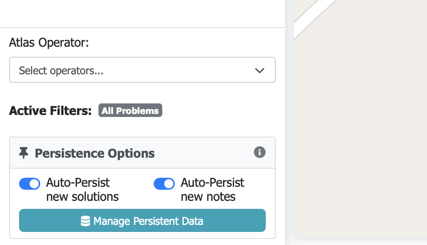
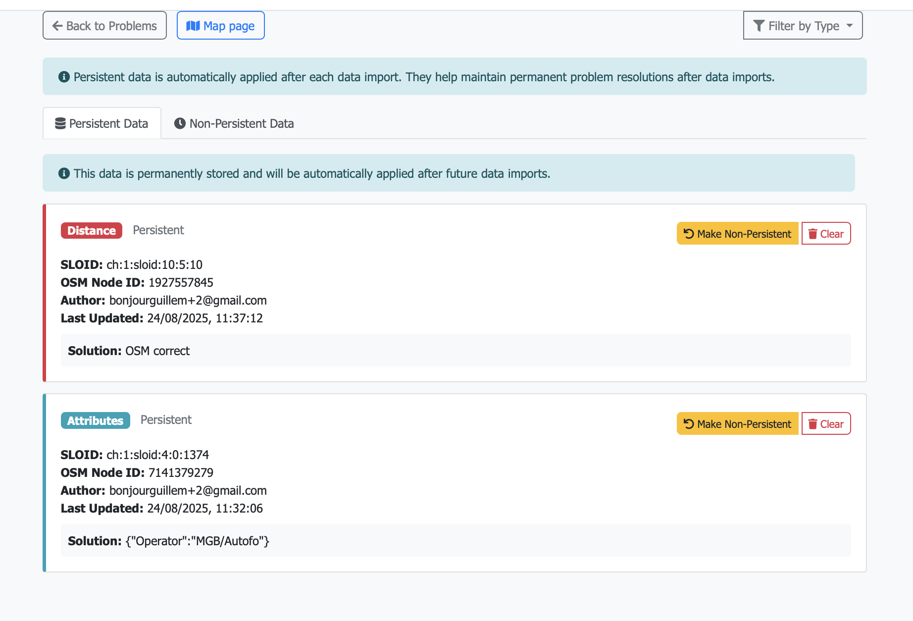

## Persistent Data (Solutions and Notes)

This system preserves validated solutions and notes across data imports. When someone adds a note or saves a solution for a problem, they can choose to make it persistent. If made persistent, it will not be changed by future data imports. Data imports should be scheduled regularly to refresh stops and route data. Here’s how it works:

### Database

A single table, `persistent_data`, stores persistent solutions and notes:
- `sloid` (nullable), `osm_node_id` (nullable)
- `problem_type` in {'distance', 'unmatched', 'attributes', 'duplicates'} or NULL for notes
- `solution` (for problems)
- `note_type` in {'atlas', 'osm'} or NULL for problems
- `note` (for persistent notes)
- `created_by_user_id`, `created_by_user_email` (author attribution)
- `created_at`, `updated_at` timestamps
- Unique constraint: (`sloid`, `osm_node_id`, `problem_type`, `note_type`)

### Flow

1) `import_data_db.py` writes new stops and problems to the database.
2) At the end of this process, the `persistent_data` table remains intact. If the problem still exists, the stored solution and/or note is applied.
3) `apply_persistent_solutions()` in [backend/services/import_persistence.py](../backend/services/import_persistence.py) applies persisted solutions and notes to the fresh data.

### Possible scenarios

- Stop still exists, same problem → solution is re‑applied
- Stop exists, problem no longer exists → nothing to apply; solution kept in case the problem reappears in future runs
- Stop removed → nothing to apply; solution retained
- New problem type → previous solution does not apply

### UI
On the problems page:

    

        
        
Persistent solution indicator on problem resolution section

    

    

        
        
Persistence toggles for notes and problems solutions. 

    

The Persistent Data page allows users to choose which solutions and notes to make persistent. If a user made a solution persistent, they can later revert their own items back to non‑persistent.

See also: [PERMISSIONS.md](./PERMISSIONS.md) for who can access these endpoints.

### Benefits and cautions

- Preserves the context of why decisions were made (via notes)
- Persistent solutions can be updated or removed
- Periodically review persistent items
- Notes are applied regardless of attribute changes

### Key endpoints (see `backend/blueprints/problems.py`)

- Solutions: `/api/save_solution`, `/api/make_solution_persistent`, `/api/check_persistent_solution`
- Notes: `/api/save_note/atlas`, `/api/save_note/osm`, `/api/make_note_persistent/<atlas|osm>`, `/api/check_persistent_note/<atlas|osm>`
- Lists/manage: `/api/persistent_data`, `/api/non_persistent_data`
- Admin ops: `/api/make_all_persistent`, `/api/clear_all_persistent`, `/api/clear_all_non-persistent`