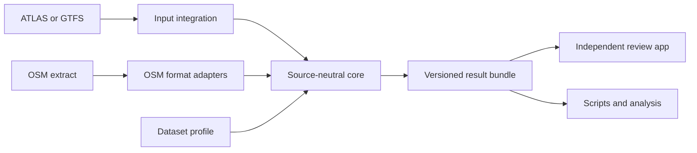

# Transport Matcher

A Python producer package for matching public transport stops and routes against OpenStreetMap. It contains a source-neutral matching core, curated format adapters, optional acquisition clients and maintained first-party integrations. It returns complete results: matches and their evidence, unmatched entities, stop groups, discrepancies and diagnostics. It runs independently of the review website, Flask, PostGIS and any database service. Swiss GTFS preprocessing uses an embedded DuckDB database for temporary local work.

The Swiss ATLAS workflow and generic GTFS workflow use the same stop predicates. Dataset profiles define identifier mappings, grouping policies and thresholds. The project is licensed under AGPL-3.0-or-later.



## Quickstart: no downloads or database

From this directory, with Python 3.10 or later:

```bash
python -m venv .venv
source .venv/bin/activate
python -m pip install -e '.[test]'
python -m pytest tests/test_api.py tests/test_matching_regressions.py tests/test_results.py
```

The basic package depends on NumPy and SciPy. Extras add only the dependencies for the selected workflow:

| Install | Use |
|---|---|
| `.` | In-memory matching, OSM XML parsing and bundle export/validation. |
| `.[gtfs]` | Generic GTFS directory/ZIP input; adds pandas. |
| `.[swiss]` | Local Swiss ATLAS/GTFS processing; adds pandas, DuckDB and geographic dependencies. |
| `.[acquisition]` | Swiss source downloads and geographic preprocessing. |
| `.[test]` | Core tests; combine with adapter extras for the full suite. |

This example needs only the basic package:

```python
from transport_matcher.api import match
from transport_matcher.core.models import SourceStop, OsmNode

source = [SourceStop("my-agency", "central", 52.525, 13.369, name="Central")]
osm = [OsmNode("100", 52.52501, 13.36901, name="Central", public_transport="platform")]
output = match(source, osm)

for result in output.matched:
    print(result.source_node.key, result.osm_node.key, result.match_type, result.distance_m)
print(output.problems)
print(output.diagnostics)  # Missing route evidence is reported explicitly.
```

`SourceStop.key` includes the dataset namespace; neither SLOID nor UIC is required. OSM identities include element type. Coordinates must be finite WGS84 values. Inputs with duplicate identities or invalid positions fail before matching.

## Run a dataset and export results

A tiny synthetic GTFS example is included in `examples/`. GTFS parsing adds pandas:

```bash
python -m pip install -e '.[gtfs]'
transport-matcher gtfs --source examples/gtfs --namespace demo --osm examples/osm.xml --output /tmp/demo-results
```

For the existing Swiss workflow:

```bash
python -m pip install -e '.[swiss]'
transport-matcher swiss --source /path/to/stops_ATLAS.csv --osm /path/to/osm_data.xml --processed /path/to/processed --output /tmp/swiss-results
```

Use `transport-matcher --help` for acquisition and GTFS refresh options. Commands take explicit paths; the in-memory API never reads files, environment variables or credentials. Output directories must be new. Result writing validates a temporary bundle before publishing it.

See [the result format](RESULT_FORMAT.md) for the integration contract. The review application consumes that format without importing this package.

## Documentation

The canonical engine documentation lives in [`documentation/`](documentation/1.%20Download%20and%20process%20data.md):

- [Input integrations and acquisition](documentation/1.%20Download%20and%20process%20data.md)
- [Stop matching](documentation/2.%20Matching%20process.md)
- [Route comparison](documentation/3.%20Routes.md)
- [Problem detection](documentation/4.%20Problems.md)
- [Caching and performance](documentation/5.2%20Pipeline%20Performance.md)
- [Engine tests](documentation/6.%20Pipeline%20tests.md)
- [Changelog](documentation/Changelog.md)
- [Related projects and collaboration opportunities](documentation/Related%20projects.md)

The review application may render these pages in its combined documentation portal, but changes to engine behavior and its documentation belong together in this package.

The built-in adapter set is intentionally curated. External datasets can implement `adapters.base.SourceAdapter` and return `AdapterResult` without adding code to this distribution. See the input-integration documentation for the acceptance criteria used for built-in adapters.

## Standalone container

Build from this `engine/` directory; its Docker build context contains no review-application code:

```bash
docker build -t transport-matcher .
mkdir -p results
docker run --rm --user "$(id -u):$(id -g)" \
  -v "$PWD/examples:/inputs:ro" -v "$PWD/results:/results" \
  transport-matcher gtfs --source /inputs/gtfs --namespace demo \
  --osm /inputs/osm.xml --output /results/demo
```

From the parent repository, the equivalent build command is `docker build -t transport-matcher engine`. The image includes all supported adapter extras. Local inputs are mounted read-only; completed bundles appear in the mounted output directory. Choose a new output name for each run.

## Profiles and matching behavior

Use `MatchingProfile` for a dataset or agency. The default profile runs name, route and distance rules. It enables exact matching only for explicitly configured reference mappings; station grouping is disabled by default. The Swiss profile enables the existing station-reference allocation and pair/trio rules, preserving predicate order. `osm_station_ref_tag` selects an agency's station-reference tag without rewriting OSM tags; its corresponding station-scoped `ReferenceRule` must explicitly permit comparison. Generic attribute checks prefer OSM `name`, while the Swiss profile retains its existing `uic_name` policy.

```python
from transport_matcher.core.models import Reference, SourceStop
from transport_matcher.profiles import MatchingProfile, ReferenceRule

profile = MatchingProfile(
    profile_id="city-transit",
    reference_rules=(ReferenceRule(
        namespace="city-transit-stop", osm_tag="gtfs:stop_id", scope="stop",
        source_namespace="city-transit",
        osm_scope_tag="gtfs:feed", osm_scope_value="city-transit",
    ),),
    max_distance=40,
)
stop = SourceStop(
    "city-transit", "101", 52.5, 13.4,
    references=(Reference("city-transit-stop", "101", "stop"),),
)
```

Matching bare equal IDs across feeds is unsafe. A reference rule states the identifier namespace, stop/station scope and compatible OSM tag. Optional OSM scope tags restrict agency/feed-specific identifiers. Feed route identifiers must be scoped by the adapter too; Swiss year-code normalization lives in the Swiss profile.

The engine deliberately supports multiple links for station references and group propagation. It does not impose a universal one-to-one relationship. A trio's middle stop position remains without a direct link when its two sides match; the result marks it effectively matched and does not create an unmatched problem for it.

The core API returns stop results and route evidence. The dataset runners additionally compare complete route/itinerary records and attach adapter metadata before writing the bundle. An adapter without route inputs remains useful for stop matching.

## Contributing

Start with [CONTRIBUTING.md](CONTRIBUTING.md). Core changes use tiny offline cases in `tests/`; UI development uses the separate review application. No national download is needed to improve a predicate. The [Swiss snapshot](examples/swiss/expected.json) records pre-refactor decisions for a small fixture; adapter tests compare its matches, groups, problems and route outcomes with the extracted engine.

## Swiss processing performance

Fresh Swiss GTFS processing uses DuckDB and partitioned Parquet to reduce repeated trip patterns before Python itinerary construction. Set `GTFS_THREADS` (default `2`) and `GTFS_MEMORY_LIMIT` (default `768MB`) to tune native processing; the latter is not a cap on total process RSS. `GTFS_PROCESSING_BACKEND=pandas` retains the comparison implementation. These options affect adapters, not the in-memory core API.

Acquisition caches parsed GTFS independently from ATLAS mapping and checkpoints successful stages before fetching OSM. JSON stage logs provide elapsed wall/CPU time, 30-second heartbeats, cache-miss reasons and reduction counts. Bundles use gzip level 1 by default; `--compression-level 9` trades export time for smaller artifacts. Checksums and complete validation remain enabled.

Run `python benchmarks/gtfs.py --help` for an offline comparison that records product hashes and timings. The benchmark accepts explicit inputs and writes only temporary processing files and the requested report.
