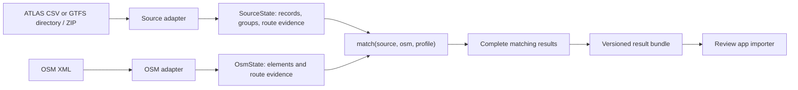

# E1 Data Acquisition & Processing

These are the canonical source and acquisition docs for the independently installable engine. In the combined review checkout, the package root is `engine/`; commands on this page run from that directory. Adapters translate source files into normalized records, while the matching core never opens files, downloads data, imports Flask or accesses a database. Switzerland is one supported profile. A generic GTFS feed uses the same predicates with different source records and policies.



## Code structure

All package paths below are relative to `src/transport_matcher/`.

| Module | Responsibility |
|---|---|
| `adapters/atlas.py` | Map Swiss columns to `SourceStop`; compute Swiss duplicate groups |
| `adapters/gtfs.py` | Read any GTFS directory or ZIP; scope identifiers by feed and retain ordered route calls |
| `adapters/osm.py` | Parse OSM nodes, supported station ways and relation evidence into `OsmState` |
| `adapters/get_atlas_data.py`, `get_atlas_gtfs.py` | Swiss acquisition filters, streaming GTFS integration and native GTFS-to-SLOID resolution |
| `adapters/get_osm_data.py` | Overpass acquisition and OSM route products; products may be returned entirely in memory |
| `adapters/route_products.py` | Read optional cached products at an explicit path |
| `adapters/acquisition.py` | Refresh source files and publish portable acquisition metadata |
| `profiles/` | Reference mappings, enabled rules, grouping, distance thresholds and Swiss route-ID normalization |
| `api.py` | Execute matching and stop problem detection over normalized records |
| `swiss.py` | Compose Swiss adapters, complete route comparison, identity extensions and input fingerprints |

## Run against local files

Install the engine separately from the web app:

```bash
python -m pip install -e '.[swiss,test]'
transport-matcher swiss --source /data/stops_ATLAS.csv --osm /data/osm.xml --processed /data/processed --output /results/run-001
```

`--processed` is optional. Present source-route and GTFS identity products are included in the result; missing route evidence is recorded as a diagnostic. OSM route products always come from the supplied XML, so a cached CSV cannot silently describe a different OSM snapshot.

Use `--gtfs /data/gtfs` to rebuild Swiss GTFS identity and route products. With `--boundary /data/switzerland.geojson`, the runner applies explicit Swiss geography filtering. Without that argument, the GTFS stop table is treated as already selected input; this decision is recorded in metadata. Local matching does not download a polygon. Temporary DuckDB tables and partitioned Parquet files are cleaned up after the run.

## Generic GTFS

```bash
python -m pip install -e '.[gtfs]'
transport-matcher gtfs --source ./feed.zip --namespace agency_name --osm ./agency.osm.xml --output ./results/agency-001
```

Stop identities use `agency_name:<stop_id>` and route identities use `agency_name:route:<route_id>`. The namespace must identify a feed and remain stable between runs. A feed needs `stops.txt`; route evidence is optional, but if provided requires `routes.txt`, `trips.txt` and `stop_times.txt` together. Numeric `stop_sequence` order, loops and repeated stops are preserved. Matching selects boarding stops (`location_type=0` or blank); parent stations and other location types remain in the GTFS source extension. Parent references stay available without letting a station steal a child platform match. No SLOID, UIC prefix, Swiss polygon or Swiss route-year normalization is required.

The command declares that OSM `gtfs:route_id` tags in its extract belong to that feed. For an extract containing several feeds, normalize and scope evidence explicitly before using the Python API. The generic adapter currently reads its GTFS tables into memory; the Swiss adapter retains the national feed's streaming path.

## Download and cache a Swiss workspace

```bash
python -m pip install -e '.[acquisition]'
transport-matcher swiss --download --workspace /work/swiss --output /work/results/run-001
```

`refresh_swiss(workspace, force=False)` owns `/work/swiss/data/raw`, `data/processed` and `data/source_metadata.json`. It stages downloads, filters ATLAS, builds Swiss GTFS products, and refreshes OSM. The app does not own those source-processing decisions.

ATLAS/GTFS products can be reused only when HTTP validators agree and cached file fingerprints verify. A stable permalink or download filename alone is insufficient. Changed boundary fingerprints, cache-format versions or expired ATLAS validity records also invalidate the cache. `--force` rebuilds source products. OSM refreshes on each acquisition run; empty OSM products overwrite old CSV contents rather than leave stale relations behind.

| Location below `workspace/data` | Contents |
|---|---|
| `raw/stops_ATLAS.csv`, `raw/osm_data.xml` | Selected Swiss platforms and the OSM extract |
| `raw/switzerland.geojson`, `raw/gtfs/` | Explicit boundary and the extracted GTFS input files |
| `processed/atlas_line_families.csv`, `atlas_itineraries.csv`, `atlas_itinerary_stop_calls.csv` | Swiss source route products |
| `processed/gtfs_stops_raw.csv`, `gtfs_stop_identity_resolution.csv` | Native Swiss GTFS identity products |
| `cache/gtfs/*.parquet` | Feed-derived metadata and reduced trip patterns, reusable independently of ATLAS |
| `source_metadata.json` | Validators, acquisition timestamps, file fingerprints and source filter statistics |

The result bundle carries complete matches, unmatched records, groups, problems, routes and optional Swiss identity extensions. The review app consumes that bundle and does not read these raw/processed files. See [the result and import boundary](../../documentation/1.1%20Import%20Process.md).

## Source details

- [E1.1 ATLAS stops](1.1%20ATLAS%20stops.md)
- [E1.2 GTFS ATLAS data](1.2%20GTFS%20ATLAS%20data.md)
- [E1.3 OSM data](1.3%20OSM%20data.md)
- [E3 Routes](3.%20Routes.md)

OSM route frames are now built once in memory by the runner from the current XML. Older `processed/osm_route_*.csv` files are ignored by that runner. See [Pipeline Performance](5.2%20Pipeline%20Performance.md) for the cache-stage dependencies and configuration.
