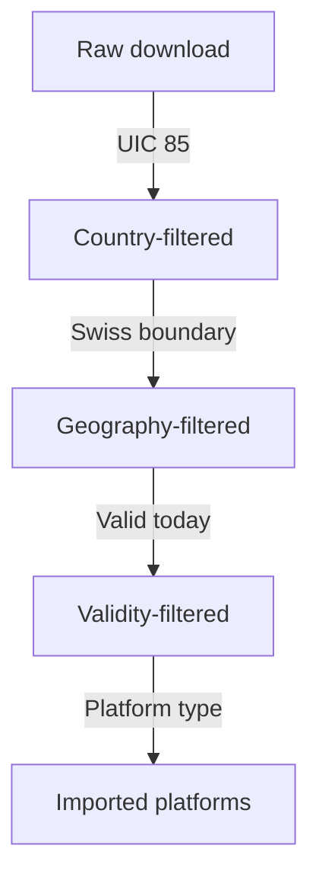

# E1.1 Swiss Integration: ATLAS Stops

<a href="https://atlas.app.sbb.ch/service-point-directory" target="_blank">ATLAS</a> is the official registry of Swiss public transport stops. This page documents the maintained Swiss input integration, not a requirement of the source-neutral matching core. The integration downloads and filters boarding platforms and resolves GTFS `stop_id` values to SLOIDs for Swiss route processing.
> [!NOTE]
> The standalone acquisition adapter caches ATLAS filtering, the downloaded GTFS feed, parsed GTFS products, and GTFS-to-ATLAS mapping as separate stages. HTTP validators establish remote freshness and SHA-256 fingerprints verify local products. For example, an ATLAS-only change can reuse the parsed GTFS feed and rebuild only the dependent identity/itinerary mapping. OSM is refreshed for every full acquisition run. See [E5.1 Source Snapshot Caching](5.1%20Atlas-Cached%20Import%20Optimization.md) and [E5.2 Pipeline Performance](5.2%20Pipeline%20Performance.md).

## Filtering Pipeline

The diagram is intentionally structural. Run-specific timestamps and counts are exported in bundle metadata and belong to deployment monitoring or the review application, not this canonical engine page.

## Filters Applied

| # | Filter | Criterion | Exported counters |
|---|--------|-----------|-------------------|
| 1 | UIC number | `uicCountryCode == 85` | `raw_total`, `eliminated_by_uic_number`, `after_uic_number_filter` |
| 2 | Geography | Inside Swiss border polygon | `eliminated_by_geo`, `after_geo_filter` |
| 3 | Validity | `validTo >= today` | `eliminated_by_validity`, `after_validity_filter` |
| 4 | Type | `trafficPointElementType == BOARDING_PLATFORM` | `eliminated_by_type`, `after_type_filter`, `type_counts` |

> [!NOTE]
> Some stops have Swiss UIC codes but are physically outside Switzerland. We use <a href="https://github.com/ZHB/switzerland-geojson" target="_blank">`switzerland.geojson`</a> with GeoPandas for precise filtering.

## `trafficPointElementType` Values

The filtering report records every type found after the country, geography, and validity filters. The currently published statistics expose the two expected values below; newly introduced upstream values remain visible in the raw `type_counts` metadata and are excluded unless they are `BOARDING_PLATFORM`.

| Type | Policy |
|------|--------|
| `BOARDING_PLATFORM` | Included |
| `BOARDING_AREA` | Excluded |

## Output File

`data/raw/stops_ATLAS.csv` key columns:

| Column | Description | Example |
|--------|-------------|---------|
| `number` | UIC reference (7-digit) | `8503000` |
| `sloid` | Swiss Location ID | `ch:1:sloid:8503000:1` |
| `designationOfficial` | Official stop name | `Zürich HB` |
| `designation` | Platform identifier | `1`, `A`, `Nord` |
| `wgs84North` / `wgs84East` | Coordinates | `47.3782` / `8.5401` |
| `validFrom` / `validTo` | Validity period | `2020-01-01` / `9999-12-31` |
| `servicePointBusinessOrganisationAbbreviationDe/Fr/It/En` | Operating company | `SBB/CFF/FFS` |

The filtered ATLAS coordinates are reused downstream in two places:

- during the main OSM <-> ATLAS stop matching pipeline (exported in the result bundle and projected by the app into `stops_matched`)
- during the GTFS `stop_id` <-> `sloid` matching phase in `get_atlas_gtfs.py` (exported and projected into `gtfs_stop_identity_resolution`)

## Downstream Usage

1. **GTFS integration + GTFS `stop_id` <-> `sloid` mapping** -> [E1.2 GTFS](1.2%20GTFS%20ATLAS%20data.md)
2. **Routes tab diagnostic map** -> [A2.6 Routes Pages](../../documentation/2.6%20Routes%20Pages.md)
3. **Matching pipeline** -> [E2 Matching process](2.%20Matching%20process.md)

## Normalized engine records

`adapters.atlas.atlas_records()` maps these columns to `SourceStop`. The engine key is `atlas:<sloid>`; the native SLOID remains a source reference and Swiss extension. Invalid/missing identities or non-finite/out-of-range coordinates fail validation instead of silently becoming `(0, 0)`. The review app converts Swiss keys back to native SLOID URLs when projecting a validated bundle.
