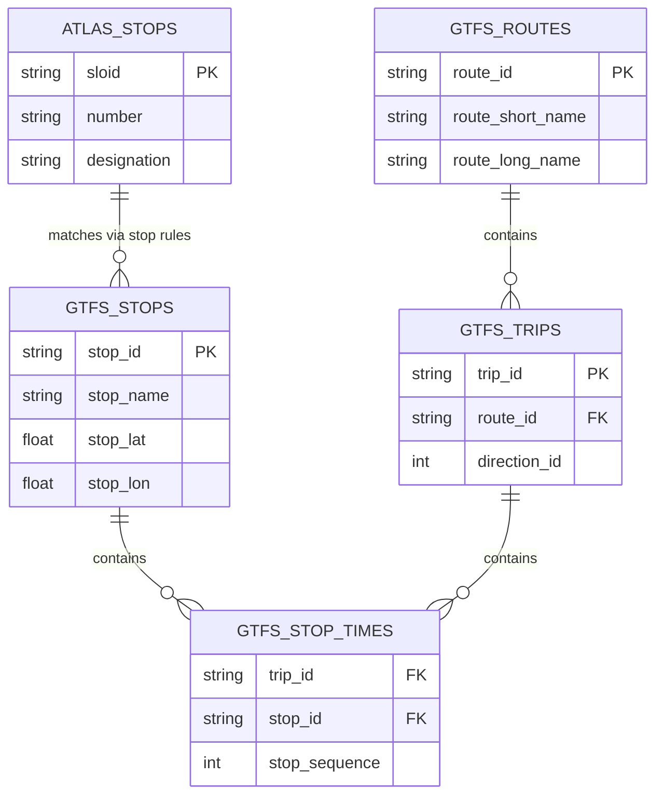
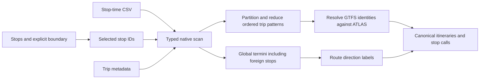

# GTFS ATLAS Data

The GTFS integration stage produces a unified output family:

1. **`data/processed/atlas_line_families.csv`**, **`atlas_itineraries.csv`**, and **`atlas_itinerary_stop_calls.csv`**: normalized ATLAS route artifacts used during route import, stop-level route matching (adapter-supplied `SourceState` evidence), and line-family / itinerary comparison.
2. **`data/processed/gtfs_stops_raw.csv`** and **`gtfs_stop_identity_resolution.csv`**: cached GTFS stop identity artifacts included in the engine result bundle and the GTFS diagnostic map.
3. **Statistics in `data/source_metadata.json` and the result bundle**: canonical GTFS-to-ATLAS metrics; the application writes `data/gtfs_atlas_stats.json` and embeds them into `data/stats.json` after import.

Together, these artifacts map ATLAS stops to their associated transit routes and directions using GTFS (General Transit Feed Specification) timetable data, and they also materialize the canonical GTFS `stop_id` <-> ATLAS `sloid` state used by the Routes diagnostic map.

GTFS provides the underlying data that allows us to know which routes (e.g., "Tram 11") serve which stops, and in which direction (e.g., "towards Rehalp").

## Statistics

We track how many ATLAS SLOIDs are resolved from the filtered Swiss GTFS stops.

- **ATLAS Stops**: {{stat:gtfs_atlas.atlas.total}}
- **ATLAS SLOIDs Resolved from GTFS Stops**: {{stat:gtfs_atlas.atlas.touched_by_gtfs_routes}}
- **ATLAS Coverage**: {{stat:gtfs_atlas.atlas.coverage_percent}}%

These ATLAS-side coverage stats are distinct from the GTFS `stop_id` mapping stats below. The ATLAS count measures unique resolved SLOIDs, while the next block measures unique GTFS `stop_id`s resolved to any ATLAS SLOID. The exported field retains the legacy name `touched_by_gtfs_routes`, but it is computed from the canonical stop-identity matches before the route-row join.

How the GTFS `stop_id`s map to the ATLAS `sloid`s:
- **Total GTFS Stops Processed**: {{stat:gtfs_atlas.gtfs_stop_ids.total}}
- **Matched GTFS Stops**: {{stat:gtfs_atlas.gtfs_stop_ids.matched_to_atlas}} ({{stat:gtfs_atlas.gtfs_stop_ids.coverage_percent}}%)
- **Unmatched GTFS Stops**: {{stat:gtfs_atlas.gtfs_stop_ids.unmatched}}
- **Original stop_id Assignments**: {{stat:gtfs_atlas.assignments.original_stop_id}}
- **Strict Matching Assignments**: {{stat:gtfs_atlas.assignments.strict}}
- **Coordinate Proximity Assignments**: {{stat:gtfs_atlas.assignments.coordinate_proximity}}
- **Unique-Number Fallback Assignments**: {{stat:gtfs_atlas.assignments.unique_number_fallback}}

## GTFS File Structure

Before processing the data, it is helpful to understand the core structure of a GTFS feed. A GTFS feed is a collection of CSV files (with a `.txt` extension) zipped together. The files we use to build route associations are:

1. **`stops.txt`**: Contains the physical locations of transit stops. Each stop has a unique `stop_id` (e.g., `8503000:0:1` for a specific platform), coordinates, and names.
2. **`routes.txt`**: Contains the definition of transit lines, such as "Tram 11" or "S12". Each route has a unique `route_id`, a `route_short_name`, and optional route metadata such as `route_long_name`, `route_desc`, and `route_type`.
3. **`trips.txt`**: Defines individual journeys along a route. It links a specific `trip_id` to a `route_id` and includes direction information (`direction_id`). The exporter also uses `trip_headsign` and `trip_short_name` when grouping trips into itinerary buckets.
4. **`stop_times.txt`**: This is the connective tissue. It defines the exact schedule. Each row links a `trip_id` to a `stop_id` and provides the arrival/departure times, as well as the order the stop appears in the trip (`stop_sequence`).

**Example of `stop_times.txt`:**

| `trip_id` | `arrival_time` | `departure_time` | `stop_id` | `stop_sequence` |
| :--- | :--- | :--- | :--- | :--- |
| `trip_1001` | `08:00:00` | `08:00:00` | `8503000:0:1` | `1` |
| `trip_1001` | `08:05:00` | `08:05:00` | `8503001:0:2` | `2` |
| `trip_1001` | `08:10:00` | `08:10:00` | `8503002:0:1` | `3` |

To know what route serves a physical `stop_id`, we must join these tables: `stop_times.txt` -> `trips.txt` -> `routes.txt`.

### Entity Relationship Diagram

Here is a conceptual database diagram illustrating how the GTFS files relate to each other, and how they ultimately map to the ATLAS stops data:

## Processing a large feed

The local national snapshot contains more than 26 million selected stop-time rows. The default Swiss adapter uses DuckDB to scan the necessary CSV columns, compute global termini, and partition selected calls into Parquet by trip hash. It reduces identical ordered trip patterns before constructing Python itinerary objects. This avoids writing/reparsing a large intermediate CSV and creating a pandas group for every scheduled trip.

The feed-derived products are cached separately from ATLAS identity mapping. ATLAS-only changes can therefore reuse parsed GTFS. The historical pandas chunked reader remains available with `GTFS_PROCESSING_BACKEND=pandas` for comparisons.

See [Pipeline Performance](7.5%20Pipeline%20Performance.md) for algorithms, cache dependencies, memory limits, logs and reproducible benchmarks.

## Identity matching

### Match GTFS to ATLAS (`stop_id` → `sloid`)
**Goal:** Link the physical GTFS platform to our ATLAS database.
**Action:** Apply matching algorithms to connect the GTFS `stop_id` (e.g., `8503000:0:1`) to the ATLAS `sloid` (e.g., `ch:1:sloid:8503000:1`).
**Data Structure Output:** A reusable GTFS-to-ATLAS payload containing the integrated route rows, the canonical `stop_id` <-> `sloid` matches, and exported mapping stats.

| Strategy | Description |
|----------|-------------|
| **1. Original stop_id** | If the GTFS feed already exposes an `original_stop_id` equal to an ATLAS `sloid`, that identity is accepted directly. |
| **2. Strict Match (`uic_platform`)** | Derive the UIC number from `didok`, `original_stop_id`, or `stop_id`; derive the local/platform reference from the identifier or `platform_code`; normalize special platform codes (`10000 -> 1`, `10001 -> 2`); then match `(uic_number, normalized_local_ref)` against ATLAS `(number, normalized designation)`. |
| **3. Coordinate Proximity** | For stops that fail strict matching, the system searches for ATLAS stops with the same UIC number within a **0.5-meter radius**. The match is only assigned if it is unambiguous (1-to-1). |
| **4. Unique-Number Fallback** | Only for GTFS stops that failed the earlier steps: if the ATLAS `number` appears exactly once in the dataset, assign that single `sloid`. |

The canonical matcher is reused in three places:

- route integration (`atlas_line_families.csv`, `atlas_itineraries.csv`, `atlas_itinerary_stop_calls.csv`)
- import payload generation (`gtfs_stops_raw.csv`, `gtfs_stop_identity_resolution.csv`)
- exported stats (`data/gtfs_atlas_stats.json`)

## How GTFS Trips Become ATLAS Itineraries

The route export does not write one row per raw GTFS `trip_id`.

Instead, the exporter reconstructs a compact ATLAS-side route model with three levels:

1. **Line family**: one row per GTFS `route_id`
2. **Itinerary**: one representative direction/variant bucket inside that line family
3. **Stop call**: one ordered stop row inside the chosen itinerary

The itinerary bucketing logic is intentionally conservative:

- the outer grouping key is `route_id` plus GTFS `direction_id`
- within that bucket, `representative_headsign` is preferred when present
- if no headsign exists, `trip_short_name` is used
- if neither text field is present, the fallback grouping key is an ordered UIC-level stop-pattern hash

When several raw trips collapse into the same emitted itinerary:

- the dominant underlying stop pattern becomes the representative stop sequence
- merged platform-level SLOID variants are retained on the stop-call rows
- `trip_count` records how many GTFS trips were collapsed into that itinerary

This keeps the exported route layer compact enough for comparison while preserving the physical-stop identity needed by the importer.

## GTFS Route Identifiers

### A Note on GTFS route_ids
The `route_id` is an internally generated ID specific to the system creating the timetable data. In Switzerland, it follows a strict naming convention:
`<Betriebszweig>-<Liniennummer>-<Projektkurzbezeichnung>-<Linienversionsnummer>`
(Branch of operation) - (Line number) - (Project short designation) - (Line version number)

### Normalization Strategy
In Switzerland's GTFS data, the `route_id` format includes a `<Projektkurzbezeichnung>` (project short designation) that denotes the specific timetable year (e.g., `-j24`, `-j25`, `-j26`). This means a physical route gets a new ID every year. 

If an OSM mapper entered `gtfs:route_id=11-T-j24-1` in 2024, it wouldn't match the backend's 2026 data (`11-T-j26-1`). The `route_id_normalized` field replaces these year-specific codes with `-jXX` (e.g., `11-T-jXX-1`), allowing historical OSM tags to successfully match against current datasets. 
## Outputs

The pipeline materializes the GTFS-derived output family in `data/processed/`.

### 1. `atlas_line_families.csv`

Defines the ATLAS line-family entities for the normalized route import path.

| Column | Description |
|--------|-------------|
| `atlas_line_id` | Source GTFS `route_id`, used as the ATLAS-side line-family identifier |
| `route_id_normalized` | Simplified `-jXX` version |
| `agency_id` | GTFS Agency ID |
| `route_short_name` | Short route name |
| `route_long_name` | Long route name |
| `route_desc` | Route description |
| `route_type` | Transport mode |

### 2. `atlas_itineraries.csv`

Defines the itinerary rows derived from GTFS trips/directions.

| Column | Description |
|--------|-------------|
| `atlas_itinerary_id` | Deterministic identifier built from the route ID, direction, and itinerary bucket |
| `atlas_line_id` | Foreign key to `atlas_line_families.csv` |
| `direction_id` | Direction ID (`0` or `1`) |
| `representative_headsign` | Representative GTFS headsign used for bucketing and display |
| `direction_label` | Derived direction name (e.g. `Zürich HB → Bern`) |
| `trip_count` | Number of raw GTFS trips collapsed into the itinerary |
| `shape_id` | Ordered stop-identity sequence for the selected representative pattern; this is not the raw GTFS `shape_id` |
| `headsign_or_pattern_hash` | Bucket key derived from headsign, trip short name, or the fallback stop-pattern hash |

### 3. `atlas_itinerary_stop_calls.csv`

Maps individual stops to the normalized itineraries.

| Column | Description |
|--------|-------------|
| `atlas_itinerary_id` | Foreign key to `atlas_itineraries.csv` |
| `stop_sequence` | Original GTFS order within the representative trip |
| `stop_id` | Source GTFS stop identifier |
| `sloid` | Resolved ATLAS SLOID, when available |
| `sloid_variants` | JSON list of platform-level SLOID variants merged into the representative pattern |
| `mapping_method` | Resolution method: `original_stop_id`, `uic_platform`, `coordinate_proximity`, or `unique_number` |
| `stop_name` / `platform_code` | GTFS stop label and platform code |
| `original_stop_id` | Original feed-level stop identifier |
| `location_type` / `parent_station` | GTFS hierarchy metadata |
| `canonical_stop_key` | Resolved SLOID when available, otherwise `gtfs:<stop_id>` |
| `uic_number` | Parsed UIC number when available |

### 4. `gtfs_stops_raw.csv`

Cached raw GTFS stop rows for the engine result extension and GTFS diagnostic map.

| Column | Description |
|--------|-------------|
| `stop_id` | GTFS stop identifier |
| `stop_code` | Raw GTFS stop code |
| `stop_name` | GTFS stop name |
| `platform_code` | GTFS platform code when present |
| `original_stop_id` | Original feed-level stop identifier used by direct `sloid` matches |
| `location_type` | GTFS location type |
| `parent_station` | GTFS parent station identifier |
| `uic_number` | Parsed Swiss UIC number |
| `local_ref` | Raw local/platform suffix parsed from `stop_id` |
| `normalized_local_ref` | Local ref normalized for strict matching |
| `stop_lat` / `stop_lon` | GTFS coordinates |

### 5. `gtfs_stop_identity_resolution.csv`

Cached GTFS <-> ATLAS identity-resolution rows for the engine result extension and the `/routes/gtfs-stop-id-sloid` map.

| Column | Description |
|--------|-------------|
| `stop_id` | GTFS stop identifier |
| `source_location_type` | GTFS `location_type` copied onto the state row |
| `identity_level` | Derived identity class such as `platform`, `station`, or `child_stop` |
| `resolved_sloid` | Matched ATLAS SLOID, or NULL when unresolved |
| `resolution_method` | `original_stop_id`, `uic_platform`, `coordinate_proximity`, `unique_number`, or `unmatched` |
| `confidence` | Confidence score derived from the resolution method |
| `distance_m` | Coordinate-proximity distance when applicable |
| `gtfs_stop_lat` / `gtfs_stop_lon` | GTFS-side coordinates copied onto the state row |
| `atlas_lat` / `atlas_lon` | ATLAS-side coordinates copied onto the state row |
| `details_json` | Extra GTFS identity fields such as `original_stop_id`, `platform_code`, and `parent_station` |

### 6. Portable statistics and result extensions

Canonical GTFS-to-ATLAS statistics travel in the `gtfs_atlas_stats` result extension and acquisition metadata. The app may expose them under `gtfs_atlas` in its presentation statistics.

It includes:

- ATLAS-side coverage (`atlas.total`, `atlas.touched_by_gtfs_routes`, `atlas.coverage_percent`)
- GTFS-side mapping coverage (`gtfs_stop_ids.*`)
- assignment counts (`original_stop_id`, `strict`, `coordinate_proximity`, `unique_number_fallback`)
- coordinate-proximity diagnostics
- cardinality and unmatched-reason diagnostics

## Implementation
- **Scripts**: `src/transport_matcher/adapters/get_atlas_gtfs.py`, `src/transport_matcher/adapters/get_atlas_data.py`
- **Key Functions**:
    - `load_gtfs_data_streaming()`: Retained pandas comparison path. The default feed processor is `gtfs_columnar.load_gtfs_columnar()`, which reduces native trip patterns before Python itinerary construction.
    - `build_gtfs_atlas_payload()`: Builds the canonical reusable GTFS-to-ATLAS payload for route export, stats, and DB import.
    - `build_integrated_gtfs_data_streaming()`: Integrates the loaded GTFS data with ATLAS stops for route-level outputs.
    - `match_gtfs_to_atlas()`: Maps GTFS `stop_id` to ATLAS `sloid` using original-stop identity, strict matching, coordinate proximity rescue, and unique-number fallback.
    - `build_gtfs_db_payload_rows()`: Materializes GTFS stop rows and GTFS <-> ATLAS state rows for database import.
    - `write_gtfs_db_payload_cache()`: Writes `gtfs_stops_raw.csv` and `gtfs_stop_identity_resolution.csv` into `data/processed/`.
    - `write_atlas_route_csvs()`: Writes the normalized ATLAS route tables from the integrated GTFS data.

The Routes tab diagnostic map reads the imported versions of these payloads from the `gtfs_stops_raw` and `gtfs_stop_identity_resolution` tables. See [6.6 Routes Pages](../../documentation/6.6%20Routes%20Pages.md).

## Separation and coordinate completeness

The engine reads caches from an explicitly supplied processed directory and exports `gtfs_stops`, `gtfs_atlas_state` and `gtfs_atlas_stats` extensions. Acquisition stores source metrics in `data/source_metadata.json`; the integration helper writes a separate statistics JSON only when explicitly given `stats_path`. The app consumes exported rows and owns any legacy presentation sidecar.

`build_gtfs_db_payload_rows()` resolves ATLAS coordinate snapshots from the complete SLOID lookup. It no longer prefilters that lookup by GTFS UIC values: a valid direct `original_stop_id` match can point to a different UIC and must retain coordinates. An offline regression covers this case.

This page describes the Swiss adapter. The generic `adapters.gtfs.read_gtfs()` path does not require Swiss ID conventions, geography filters or SLOID integration; see [1. Sources and adapters](1.%20Download%20and%20process%20data.md).
