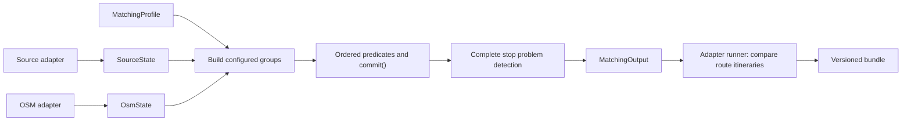
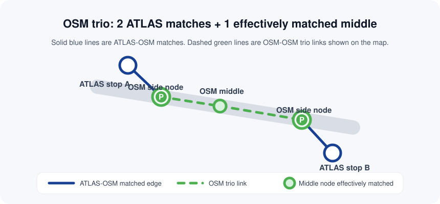
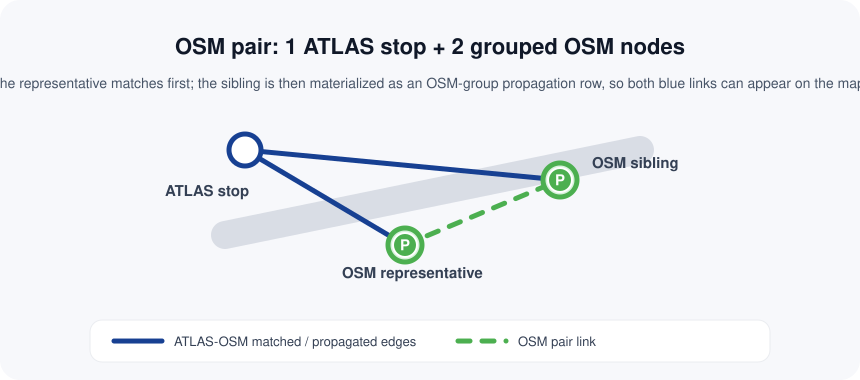
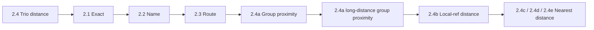
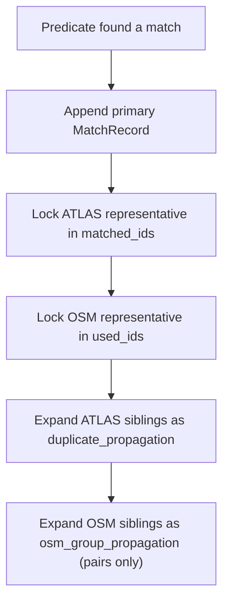

# E2 Matching Process

The engine matches normalized source stops with OSM public transport elements. Its public API is `transport_matcher.match(source, osm, profile)`. The Swiss profile preserves the existing ordered matching and allocation behavior; other feeds can use the same engine without Swiss identifiers.

```python
from transport_matcher import match
from transport_matcher.core.models import SourceStop, OsmNode
from transport_matcher.profiles import MatchingProfile

result = match(
    [SourceStop(namespace="agency", source_id="A", lat=48.0, lon=2.0, name="Central")],
    [OsmNode(node_id="1", lat=48.0, lon=2.0, name="Central", public_transport="platform")],
    MatchingProfile(),
)
```

No application, database, network connection or source file is needed for this example. `match()` copies its inputs into fresh per-run states, so separate runs cannot share allocation or route state.

## End-to-end flow



`api.py` handles normalized stop matching and problem detection. `swiss.run_matching(...)` and `adapters.gtfs.run_gtfs(...)` additionally compose file adapters and complete route comparison. The web importer persists exported decisions.

## Records, state and policies

| Component | Responsibility |
|---|---|
| `SourceStop` | Stable `namespace:source_id` key, position, name, platform code, optional references, parent and extensions |
| `Reference` | An identifier's namespace, value and scope; a station reference differs from a platform identifier |
| `OsmNode` | OSM tags, position and typed identity (`osm:node:1`, `osm:way:1`) |
| `SourceState` | Explicit source records, duplicate groups, optional route evidence and matched allocation |
| `OsmState.from_records()` | Explicit OSM records, reference/name indexes and lazy spatial queries |
| `RouteState.from_records()` | Per-run route equivalencies from already normalized route products |
| `MatchingProfile` | Compatible reference rules, predicate order, grouping policy and distance/problem thresholds |

Parsing belongs in adapters. `adapters.atlas` maps `sloid` to `source_id`, `designationOfficial` to `name`, `designation` to `platform_code`, and `number` to the configured station reference. It supplies Swiss duplicate groups. `adapters.osm.read_osm()` parses XML and passes records/evidence to state; co-located nodes remain distinct.

A GTFS adapter supplies a different namespace and does not infer UIC references from arbitrary `stop_id` strings. Generic exact matching uses explicit compatible `ReferenceRule`s. Swiss station-reference allocation is enabled by `profiles.SWITZERLAND`.

## What counts as a match

A `MatchRecord` links `source_node` to `osm_node`, with `match_type`, `distance_m`, readable `notes`, structured `evidence`, and computed `problems`. Predicates query the current unmatched view and call `ctx.commit()`; that call locks representatives immediately and expands supported sibling groups.

The Swiss profile preserves these allocations:

| Cardinality | Reason |
|---|---|
| Many source stops to one OSM element | The only compatible UIC candidate, or source duplicate propagation |
| One source stop to several OSM elements | A single source candidate for a UIC, or OSM pair propagation |
| Two source stops to two trio sides | The middle stop position remains a structural member |

A trio middle does not become an additional `MatchRecord`. The engine marks it in `effectively_matched_osm_ids` when both sides match; the app projects that decision into its map tables.

## Swiss duplicate and OSM grouping policies

The following detailed rules describe the Swiss profile. Generic profiles can disable grouping or configure a different policy. Source duplicate grouping is prepared by `adapters.atlas.atlas_state()`: the same nonempty `(station_ref, platform_code)` creates a group; the first sorted source key is the representative. The state receives that group explicitly, without reading a DataFrame or file.

### OSM grouping before predicates

`OsmState.build_groups()` runs before matching so obvious OSM siblings behave like one logical entity during predicate execution.

Grouping now runs in two layers, in this order:

1. **Trios first** (`osm_trio`) for strict 3-node UIC cases.
2. **Pairs second** for all remaining reciprocal sibling pairs, with a perfect-count branch first.

The map uses one consistent visual convention for grouped OSM structures:

- Solid blue lines are ATLAS-OSM matches.
- Dashed green lines are OSM-OSM structural links inside a pair or trio.
- Trio middles are shown on the map once imported as `effectively_matched`, but they are still not pipeline `MatchRecord`s.

| Group type | Representative | Sibling(s) | Core rule |
|------------|----------------|------------|-----------|
| `osm_trio` | One non-middle side node | Side partner + identified middle | UIC-scoped trio: exactly 3 OSM nodes + exactly 1 stop_position + exactly 2 ATLAS rows for that UIC, with both side nodes within 15 m of the middle |
| `osm_pair_uic_equal_15m` | `public_transport=platform` | `public_transport=stop_position` | UIC-scoped perfect-count branch: `platform_count == stop_position_count == atlas_effective_count`; reciprocal nearest-neighbour within 15 m; no ratio gate |
| `osm_pair_uic` | `public_transport=platform` | `public_transport=stop_position` | Reciprocal nearest-neighbour pairing within 12 m, UIC-scoped |
| `osm_pair_name_equal_15m` | `public_transport=platform` | `public_transport=stop_position` | Name-scoped perfect-count branch (anchored to UIC): equal counts + reciprocal nearest-neighbour within 15 m; no ratio gate |
| `osm_pair_name` | `public_transport=platform` | `public_transport=stop_position` | Same spatial pairing, but name-scoped and anchored back to a UIC |
| `osm_pair_tram_equal_15m` | `railway=tram_stop` | `public_transport=stop_position` | Tram-scoped perfect-count branch: equal counts + reciprocal nearest-neighbour within 15 m; no ratio gate |
| `osm_pair_tram` | `railway=tram_stop` | `public_transport=stop_position` | Same pairing logic for tram stops |

#### Visual examples

The screenshots below are represented as simplified SVG schematics so the pair/trio semantics remain readable in the documentation PDF as well.

**OSM trio matched to 2 ATLAS stops**



The trio's two side nodes are the only true pipeline matches. The middle `stop_position` remains unmatched during predicate execution, then becomes `effectively_matched` during import so it can be rendered on the map with dashed green OSM-OSM links to both sides.

**OSM pair matched to 1 ATLAS stop**



For a pair, the representative node matches first and `ctx.commit()` propagates that result to the sibling as `osm_group_propagation`. On the map this reads as two blue ATLAS-OSM links plus one dashed green OSM-OSM pair link.

Important details:

1. Grouping uses reciprocal nearest-neighbour checks, not just raw proximity.
2. Trios are only registered when both side nodes are within `15 m` of the middle `stop_position`; otherwise those nodes stay available for the later pair grouping paths.
3. For perfect-count anchors (`left_count == right_count == atlas_effective_count`), grouping first tries reciprocal conflict-free pairing within `15 m` and bypasses ratio checks.
4. `atlas_effective_count` is computed per UIC by counting only ATLAS rows whose nearest same-UIC OSM node is within `30 m`.
5. The strict/relaxed fallback path still uses the original (unfiltered) `atlas_count`.
6. If the perfect-count branch does not apply or cannot produce a full 1:1 pairing, it tries a `1.5` ratio threshold and accepts those pairs only when grouped + ungrouped OSM entities exactly match the ATLAS count for that anchor.
7. If the strict complete-count check fails, it retries with `2.0` and accepts reciprocal pairs it finds as an incomplete group set.
8. In ratio-based paths, the ratio test compares the nearest candidate (which must be within `12 m`) against the true second-nearest candidate, even if that second candidate is beyond `12 m`. If no second candidate exists at all, the ratio test does not reject the pair.
9. The same perfect-count-first then strict-vs-incomplete policy applies to UIC, name, and tram pairing paths.

After grouping, lookup methods such as `get_by_uic()`, `get_by_name()`, and `batch_query_radius()` return `OsmEntity` wrappers for representatives while hiding siblings.

## Phase 2: Run the Predicate Pipeline

The runner executes predicates in this order:



Each predicate sees only the current unmatched view of the state. Once a representative is committed, later predicates skip it automatically.

| Execution | Predicate | Match types | What it actually does |
|------|-----------|-------------|------------------------|
| `1` | [`TrioDistanceMatchingPredicate`](2.4%20Distance%20matching.md) | `distance_matching_trio` | **Absolute first run.** For each trio UIC with exactly 2 unmatched ATLAS rows, match the two non-middle side nodes via minimum-total-distance 2x2 assignment; keep middle node unmatched |
| `2` | [`ExactReferencePredicate`](2.1%20Exact%20matching.md) | `exact` | Matches `SourceStop.station_ref` to `OsmNode.uic_ref`; when both sides have multiples, refines by `designation == local_ref` |
| `3` | [`NameMatchPredicate`](2.2%20Name%20matching.md) | `name` | Matches `designationOfficial` through the OSM name index and optionally refines by `designation == local_ref` |
| `4` | [`RouteMatchPredicate`](2.3%20Stop-stop%20matching%20using%20routes.md) | `route_gtfs_tokens`, `route_gtfs_direction` | Still limited to 50 m, then commits only mutual unique-best route-supported edges: GTFS token overlap first and exact direction-name fallback second; equal-strength ambiguities are skipped |
| `5` | [`GroupProximityPredicate`](2.4%20Distance%20matching.md) | `distance_matching_1_uic_ref`, `distance_matching_1_uic_name`, `distance_matching_1_name` | Conflict-free maximum-cardinality assignment within grouped ATLAS and OSM candidates |
| `6` | [`GroupProximityPredicate` configured with `profile.long_distance`](2.4%20Distance%20matching.md) | `long_distance_group_proximity_uic_ref`, `long_distance_group_proximity_uic_name`, `long_distance_group_proximity_name` | Repeats the group-proximity logic with a wider `150 m` cap to catch conflict-free grouped matches that the 50 m pass leaves behind |
| `7` | [`LocalRefDistancePredicate`](2.4%20Distance%20matching.md) | `distance_matching_2` | Exact `designation == local_ref` within 50 m |
| `8` | [`NearestDistancePredicate`](2.4%20Distance%20matching.md) | `distance_matching_3a` | First single-candidate nearest-distance pass within 50 m |
| `9` | [`NearestDistancePredicate`](2.4%20Distance%20matching.md) | `distance_matching_3b` | Ratio-test nearest-distance pass within 50 m |
| `10` | [`NearestDistancePredicate`](2.4%20Distance%20matching.md) | `distance_matching_3a_second_pass` | Second single-candidate nearest-distance retry after ratio-pass locking |

### Predicate contract

All predicates implement the same interface:

```python
class BasePredicate(ABC):
    @abstractmethod
    def run(self, ctx: MatchingContext) -> None:
        ...
```

They do not return match records. They query state and call `ctx.commit()` when they decide to match.

## Phase 3: Record Matches Through `ctx.commit()`

`MatchingContext.commit()` is the only mutation gateway in the pipeline.



For `osm_trio` groups, `ctx.commit()` intentionally skips OSM sibling propagation so the trio middle node does not become an `osm_group_propagation` match. The engine records the middle node in `effectively_matched_osm_ids` when both side nodes match. Import only projects that exported decision for querying and map rendering.

That immediate locking is why the pipeline is safe even inside a single predicate loop: later rows consult the updated state, not just the original snapshot.

This matters especially for the predicates that batch KDTree lookups up front:

1. `LocalRefDistancePredicate`
2. `NearestDistancePredicate`
3. `RouteMatchPredicate`

They all re-check `used_ids` against the live state before committing so they do not reuse a stale candidate computed earlier in the same run.

## Phase 4: Global Matching Rules

### Station filtering

| Predicate family | Stations excluded? | Notes |
|------------------|--------------------|-------|
| Exact and name matching | Yes, according to `OsmNode.is_station` | `get_by_uic()` and `get_by_name()` exclude `public_transport=station` and `railway=station`; `aerialway=station` remains eligible because `OsmNode.is_station` explicitly returns `False` for aerialway stations |
| Group proximity, local-ref, nearest-distance, and route matching | Yes, according to `OsmNode.is_station` | Grouped lookups and `batch_query_radius(..., include_stations=False)` apply the same filter |
| Trio distance matching | No additional station filter | It operates on the two side nodes of already registered UIC trios |

### Spatial constants

| Constant | Value | Used by |
|----------|-------|---------|
| `max_distance` | `50 m` | Route matching, the first group-proximity pass, local-ref matching, and nearest-distance matching |
| `profile.long_distance` | `150 m` | Long-distance group-proximity pass |
| `profile.ratio_factor` | `4` | `NearestDistancePredicate` |
| `profile.ratio_min_second_distance` | `10 m` | `NearestDistancePredicate` |
| `profile.grouping.pair_distance` | `12 m` | OSM pre-grouping |
| `profile.grouping.perfect_count_distance` | `15 m` | OSM pre-grouping perfect-count branch |
| `profile.grouping.trio_middle_distance` | `15 m` | OSM trio registration |
| `profile.grouping.nearby_source_distance` | `30 m` | Perfect-count source effective count |

### Distance storage

All predicates store the actual haversine distance they used, including exact UIC matches.

## Outputs

`run_pipeline()` returns a `PipelineResult`; the public `match()` API completes grouping and problem results into `MatchingOutput`. The source-specific runner adds routes and extensions.

| Type | Fields | Description |
|------|--------|-------------|
| `PipelineResult` | `matched`, `unmatched_source`, `unmatched_osm` | Pure pipeline output |
| `MatchingOutput` | `PipelineResult` fields plus all source/OSM entities, groups, problems, diagnostics, metadata, routes and extensions | Complete domain output for result export |

`unmatched_source` contains all unmatched nodes, including hidden duplicate siblings of unmatched representatives. `unmatched_osm` contains all unmatched OSM nodes, including group siblings and stations if they were never used.

### No-nearby-OSM detection

The engine computes `source_isolated_keys` and `isolated_osm_ids` using the profile isolation radius (50 m for Switzerland). That does **not** create additional matches; it feeds [problem detection](4.%20Problems.md).

## Domain Models

The pipeline uses three core domain models plus two entity wrappers.

| Type | Purpose |
|------|---------|
| `SourceStop` | Immutable ATLAS platform model |
| `OsmNode` | Immutable OSM node model |
| `MatchRecord` | Mutable link object with match metadata |
| `SourceEntity` | Wrapper that exposes one representative plus duplicate siblings |
| `OsmEntity` | Wrapper that exposes one representative plus grouped OSM siblings |

Key fields on `SourceStop`:

| Field | Source |
|-------|--------|
| `namespace`, `source_id`, `key` | `atlas`, native SLOID, `atlas:<sloid>` |
| `station_ref` | `number`, governed by the Swiss reference rule |
| `platform_code` | `designation` |
| `name` | `designationOfficial` |
| `operator` | `servicePointBusinessOrganisationAbbreviationEn` |

Key fields on `OsmNode`:

| Field | Source |
|-------|--------|
| `node_id` | XML node id |
| `local_ref` | `local_ref`, falling back to `ref` |
| `name` | `name` |
| `uic_name` | `uic_name` |
| `uic_ref` | `uic_ref` |
| `network`, `operator` | Same-named OSM tags |
| `public_transport`, `railway`, `amenity`, `aerialway` | Same-named OSM tags |
| `tags` | Full tag dict |

## Performance Notes

Spatial matching uses a lazy `scipy.spatial.cKDTree` over 3D unit-sphere coordinates. The tree is cached and only rebuilt when the station-inclusion mode changes; matched nodes are filtered at query time rather than by rebuilding the tree after every commit.

The batched KDTree path is used by the local-ref, nearest-distance, and route predicates. `GroupProximityPredicate` does not use the KDTree; it builds a full pairwise distance matrix with NumPy broadcasting over each grouped candidate set.

## Result summary

Every result bundle includes source-stop, OSM-element, match, unmatched and problem totals in its metadata. The engine documentation stays independent of a particular imported snapshot; the review application may display the values from its active bundle.

## Code References

| Component | File |
|-----------|------|
| Domain models | [models.py](../src/transport_matcher/core/models.py) |
| Swiss adapter runner | [swiss.py](../src/transport_matcher/swiss.py) |
| Pipeline framework | [pipeline.py](../src/transport_matcher/core/pipeline.py) |
| State management | [state.py](../src/transport_matcher/core/state.py) |
| Exact matching | [predicates/exact_matching.py](../src/transport_matcher/core/predicates/exact_matching.py) |
| Name matching | [predicates/name_matching.py](../src/transport_matcher/core/predicates/name_matching.py) |
| Distance matching | [predicates/distance_matching.py](../src/transport_matcher/core/predicates/distance_matching.py) |
| Route matching | [predicates/route_matching_gtfs.py](../src/transport_matcher/core/predicates/route_matching_gtfs.py) |
| Spatial index | [utils/spatial_index.py](../src/transport_matcher/core/utils/spatial_index.py) |
