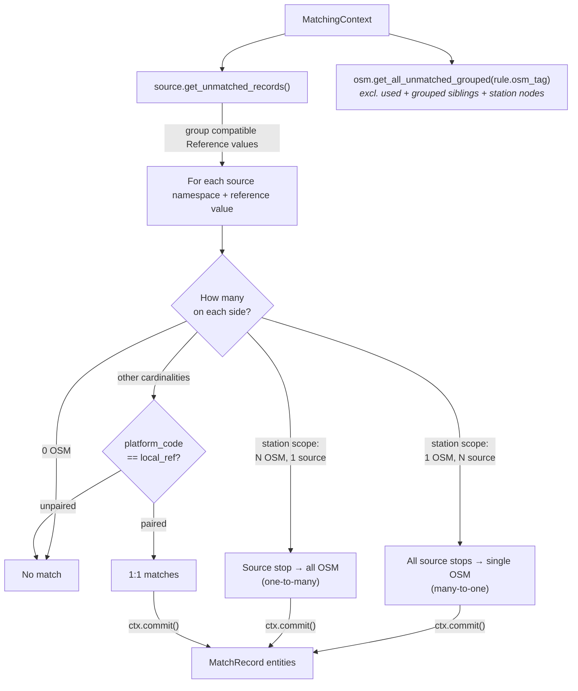

# Exact Matching

The generic `ExactReferencePredicate` compares explicitly compatible `Reference` and `ReferenceRule` values. Equal strings from different namespaces do not establish identity. The UIC scenarios below describe the Swiss profile, which enables station-reference allocation. Feeds without compatible references skip this stage and can still match by name, routes or distance.

Exact matching is the **second predicate run** in the pipeline. It produces the highest-confidence identifier-based matches through profile-approved references; in the Swiss profile, that reference is the shared UIC number.

## Overview

The UIC (Union Internationale des Chemins de fer) reference is a standardized identifier used across European rail systems.

| Dataset | UIC Field | Domain Model Field | Example |
|---------|-----------|-------------------|---------|
| ATLAS | `number` | `SourceStop.station_ref` | 8503000 |
| OSM | `uic_ref` tag | `OsmNode.uic_ref` | 8503000 |

**Result**: {{stat:matching_stages.exact.count}} exact matches

## How It Works

`ExactReferencePredicate` iterates the active profile's `ReferenceRule`s. For each rule, it groups compatible source `Reference` values by source namespace and looks up unmatched OSM candidates through the rule's configured tag. `ReferenceRule.accepts()` verifies identifier namespace, stop/station scope, source namespace, OSM tag, and any optional OSM feed/agency scope before a match can be committed.

Station-scoped rules intentionally preserve the Swiss many-to-one and one-to-many allocation shown below. For a stop-scoped rule, repeated source declarations of the same identifier are treated as ambiguous and reported in diagnostics rather than expanded as station links.

> **Implementation note**: exact matches store the actual haversine distance between the ATLAS and OSM coordinates.

## Matching Scenarios

| Scenario | Example | Resolution |
|----------|---------|------------|
| **1 OSM → N ATLAS** | Single node, multiple platforms | All ATLAS entries match to one node |
| **N OSM → 1 ATLAS** | Multiple nodes, single platform | One platform matches all nodes |
| **N OSM ↔ M ATLAS** | Multiple both sides | Disambiguate by `designation` ↔ `local_ref` |

### Disambiguation

When both sides have multiple entries with the same UIC, the `designation` field (`SourceStop.platform_code` — the ATLAS platform number) is matched against `local_ref` (`OsmNode.local_ref` — the OSM platform identifier), case-insensitively.

ATLAS entries without a matching `designation`/`local_ref` remain unmatched in this stage. If several OSM candidates share the same matching `local_ref` under a station-scoped rule, the predicate takes the first still-unused candidate in adapter order. It checks `ctx.osm.is_used()` to avoid double-booking an OSM node within the many-to-many case.

| Field | Domain Model | Meaning | Example |
|-------|-------------|---------|---------|
| `designation` | `SourceStop.platform_code` | Platform identifier (letter/number) | "A", "1", "Nord" |
| `designationOfficial` | `SourceStop.name` | Full stop name | "Zurich HB" |
| `local_ref` | `OsmNode.local_ref` | Platform identifier | "A", "1" |
| `uic_ref` | `OsmNode.uic_ref` | UIC reference number | "8503000" |

**Key distinction**: `platform_code` is distinct from `name`
- `platform_code`: Platform-level identifier (e.g., "Track 1")
- `name`: Station/stop name (e.g., "Zurich HB")

This ensures we match individual platforms rather than entire station buildings.

## Code Reference

| Class | Description |
|-------|-------------|
| `ExactReferencePredicate` | Predicate class; applies explicit reference rules and preserves station-scoped allocation/disambiguation behavior |

All logic is in [predicates/exact_matching.py](../src/transport_matcher/core/predicates/exact_matching.py).
