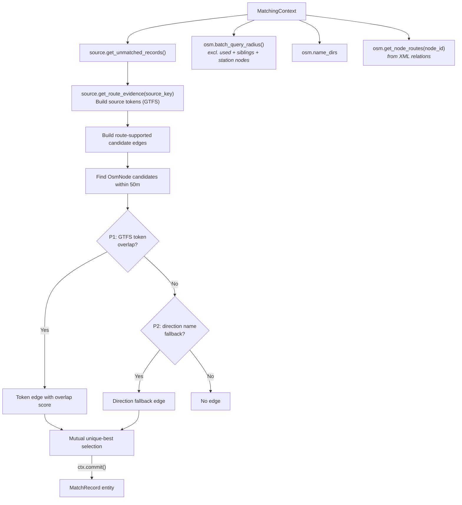

# E2.3 Route Matching

Route matching is the **fourth predicate run** in the pipeline, before the distance-matching block, and correlates ATLAS platforms with OSM nodes based on **shared GTFS transit routes and directions**.

## Overview

While the previous predicates rely on exact UICs or names, **Route Matching** provides an earlier disambiguation layer before the purely distance-driven predicates run.

Importantly, this is still a **spatial, stop-to-stop matching process**, not just linking abstract routes. For every unmatched ATLAS stop, the predicate looks for unmatched OSM stops within a 50m radius. Route data acts as the proof that two physically close points are indeed the same stop, but the predicate is intentionally conservative: it only commits route-supported edges that are the **unique strongest choice on both sides**. Candidate collection uses `batch_query_radius(..., include_stations=False)`, which excludes `public_transport=station` and `railway=station`; `aerialway=station` stays eligible because `OsmNode.is_station` explicitly returns `False` for aerialway stations.

Each result bundle records the run-specific number of route-based matches.

Unlike the row-by-row exact, name, local-ref, and nearest-distance predicates, route matching builds a global set of route-supported candidate edges and commits only mutual unique-best edges. This prevents the old greedy behavior where the first route-compatible ATLAS row could consume an OSM node even when another unmatched ATLAS stop had stronger route evidence.

## Required Data

Route matching relies entirely on data owned by the state layer — the predicate performs no file I/O:

- `OsmNode` candidates found via batched `OsmState.batch_query_radius()` within `max_distance`
- `OsmState.name_dirs` — per-node direction strings (parsed from XML relations)
- `OsmState._node_routes` via `ctx.osm.get_node_routes(node_id)` — per-node GTFS route memberships derived from OSM XML relations during `adapters.osm.read_osm()`
- `SourceState._route_evidence_by_key` via `ctx.source.get_route_evidence(source_key)` — normalized route entries supplied by the source adapter; state construction reads no files

Route state is a fresh `RouteState.from_records(...)` per run, passed through `MatchingContext`. Adapters supply normalized route IDs: the Swiss adapter normalizes `-j25` to `-jXX`, while generic GTFS IDs retain their feed namespace and original text. Missing source or OSM route evidence produces a `route_evidence_unavailable` diagnostic and skips evidence-dependent checks.

## Token-Based Matching

Route data is converted into comparable tokens. The predicate tries two priority levels:

### P1: GTFS Route-ID Tokens

The predicate primarily compares per-stop GTFS route tokens that are already loaded into `SourceState` and `OsmState`:

- **ATLAS Tokens**: Raw and normalized `(route_id, direction_id)` tokens built from the normalized GTFS route CSVs. Rows without a direction or usable route identifier are skipped.
- **OSM Candidates**: For each nearby node, `ctx.osm.get_node_routes(node_id)` contributes `(gtfs_route_id, direction_id)` and `(normalize_route_id(gtfs_route_id), direction_id)` tokens derived from the XML relation pass.

`run_matching()` constructs per-run `RouteState` from normalized in-memory route records before the predicate pipeline. When that state contains a mapping for an OSM relation ID, the token builder also adds the mapped ATLAS route ID and its normalized form before intersecting it with the ATLAS tokens.

Normalized route IDs are therefore carried on the ATLAS side in `atlas_line_families.csv` and computed on the OSM side at match time. `RouteState` uses the same normalization helper when it is populated.

If `ref_trips` does not yield a direction, OSM route extraction currently emits both direction buckets (`0` and `1`) for that relation membership so route-id evidence can still participate.

### P2: Name-Based Direction Fallback

ATLAS direction names are compared against OSM route relation direction strings (first/last member names like `"Zurich HB → Bern"`), stored in `OsmState.name_dirs`. The current implementation checks exact direction-string membership.

## Selection Rule

The predicate does not match greedily per ATLAS row.

1. Build every candidate token edge within 50 m and score it by GTFS token overlap size.
2. For each ATLAS stop, keep only its unique best-scoring token edge.
3. For each OSM node, keep only its unique best-scoring token edge.
4. Commit only edges that are unique-best from both directions.
5. After token-edge commits, apply the same mutual unique-best rule to the pre-collected direction-only edges whose ATLAS and OSM endpoints are still free.
6. A tied best score is not committed in that priority pass; any still-free endpoint proceeds to direction-only selection and, if still unmatched, to the later distance predicates.

## Data Sources

| Source | File / Origin | Loaded by | Description |
|--------|--------------|-----------|-------------|
| GTFS routes | `data/processed/atlas_line_families.csv`, `atlas_itineraries.csv`, `atlas_itinerary_stop_calls.csv` | `SourceState` | Timetable-derived route entries per SLOID for stop-level matching |
| OSM routes | OSM XML relations | `adapters.osm.read_osm()` | Route memberships per OSM node (via relation ID) |
| Route equivalency state | Adapter-supplied source-family records plus OSM relation frames derived from the current XML | `RouteState.from_records()` before the predicate pipeline | Exact/normalized source line-family crosswalk used when building OSM tokens |

## Related Documentation

- [E1.2 GTFS](1.2%20GTFS%20ATLAS%20data.md) – GTFS route extraction
- [E1.3 OSM data](1.3%20OSM%20data.md) – OSM route extraction
- [E3.2 Route-Route Matching](3.2%20Route-Route%20Matching.md) – Route-level source↔OSM linking in the engine

(Route provenance is tracked in the output via `match_type`: `route_gtfs_tokens` for token-overlap matches and `route_gtfs_direction` for exact direction-name fallback matches.)

## When Route Matching Succeeds

Route matching is particularly effective for:

1. **Platforms without UIC**: Some `OsmNode` entities lack `uic_ref` but have route memberships
2. **Ambiguous proximity**: When multiple `OsmNode` entities are nearby, shared routes disambiguate
3. **Direction conflicts**: When nearby ATLAS platforms share a UIC but serve opposite directions, route evidence prevents early distance locking from picking the wrong side

## Code Reference

| Class / Method | Description |
|----------------|-------------|
| `RouteMatchPredicate` | Predicate class; leverages `RouteState` and `batch_query_radius()` |
| `ctx.source.get_route_evidence(source_key)` | Returns route assignments for a normalized source key |
| `ctx.osm.get_node_routes(node_id)` | Returns relation memberships for an OSM node |
| `RouteState.get_source_route()` | Returns the mapped source route for a given OSM relation ID |

All predicate logic is in [predicates/route_matching_gtfs.py](../src/transport_matcher/core/predicates/route_matching_gtfs.py). Route state logic lives in [route_state.py](../src/transport_matcher/core/route_state.py).
