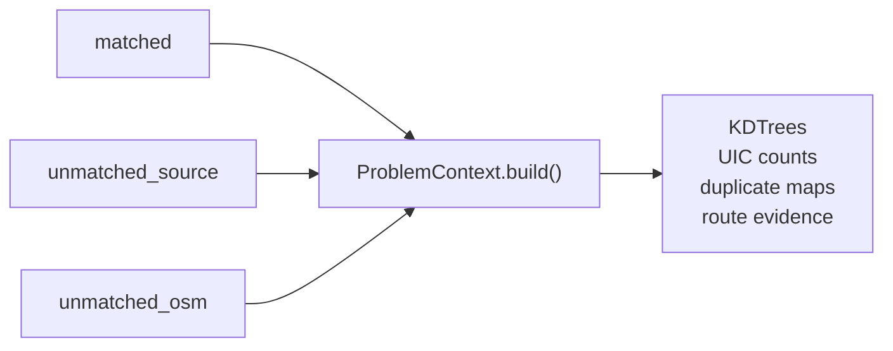
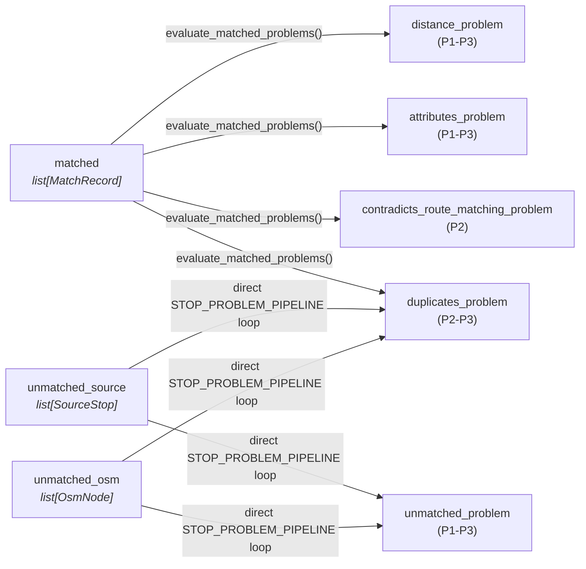

# 4.1 Stop Problems

Stop problems are detected **after the matching pipeline completes** and identify data quality issues regarding individual stops.

Detection uses a **predicate pipeline** mirroring the matching pipeline architecture. During the standalone engine run, `ProblemContext.build()` precomputes shared indexes (KDTrees, UIC counts, duplicate maps, and route evidence lookups) from the `MatchingOutput`. Each eligible record is then evaluated by the configured stop problem predicates.

> [!NOTE]
> The implemented problem pipeline is currently stop-scoped only. It writes `Problem` rows against `stops_matched.id` and runs the five stop predicates listed below. Route evidence is used only by the stop-level `contradicts_route_matching` predicate; route entity and route membership problem pipelines are still planned documentation, not active emitted problem rows.

**Code**: [problem-detection pipeline](../src/transport_matcher/core/problem_detection/pipeline.py)

## How Detection Runs

#### 1. Context construction — `ProblemContext.build(MatchingOutput)`

The three matching-output lists are used during a single context-construction step to precompute shared indexes. The builder traverses them as needed for the spatial, UIC-count, and duplicate indexes. The resulting `ProblemContext` is then passed as the `ctx` argument to every predicate call.



#### 2. Invocation — which records are evaluated by which predicates

Each record is passed individually as the predicate's record argument. Predicates use `isinstance` checks to decide whether they apply and return `[]` when the record type is irrelevant.



### Invocation Paths

**Matched records** use `MatchRecord.evaluate_matched_problems()`, which calls each predicate with the `MatchRecord` itself. The predicates access `record.source_node` and `record.osm_node` directly:

```python
current_match.evaluate_matched_problems(problem_ctx, STOP_PROBLEM_PIPELINE)
```

**Unmatched records** are passed as bare `SourceStop` or `OsmNode` entities directly to every configured predicate. The runtime also records the nearest-counterpart distance as exported problem evidence:

```python
for predicate in STOP_PROBLEM_PIPELINE:
    for result in predicate(problem_ctx, source_node):
        # Convert result to an exported DetectedProblem.
        ...
```

The separately exported `evaluate_unmatched_problems(...)` helper is available to callers that want a collected list. Each predicate uses `isinstance` checks to decide whether it applies — `distance_problem` returns `[]` for bare nodes, `unmatched_problem` returns `[]` for `MatchRecord`, etc.

Adapters validate source identity and WGS84 coordinates. The engine evaluates all normalized entities; `(0, 0)` is a valid geographic position rather than an implicit missing-coordinate sentinel.

## `ProblemContext`

Built once from `MatchingOutput` via `ProblemContext.build()`, providing precomputed indexes:

| Index | Type | Purpose |
|-------|------|---------|
| `osm_kdtree` | `KDTree` | Spatial queries for isolation detection (all OSM coords) |
| `source_kdtree` | `KDTree` | Spatial queries for OSM isolation detection (all normalized source coordinates) |
| `source_count_by_uic` | `dict[str, int]` | Source occurrences per configured station reference across matched records and unmatched entities |
| `osm_count_by_uic` | `dict[str, int]` | OSM occurrences per UIC across matched records and unmatched entities |
| `osm_platform_count_by_uic` | `dict[str, int]` | Platform-like OSM occurrences per UIC |
| `duplicate_key_map` | `dict[str, list[str]]` | Source duplicate groups |
| `duplicate_osm_group_map` | `dict[str, list[str]]` | OSM duplicate groups by `(uic_ref, local_ref)` |
| `duplicate_osm_node_ids` | `set[str]` | All OSM node IDs in a duplicate group |
| `handled_duplicate_keys` | `set[str]` | Individual source keys whose match record has `match_type='duplicate_propagation'` |
| `source_route_evidence_by_key` | `dict[str, dict[str, list]]` | Per-source-key GTFS route evidence used for route-contradiction checks |
| `osm_node_routes` | `dict[str, list[dict]]` | Per-node OSM route memberships used for route-contradiction checks |
| `osm_name_dirs` | `dict[str, set[str]]` | Per-node direction strings used for route-contradiction fallback checks |

The UIC maps count occurrences rather than deduplicating entity IDs. A node or SLOID represented by multiple `MatchRecord` objects therefore contributes more than once.

## Stop Problem Types

| Problem Type | Description | Priorities | Applies to |
|--------------|-------------|------------|------------|
| **Distance** | Matched pairs too far apart | P1, P2, P3 | `MatchRecord` only |
| **Attributes** | Inconsistent data for matched pairs | P1, P2, P3 | `MatchRecord` only |
| **Contradicts Route Matching** | Matched pair conflicts with its own route evidence | P2 | `MatchRecord` only |
| **Unmatched** | Stops without a counterpart | P1, P2, P3 | `SourceStop` / `OsmNode` only |
| **Duplicates** | Redundant entries | P2, P3 | All three types |

---

## 4.1.1. Distance Problems

Flag matched pairs where physical distance exceeds tolerance. This typically indicates either a matching error or significant coordinate discrepancy between datasets.

The predicate reads `record.distance_m` and `record.source_node.operator` directly from the `MatchRecord`.

### Thresholds

The defaults come from `MatchingProfile.distance_priorities = (80, 25, 15)`. A profile can override all three values and configure `distance_priority_exempt_operators`.

### Priority Logic

| Priority | Condition | Rationale |
|----------|-----------|-----------|
| **P1** | Non-SBB AND distance > 80m | Large displacement for any operator abbreviation other than `SBB` |
| **P2** | Non-SBB AND 25m < distance <= 80m | Moderate displacement |
| **P3** | SBB AND distance > 25m | Railway tolerance (large platforms) |
| **P3** | Any operator AND 15m < distance <= 25m | Minor displacement |

> [!NOTE]
> **SBB** platforms can span many meters, so higher distance tolerance is applied. The SBB check uses `SourceStop.operator`.

**Example**: A bus stop matched with 85m distance would be flagged as **P1** (critical), while a train platform with the same distance would be **P3** (minor).

---

## 4.1.2. Unmatched Problems

Identify stops that failed to match. The predicate receives bare `SourceStop` or `OsmNode` entities and uses `ProblemContext` spatial indexes to compute isolation.

### ATLAS Unmatched Priority

Uses `ctx.nearest_osm_distance()` (KDTree query) and `ctx.osm_count_by_uic`:

| Priority | Condition | Rationale |
|----------|-----------|-----------|
| **P1** | A UIC is present and `ctx.osm_count_by_uic` has 0 entries for it | Completely missing counterpart |
| **P1** | Nearest OSM node > 80m away (or none) | Completely isolated |
| **P2** | Nearest OSM node > 50m away | Partially isolated |
| **P2** | Platform count mismatch (ATLAS vs OSM for same UIC) | Data inconsistency |
| **P3** | All other unmatched | Has nearby candidates |

### OSM Unmatched Priority

Uses `ctx.nearest_source_distance()` (KDTree query) and `ctx.source_count_by_uic`:

| Priority | Condition | Rationale |
|----------|-----------|-----------|
| **P1** | A UIC is present and `ctx.source_count_by_uic` has 0 entries for it | Completely missing counterpart |
| **P2** | Nearest ATLAS stop > 50m away (or none) | Spatially isolated, but still lower than the no-ATLAS-by-UIC case |
| **P2** | Platform count mismatch (ATLAS vs OSM for same UIC) | Data inconsistency |
| **P3** | All other unmatched | Has nearby candidates |

### Isolation Detection

Isolation is computed using `ProblemContext.nearest_osm_distance()` / `nearest_source_distance()`, which query the precomputed KDTrees. The engine also exports source isolation flags at the profile radius (50 m for Switzerland); the app projects them as `match_type='no_nearby_counterpart'` in `stops_matched`.

---

## 4.1.3. Attribute Problems

Flag inconsistencies between matched pairs. The predicate reads fields directly from `record.source_node` and `record.osm_node` on the `MatchRecord`.

### Priority Logic

| Priority | Condition | Fields Compared |
|----------|-----------|-----------------|
| **P1** | Different configured station reference | `SourceStop.station_ref` vs `OsmNode.station_ref` |
| **P1** | Different configured name | `SourceStop.name` vs the first available OSM tag in `MatchingProfile.problem_name_tags` |
| **P2** | Different local reference | `SourceStop.platform_code` vs `OsmNode.local_ref` |
| **P3** | Different operator | `SourceStop.operator` vs `OsmNode.operator` |

> **Note**: A field is compared only when both sides are present. Name, local-ref, and operator comparisons are case-insensitive; station-reference comparisons are exact and run only when the active profile permits station-reference matching for that source stop. The Swiss profile uses only `uic_name`; the generic default checks `name` and then `uic_name`. Each check can be individually toggled via `ENABLE_*_CHECK` constants in `context.py`. The predicate emits one `attributes` result at the highest-severity mismatch found, not one row per mismatched field.

---

## 4.1.4. Contradicts Route Matching Problems

Flag matched pairs whose own route evidence contradicts the chosen ATLAS↔OSM stop pairing. This predicate reads route evidence from `ProblemContext.source_route_evidence_by_key`, `ProblemContext.osm_node_routes`, and `ProblemContext.osm_name_dirs`, then reuses the same route-alignment classifier as the matching pipeline. Missing or inconclusive evidence does not produce a problem.

### Priority Logic

| Priority | Condition | Evidence Compared |
|----------|-----------|-------------------|
| **P2** | Token-level GTFS route contradiction | ATLAS GTFS route/direction tokens vs OSM GTFS route/direction tokens |
| **P2** | Direction-name contradiction | ATLAS direction names vs OSM relation direction strings |
---

## 4.1.5. Duplicate Problems

Identify redundant entries in either dataset. This predicate is **polymorphic** — it handles `MatchRecord`, `SourceStop`, and `OsmNode`.

| Priority | Type | Condition | Detection |
|----------|------|-----------|-----------|
| **P3** | OSM | Same `(uic_ref, local_ref)` for `public_transport in {platform, stop_position}` nodes, excluding members of pre-grouped non-single OSM stop units | Pre-computed in `ProblemContext._build_osm_duplicate_map()` |
| **P2** | ATLAS | `sloid` appears in `duplicate_key_map` and was not already handled by `duplicate_propagation` | From matching pipeline's `SourceState` plus `handled_duplicate_keys` |

OSM duplicates are only flagged for nodes with `OsmNode.public_transport` equal to `platform` or `stop_position`. Members of both pre-grouped pairs and trios are excluded. When both ATLAS and OSM duplicates exist, only the OSM duplicate is flagged (OSM-side takes precedence). Suppression is per SLOID: an ATLAS SLOID whose own match has `match_type='duplicate_propagation'` is suppressed, while another member of the same duplicate group can still be reported.
