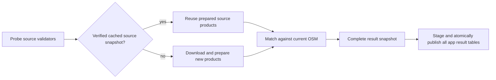

# E5.1 Source Snapshot Caching

The original `atlas_cached` database refresh mode has been replaced by complete versioned result bundles. The existing page filename is retained so documentation links remain stable.

The engine's `adapters/acquisition.py` owns source download caching. It compares usable HTTP validators and verifies cached output fingerprints before reuse. A successful refresh records source metadata, filtering statistics and GTFS identity statistics in the acquisition workspace. OSM is refreshed for each full run.

A cached input can accelerate matching preparation without making the consumer depend on previous database contents. Every result is a complete snapshot. The app no longer reads cached GTFS CSVs or checks whether ATLAS tables are populated to decide how to import.

`transport-matcher swiss --workspace /path/to/workspace --download --force --output /path/to/new-result` rebuilds source products. `--force` applies to acquisition; output run directories are never overwritten.

## Separate cache stages

Cache version 2 checkpoints filtered ATLAS stops, raw GTFS files, parsed GTFS/Parquet patterns and GTFS-to-ATLAS mapping independently. Each stage records its dependencies and output hashes. An ATLAS-only update can reuse parsed GTFS; a later OSM failure does not discard successful preprocessing. Expired ATLAS rows, changed boundaries, missing validators and changed local products invalidate the appropriate stages.

See [Pipeline Performance](5.2%20Pipeline%20Performance.md) for the complete dependency diagram, invalidation table, settings and measurements.
