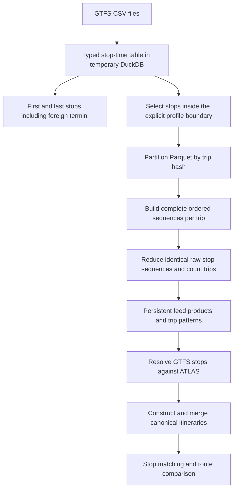
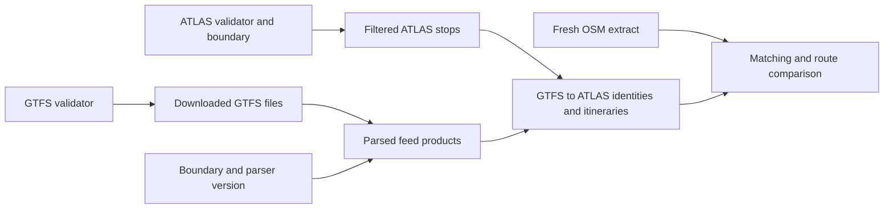
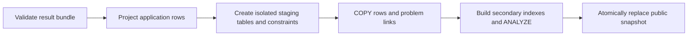

# Pipeline performance

The pipeline now reduces GTFS trips before building Python itinerary objects, caches feed processing separately from ATLAS matching, and loads the review database with PostgreSQL COPY. These changes preserve the independent engine/application boundary and the version 1 result format.

This chapter explains what runs, what can be reused, how to measure it, and how to reproduce the checks. Performance depends on the feed, storage, available memory and concurrent activity; the measurements below are local observations.

## GTFS: process many trips, materialize few patterns

`stop_times.txt` describes individual trips, often repeating the same ordered stops hundreds of times. The previous Swiss path scanned the file in pandas chunks, wrote selected rows to another CSV, reread that CSV, and sorted a pandas DataFrame for every trip. It already avoided rebuilding detailed stop objects for identical patterns, but only after the per-trip parsing, grouping and sorting work.

The default path uses DuckDB inside the engine adapter. No DuckDB service or application database connection is needed.



The implementation is [gtfs_columnar.py](../src/transport_matcher/adapters/gtfs_columnar.py). Its important properties are:

- IDs remain strings, including leading zeros. Only numeric `stop_sequence` determines call order; repeated visits to the same stop remain separate calls.
- Global first/last stops are computed before geographic filtering, so direction labels retain cross-border termini.
- 256 hash partitions keep every trip together even if its rows are interleaved with other trips. Trip metadata is partitioned the same way, so both ordered-list aggregation and its metadata join handle one partition at a time. Partitioning reduces working memory; a pathological individual trip or partition can still exceed the configured budget.
- Reduction groups by route, direction, headsign and ordered raw stop IDs. The short name matters when no headsign exists. Trip counts are summed; the first representative supplies stop sequence numbers. Different raw platform sequences remain separate until the existing canonical mapping/variant merge.
- Python receives reduced patterns, not a DataFrame for every scheduled trip. The trip metadata dictionary also contains only representatives needed by those patterns.
- ATLAS identity decisions, canonical sequence hashes, dominant-pattern selection and itinerary matching thresholds retain their existing rules.

Temporary DuckDB tables and partition files live below the process temporary directory and are removed when processing finishes. The previous intermediate CSV already used that temporary filesystem; this improvement removes CSV serialization/reparsing rather than merely relocating the same file. Persistent reusable products are Parquet files below `data/cache/gtfs`.

The pandas path remains available for comparison and troubleshooting with `GTFS_PROCESSING_BACKEND=pandas`. It keeps its historical assumption about trip grouping across CSV chunks; DuckDB handles interleaved trips explicitly. The accelerated path described here is wired into the Swiss acquisition/runner. The generic `transport-matcher gtfs` adapter remains a separate implementation and has not received the same national-scale benchmark.

## Independent cache stages



`data/source_metadata.json` records cache version 2, stage dependencies, SHA-256 output fingerprints and remote source validators. Cache version 1 triggers a one-time rebuild. The result bundle schema stays at version 1: these are different version numbers with different purposes.

| Change | Work performed |
|---|---|
| Nothing changes upstream | Verify cached outputs; refresh OSM; run matching and publication |
| Only ATLAS changes | Refresh/filter ATLAS; reuse parsed GTFS; remap if filtered ATLAS content changes |
| GTFS changes | Download and parse GTFS; rebuild dependent identities/itineraries as needed; reuse ATLAS |
| Boundary changes | Refilter ATLAS and reparse GTFS; reuse verified downloaded GTFS files |
| A derived itinerary CSV is missing or changed | Rebuild mapping products from verified parsed GTFS |
| Parsed GTFS cache is missing or changed | Rebuild it from verified raw GTFS, downloading again if freshness/integrity cannot be established |
| ATLAS rows expire | Refresh date-dependent ATLAS filtering even when the remote validator is unchanged |
| `--force` | Rebuild every source/preprocessing stage |

An ETag or Last-Modified validator is required to establish source freshness. A stable URL or ZIP filename alone is insufficient. File content hashes validate local products; no modification-time-only shortcut is used. The raw multi-gigabyte GTFS files are verified when they are needed to rebuild parsed products, rather than on every parsed-cache hit.

Each successful stage checkpoints metadata before the next stage begins. An OSM/network failure after GTFS processing therefore allows the next run to reuse that work. If a crash interrupts the replacement of a stage's files, their fingerprints no longer match its checkpoint and the stage is rebuilt. Existing public database tables are unaffected by acquisition failures. Run only one acquisition writer per workspace; independent workspaces can run concurrently.

`swiss --workspace ...` without `--download` remains the way to rerun matching against existing inputs. `--download` performs the source freshness checks. `--force` applies to acquisition and should be combined with `--download`.

## Route and OSM processing

Route-family matching builds three indexes: exact GTFS route ID, normalized GTFS route ID, and display route ID. It scores only candidates reachable through these indexes. Candidate scores and the final score/source-ID/OSM-ID ordering remain identical to exhaustive comparison, preserving greedy assignment tie-breaking.

Ordered stop comparison still uses longest-common-subsequence dynamic programming. Resolved identity sets and parsed variant JSON are prepared before the inner comparison loop. Publication needs only the score, so it uses a rolling row with linear working memory instead of allocating a full traceback matrix. The detailed alignment function remains available for callers needing matched/unmatched call pairs.

When explicit OSM route-stop rows are available, route construction does not materialize millions of unused way-member dictionaries. Key scoping copies only the source call frame it modifies. The runner no longer loads cached OSM CSVs that it would immediately replace, and acquisition no longer constructs the same OSM route products before the runner constructs them again. Stop/evidence parsing and route parsing still have separate consumers; they have not been merged into a new shared object model.

## Database loading and atomic publication

The review application imports no engine package. [bulk.py](../../backend/importing/bulk.py) uses psycopg COPY on the same connection and transaction that owns the staging schema.



Primary keys, unique constraints and foreign keys remain enforced while loading. Secondary indexes, including spatial indexes, are built after the data load and before publication. COPY adapts JSON explicitly and passes geometry as EWKT with SRID 4326. Rows with omitted defaulted columns are grouped separately so server defaults retain their meaning.

New map rows receive deterministic IDs inside the empty staging tables, allowing problem references to be prepared without `INSERT RETURNING` per batch. Sequences are advanced above loaded IDs before publication, including route tables with explicit IDs. No IDs are allocated against or written into the active public snapshot during staging.

Readers continue to see the old snapshot while tables load and indexes build. The final transaction retains the existing bounded lock acquisition and atomic schema move. Any load/index/lock failure leaves the old snapshot active and cleans up staging. `DB_IMPORT_METHOD=insert` retains the ORM writer for comparison; it still uses the improved staging/index workflow.

## Bundle compression

Bundles now default to gzip level 1 instead of Python's implicit level 9. This trades a larger compressed artifact for faster encoding without changing readers or schema. The CLI accepts `--compression-level 0` through `9`; the Python writer accepts `compresslevel=`.

Producer validation, checksums, complete readback verification and atomic directory publication remain enabled. Compression tuning does not skip integrity checks or promise proportional reductions in the entire export stage.

## Configuration and logs

| Setting | Default | Meaning |
|---|---|---|
| `GTFS_PROCESSING_BACKEND` | `duckdb` | Native processing; `pandas` selects the comparison path |
| `GTFS_THREADS` | `2` | DuckDB worker threads |
| `GTFS_MEMORY_LIMIT` | `768MB` | DuckDB managed memory budget; **not** a cap on total Python/container RSS |
| `DB_IMPORT_METHOD` | `copy` | Staging writer; `insert` selects ORM insertion |
| `DB_IMPORT_BATCH_SIZE` | `10000` | Maximum rows passed to each bulk operation |
| `--compression-level` | `1` | Gzip level for a newly exported bundle |

Compose forwards the environment settings to the scheduler. Higher thread counts can increase memory consumption; benchmark before increasing both concurrency and memory limits. Python stop/trip tables and matching state consume memory in addition to DuckDB, and temporary disk space is needed for native tables and partitions.

Logs emit JSON records with `stage_started`, `stage_progress`, `stage_finished` or `stage_failed`. Long stages emit a heartbeat every 30 seconds. Finished records contain elapsed wall seconds and process CPU seconds. CPU time includes all process threads and can exceed wall time. Nested stage durations overlap and must not be summed as if they were independent.

GTFS logs distinguish metadata loading, scan, filtering/termini, partitioning, pattern reduction, identity matching, itinerary construction and cache I/O. They report input bytes and reduced row/trip/pattern counts. `cache_decision` records explain hits, changed inputs, missing/corrupt products, expired ATLAS validity, forced rebuilds and unverifiable sources. Import logs separate validation, projection, row preparation, individual table loads, index creation and publication preparation.

## Reproducing validation and measurements

Install the engine's Swiss extra and run each backend in a fresh process against the **same** files. These commands do not download or modify source data:

```bash
python -m pip install -e '.[swiss,test]'
python benchmarks/gtfs.py --gtfs /path/to/gtfs --atlas /path/to/stops_ATLAS.csv --boundary /path/to/switzerland.geojson --backend pandas --report /tmp/gtfs-pandas.json
python benchmarks/gtfs.py --gtfs /path/to/gtfs --atlas /path/to/stops_ATLAS.csv --boundary /path/to/switzerland.geojson --backend duckdb --report /tmp/gtfs-duckdb.json --compare /tmp/gtfs-pandas.json
python -m pytest tests -q
```

The benchmark records wall/CPU time, process peak RSS, product counts and content hashes. Its comparison ignores export row order and checks the actual source route, itinerary, stop-call and identity products. Run on an otherwise idle machine and repeat when evaluating hardware settings. The memory measurement includes Python state and benchmark inputs; it is not DuckDB-only memory.

Application publication tests use `TEST_POSTGRES_URI` pointing to a **disposable** PostGIS database whose name ends in `_test`. They reset that database's public schema. Never point them at the active application database.

```bash
python -m pytest tests/test_snapshot_publication.py -q
```

The regressions cover identical COPY/INSERT table contents, JSON/text escaping, null geometry, SRID, default values, secondary indexes, sequences, readers during staging, index/load failures and publication lock timeouts. GTFS checks cover old/new product parity, repeated calls, platform variants, foreign termini, leading-zero IDs, missing direction, interleaved trips and empty selections. Route tests compare indexed candidates to exhaustive scoring and score-only dynamic programming to detailed traceback scores.

## Measured results

The local checks observed the following changes. These are single runs; some reference/container work overlapped other validation, so they are not a controlled speedup guarantee.

| Work | Earlier observation | Final observation |
|---|---:|---:|
| Fresh GTFS preprocessing on macOS | 31 min 7 s | 3 min 37 s |
| Runner using cached GTFS products | 180.83 s | 100.24 s |
| Route comparison within that runner | 95.50 s | 20.69 s |
| Complete national application import, 4 GiB container | 11 min 22 s | 3 min 14 s |

The fresh GTFS comparison has identical product hashes in the same environment. A Linux run also completed inside 4 GiB with identical decisions; its distance values have tiny platform floating-point variations described in the validation record. The parsed GTFS cache is 21.1 MiB for the measured feed, and 1.70 million trips reduce to 79,685 patterns.

Gzip level 1 produced a 40.76 MiB bundle in 55.90 seconds, versus 29.48 MiB in 65.07 seconds at level 9, with identical uncompressed records. This is a storage/encoding tradeoff, not a reduction in validation coverage.

See [the validation record](../../docs_to_read/refactor-validation.md) for full inputs, stage timings, comparisons and limitations. Earlier cached-run timings are not fresh GTFS import timings.

## Technical references

- [DuckDB CSV loading](https://duckdb.org/docs/stable/data/csv/overview.html): typed CSV input and parallel reading.
- [DuckDB Parquet support](https://duckdb.org/docs/stable/data/parquet/overview.html): columnar storage and partitioned processing.
- [PostgreSQL bulk population guidance](https://www.postgresql.org/docs/16/populate.html): COPY and loading before secondary index creation.
