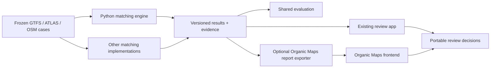

# Related Projects and Collaboration Opportunities

Research date: **2026-09-11**. This is a source-code comparison and a proposal for collaboration. No maintainers were contacted, no upstream code was copied into this project, and no cross-project accuracy benchmark was run.

## Recommendation

There is substantial overlap. Identifier matching, name matching, distance heuristics, ambiguous-stop review and configurable datasets already exist in other projects. We should not present this project as the first GTFS–OSM matcher or assume that creating another repository will attract contributors by itself.

The best next step is to make the extracted Python engine easy to evaluate against other tools, then propose **shared test cases and result adapters** to their maintainers. Organic Maps is the strongest immediate application/interface partner; GTFS Janitor offers the clearest small matching-strategy implementation to compare; PTSA is particularly relevant to our OSM stop grouping. A whole-project merger would be premature without a benchmark, an agreed data model and willing maintainers.

One correction to the earlier assessment matters: **`organicmaps/gtfs-osm-matcher` is already a separate review frontend.** Its public repository reads precomputed matching reports produced by a sibling `gtfs-parser` project. Its README describes matching methods, but those descriptions do not establish the backend algorithm implementation. [Organic Maps README](https://github.com/organicmaps/gtfs-osm-matcher/blob/0824cd2418629969d92e0b6ca67d95d0686a961f/README.md), [development data command](https://github.com/organicmaps/gtfs-osm-matcher/blob/0824cd2418629969d92e0b6ca67d95d0686a961f/package.json#L5-L11).

## Evidence and scope

The five source snapshots below were downloaded from their public repositories and inspected locally. Links pin the reviewed revision. A commit date is evidence about that revision, not a claim about maintainer availability or release stability.

| Project | Reviewed revision | Commit date | Inspection scope |
| --- | --- | --- | --- |
| Organic Maps GTFS–OSM Matcher | [`0824cd2`](https://github.com/organicmaps/gtfs-osm-matcher/commit/0824cd2418629969d92e0b6ca67d95d0686a961f) | 2026-09-10 | Frontend report parser, detail loading, strategy vocabulary and edit export; matcher backend not available in this repository |
| GTFS Janitor | [`33e9835`](https://github.com/tjhorner/gtfs-janitor/commit/33e9835af806b11999b7316a4f31d7d8034c7beb) | 2026-04-26 | Matching strategies, orchestration, profiles, worker boundary and stop-change generation |
| OSM Conflator | [`a7af835`](https://github.com/mapsme/osm_conflate/commit/a7af835ce44b3ac194469b53b7f388bba168cbe4) | 2019-06-04 | Candidate search, assignment, source models, profile loader and edit generation |
| PTSA | [`2b0953c`](https://github.com/jeflem/ptsa/commit/2b0953cde0f27af372faf2cbbf9ce94e320ef249) | 2026-04-20 | OSM grouping/scoring helpers and processing entry points |
| pfaedle | [`99f2cd4`](https://github.com/ad-freiburg/pfaedle/commit/99f2cd466696ecc6bdb73b2b3bb9008557fcb84a) | 2026-07-24 | Route path optimization, configuration and documented input/output |

Statements marked **verified** follow executable code. **Documented** means the project's own documentation describes a capability that was not verified end to end. **Proposal/inference** identifies our assessment. Source inspection does not establish comparative precision, recall, runtime or production readiness.

## 1. Organic Maps GTFS–OSM Matcher

### What is implemented in the public repository

**Verified:** this is a TypeScript/Preact/MapLibre application. The source URL is configurable through `VITE_DATA_BASE_URL`. It loads region-level metadata and an `index.tsv`, then fetches individual NDJSON records with HTTP byte-range requests. This is a real example of the pipeline/frontend separation we want, and potentially allows another engine to produce compatible reports without sharing application code. [Dependencies](https://github.com/organicmaps/gtfs-osm-matcher/blob/0824cd2418629969d92e0b6ca67d95d0686a961f/package.json#L13-L17), [data configuration](https://github.com/organicmaps/gtfs-osm-matcher/blob/0824cd2418629969d92e0b6ca67d95d0686a961f/src/config.ts), [detail fetch](https://github.com/organicmaps/gtfs-osm-matcher/blob/0824cd2418629969d92e0b6ca67d95d0686a961f/src/uielements/report.tsx#L211-L228).

Its index parser resolves columns by name, requires identifiers/coordinates/byte ranges and a category column, counts invalid rows, and supports both current and older report categories. The displayed evidence vocabulary includes identifiers, routes, names, platform codes, stop areas, identifier conflicts and route-based narrowing. Those are **verified report concepts**, not proof of the order or scoring of backend matching stages. [Index parser and strategy contract](https://github.com/organicmaps/gtfs-osm-matcher/blob/0824cd2418629969d92e0b6ca67d95d0686a961f/src/services/matchIndex.ts#L23-L220).

The report also carries GTFS/OSM timestamps and a matcher version. Route variants are loaded independently from byte ranges, then ordered by direction and stop count. The editor exports a JOSM-style `.osm` document containing proposed changes. [Report metadata](https://github.com/organicmaps/gtfs-osm-matcher/blob/0824cd2418629969d92e0b6ca67d95d0686a961f/src/uielements/report.tsx#L40-L81), [route variant loader](https://github.com/organicmaps/gtfs-osm-matcher/blob/0824cd2418629969d92e0b6ca67d95d0686a961f/src/services/routeVariants.ts), [edit encoder](https://github.com/organicmaps/gtfs-osm-matcher/blob/0824cd2418629969d92e0b6ca67d95d0686a961f/src/uielements/editor/changes.tsx#L62-L79).

### What cannot be claimed from this inspection

**Documented:** the README describes normalized names, exact stop identifiers/codes, route matching, proximity-based cluster separation, hubs and unmatched categories. **Unverified:** backend candidate generation, scoring, tie handling, actual stage ordering, and the implementation of station/stop-area reasoning. I did not locate a publicly accessible copy of the referenced current `gtfs-parser` backend during this review. An older public project with a similar name is not evidence of the current backend. [Matching descriptions](https://github.com/organicmaps/gtfs-osm-matcher/blob/0824cd2418629969d92e0b6ca67d95d0686a961f/README.md#L60-L106).

### Collaboration opportunity

**Proposal:** first ask whether they want another report producer, and request a small versioned example report/schema. Implement an optional exporter from our result bundle to that contract. Preserve provenance and distinguish unsupported categories explicitly; our accepted links must not be relabeled as their resolved clusters without equivalent evidence.

A useful first contribution could clarify relationship cardinality: the README and the current `mto` UI help text describe opposite directions. An explicit count of source and OSM members would eliminate that ambiguity. This is a documentation/contract finding, not evidence that the backend allocates stops incorrectly. [README cardinality](https://github.com/organicmaps/gtfs-osm-matcher/blob/0824cd2418629969d92e0b6ca67d95d0686a961f/README.md#L101-L102), [category descriptions](https://github.com/organicmaps/gtfs-osm-matcher/blob/0824cd2418629969d92e0b6ca67d95d0686a961f/src/services/matchIndex.ts#L76-L91).

## 2. GTFS Janitor

### Matching algorithm verified from source

The default strategy order is **ID → name → distance**. The bulk matcher applies each strategy across the remaining stops; the first nonempty result for a stop wins that pass. Results distinguish a definite single candidate from an ambiguous candidate list, including an `alwaysAmbiguous` flag. [Strategy interface and runner](https://github.com/tjhorner/gtfs-janitor/blob/33e9835af806b11999b7316a4f31d7d8034c7beb/src/lib/pipeline/matcher/bus-stops/index.ts#L8-L124).

| Stage | Verified behavior |
| --- | --- |
| ID | Compares both GTFS stop ID and stop code with OSM `gtfs:stop_id` and `ref`. One candidate at **≥500 m** remains ambiguous. Multiple ID candidates are filtered to **<100 m** and sorted by distance. [Implementation](https://github.com/tjhorner/gtfs-janitor/blob/33e9835af806b11999b7316a4f31d7d8034c7beb/src/lib/pipeline/matcher/bus-stops/strategies/by-id.ts) |
| Name | Compares normalized GTFS names with OSM `name` or `ref`. Normalization lowercases, abbreviates streets/directions and collapses spaces. A lone matching name beyond **30 m** is ambiguous. Multiple matches are narrowed to **<100 m**; exactly one within **10 m** is selected. [Implementation](https://github.com/tjhorner/gtfs-janitor/blob/33e9835af806b11999b7316a4f31d7d8034c7beb/src/lib/pipeline/matcher/bus-stops/strategies/by-name.ts) |
| Distance | Considers candidates within **100 m**. Accepts the nearest within **10 m**, or the only candidate if within **30 m**. Other nonempty candidate sets require review. [Implementation](https://github.com/tjhorner/gtfs-janitor/blob/33e9835af806b11999b7316a4f31d7d8034c7beb/src/lib/pipeline/matcher/bus-stops/strategies/by-distance.ts) |

The outer use case removes definite OSM matches from the candidate pool and retries ambiguous stops until no new definite matches appear. This imposes one-to-one consumption in that workflow. It is not a global minimum-cost assignment. [Orchestration](https://github.com/tjhorner/gtfs-janitor/blob/33e9835af806b11999b7316a4f31d7d8034c7beb/src/lib/use-cases/match-bus-stops.ts#L5-L50).

A specific regression case worth sharing: a single normalized-name candidate at 50 m is ambiguous, while two initial name candidates at 50 m and 200 m can become a definite 50 m match after the latter is filtered out. The multi-candidate branch does not reapply the singleton 30 m rule, and the common wrapper accepts a remaining singleton. This is a **source-derived prediction**, not a test run or a reported production bug. [Name branches](https://github.com/tjhorner/gtfs-janitor/blob/33e9835af806b11999b7316a4f31d7d8034c7beb/src/lib/pipeline/matcher/bus-stops/strategies/by-name.ts#L36-L61), [result conversion](https://github.com/tjhorner/gtfs-janitor/blob/33e9835af806b11999b7316a4f31d7d8034c7beb/src/lib/pipeline/matcher/bus-stops/index.ts#L66-L99).

### Reusable boundaries and limitations

**Verified:** strategies already accept plain readonly stops/candidates, so extracting them is plausible. The current application worker loads stops from its GTFS repository and emits match messages; it is not a published language-neutral engine API. JSON/YAML profiles validate candidate filters, output tags and GTFS overrides. They do not currently expose those matching thresholds as profile fields. [Worker](https://github.com/tjhorner/gtfs-janitor/blob/33e9835af806b11999b7316a4f31d7d8034c7beb/src/lib/workers/match-bus-stops.ts), [profile schema](https://github.com/tjhorner/gtfs-janitor/blob/33e9835af806b11999b7316a4f31d7d8034c7beb/src/lib/pipeline/profile/index.ts#L1-L13).

Stop edit generation is separate from matching. It skips ambiguous results, conditionally creates/updates nodes, derives tags from serving routes, and can move an existing node when its location differs by more than 100 m. Route information used for output tags should not be confused with a route-based stop-matching strategy: none appears in the default matcher list. [Change generation](https://github.com/tjhorner/gtfs-janitor/blob/33e9835af806b11999b7316a4f31d7d8034c7beb/src/lib/pipeline/actions/process-stop-matches.ts#L142-L205).

**Proposal:** collaborate on configurable/scoped identifier rules, multilingual normalization tests and candidate-result interchange. The compact strategy API is a good comparison baseline. Porting its one-to-one consumption unchanged would lose legitimate multi-link station behavior in our engine. Its English street normalization should become a locale option rather than a universal rule.

## 3. OSM Conflator

### Matching and output behavior

**Verified:** exact dataset references are processed before geometric matching. The geometric stage builds a KD-tree, retrieves a limited nearest-candidate set (default 10), applies an optional profile matcher/category filter and orders eligible pairs by distance. It repeatedly accepts the shortest remaining pair, consumes both objects and recomputes competing candidates. This is greedy assignment; it does not optimize total assignment cost globally. Match registration also prepares create/update/delete operations, so the main class is not a read-only correspondence engine. [Matching implementation](https://github.com/mapsme/osm_conflate/blob/a7af835ce44b3ac194469b53b7f388bba168cbe4/conflate/conflator.py#L234-L401).

The default source record is `{id, lat, lon, tags}`; JSON points and GeoJSON Points are supported. OSM records preserve element type, numeric ID, version and members. Distance uses a local geographic approximation with an optional offset; it is not full geometry-to-geometry distance. [Dataset parser](https://github.com/mapsme/osm_conflate/blob/a7af835ce44b3ac194469b53b7f388bba168cbe4/conflate/dataset.py#L10-L66), [source/OSM models and distance](https://github.com/mapsme/osm_conflate/blob/a7af835ce44b3ac194469b53b7f388bba168cbe4/conflate/data.py#L5-L80).

Profiles can be Python, dictionaries/classes or JSON. They support arbitrary hooks, and `max_distance` defaults to 100 m. The package exposes a CLI and depends on `kdtree` and `requests`. Those are useful extension ideas, though Python profiles are executable code rather than a portable configuration format. [Profile loader](https://github.com/mapsme/osm_conflate/blob/a7af835ce44b3ac194469b53b7f388bba168cbe4/conflate/profile.py#L12-L60), [packaging](https://github.com/mapsme/osm_conflate/blob/a7af835ce44b3ac194469b53b7f388bba168cbe4/setup.py).

### Reuse assessment

**Inference:** this is an established generic conflation design worth learning from, but not a direct replacement for transport-specific station/platform allocation and route evidence. Its limited nearest-neighbor candidate stage deserves a recall test when filters reject nearby but incompatible objects. Its inspected HEAD is from 2019; a modern installation/integration test is needed before choosing it as a dependency.

Its separate [Conflator Audit application](https://github.com/mapsme/cf_audit) is also relevant: the documented workflow imports the conflator's JSON, records human review and sends decisions back. The separation we are building has precedent. A portable review-decision file would be more valuable to share than another tightly coupled editor.

## 4. Other projects worth including

### PTSA: directly relevant OSM stop grouping

**Verified:** PTSA groups OSM stop positions, platforms and stop poles using spatial neighborhoods, transport-mode compatibility and tag comparisons. Its scoring helper weights `ref:IFOPT` most strongly (10), followed by `ref`, `local_ref` and `level` (2 each), with `ref_name`, `name` and `layer` at 1. It adds a distance adjustment and sorts positive-scoring candidates. Name comparison uses overlap between token sets. These are OSM-to-OSM relationships, not GTFS identity matching. [Scoring and neighborhood implementation](https://github.com/jeflem/ptsa/blob/2b0953cde0f27af372faf2cbbf9ce94e320ef249/backend/utils.py#L571-L652), [grouping calls](https://github.com/jeflem/ptsa/blob/2b0953cde0f27af372faf2cbbf9ce94e320ef249/backend/process_one.py#L439-L601).

**Proposal:** this may be our best technical partner for stop-unit grouping, mode/level conflicts and multi-element OSM examples. Compare its grouped units with our pair/trio handling before creating additional grouping heuristics. PTSA already has a Python processing backend and separate static map output. [Project structure](https://github.com/jeflem/ptsa/blob/2b0953cde0f27af372faf2cbbf9ce94e320ef249/README.md).

### pfaedle: route geometry evidence

**Verified:** pfaedle reads GTFS and OSM and writes GTFS shapes. Its router accumulates candidate penalties and transition costs across successive stop layers, selecting predecessor states for the lower-cost path. This solves a route-path problem that could provide evidence to a stop matcher, rather than the same stop-identity problem. Do not describe it merely as nearest-stop lookup. [Routing dynamic program](https://github.com/ad-freiburg/pfaedle/blob/99f2cd466696ecc6bdb73b2b3bb9008557fcb84a/src/pfaedle/router/Router.tpp#L80-L148), [input/output](https://github.com/ad-freiburg/pfaedle/blob/99f2cd466696ecc6bdb73b2b3bb9008557fcb84a/README.md#L43-L80).

**Proposal:** consume generated shapes or path diagnostics as an optional evidence adapter. Reimplementing its routing in our matcher would expand scope considerably. This inspection did not establish its full probabilistic model or compare its path accuracy with our route predicates.

### PTNA, GO_Sync and osm2gtfs: additional context

These entries are **documentation-level reviews**, not algorithm audits:

| Project | Why it matters | Suggested relationship |
| --- | --- | --- |
| [PTNA](https://github.com/osm-ToniE/ptna), [GTFS tools](https://github.com/osm-ToniE/gtfs), [network definitions](https://github.com/osm-ToniE/ptna-networks) | Public-transport route QA, GTFS processing and a separate contributor-maintained configuration collection | Exchange route anomaly examples and consider a similarly small profile repository once there are multiple profile maintainers |
| [GO_Sync](https://github.com/CUTR-at-USF/gtfs-osm-sync) | Longstanding Java application comparing GTFS stops/routes and supporting review and synchronization | Study historical requirements and datasets; its upstream repository is archived, so do not assume it can accept new collaboration |
| [osm2gtfs](https://github.com/grote/osm2gtfs) | Combines OSM transport data with external schedules to produce GTFS, using city-specific configuration/extensions | Potential adapter/dataset partner; it generates a feed rather than solving the same correspondence-review task |

## 5. What this engine can contribute

The current refactor's useful contribution is a **Python matching and diagnostics engine with an explicit result boundary**, combined with Swiss ATLAS experience and a review application. Generic extraction makes that contribution inspectable; it does not make the underlying ideas unique.

Concrete implementation differences worth testing:

- Exact reference rules explicitly represent identifier namespace, stop/station scope and optional OSM agency/feed constraints. Station-scoped allocation permits multiple links. [Reference predicate](../src/transport_matcher/core/predicates/exact_matching.py), [profiles](../src/transport_matcher/profiles/__init__.py).
- Group proximity can maximize valid assignment cardinality first, then minimize total distance using an assignment matrix with unmatched choices. That optimization is scoped to the relevant group/predicate, not a global optimum for the entire pipeline. [Distance assignment](../src/transport_matcher/core/predicates/distance_matching.py).
- Route matching commits mutually unique best candidates based on shared route evidence; pair/trio handling keeps relationships among multiple OSM elements explicit. [Route predicate](../src/transport_matcher/core/predicates/route_matching_gtfs.py), [trio predicate](../src/transport_matcher/core/predicates/trio_distance_matching.py).
- The library entry point accepts source stops, OSM records, a profile and optional route evidence; matching results and problem diagnostics can be exported without Flask or the app database. [Public API](../src/transport_matcher/api.py), [package exports](../src/transport_matcher/__init__.py).

These differences are reasons to compare outputs, not proof that our matches are better. Some solve Swiss-specific problems that another project's users may not need.

## 6. A practical collaboration plan

### First deliverable: a shared evaluation corpus

Publish a small collection of licensed or synthetic cases with frozen source/OSM inputs, reviewed expected relationships, explicit unmatched cases and explanations. Separate station-level truth from platform-level truth. Include:

1. Same bare stop ID in different agency/feed namespaces.
2. Accents, alternative names and country-specific abbreviations.
3. Two platforms sharing a station reference; legitimate one-to-many and many-to-one relationships.
4. Platform/stop-position pairs, trios, stop areas and different levels at similar coordinates.
5. Same-name candidates near the 10/30/100 m boundaries and exact identifiers far away.
6. Conflicting route directions, short branches and absent route evidence.
7. A greedy-assignment counterexample, ties and dense incompatible nearest neighbors.

Measure accepted-link precision/recall separately from candidate recall, unresolved cases and reviewer effort. Report results per case class, profile and source snapshot. Runtime comparisons should include extraction/normalization separately from matching. A single match percentage would obscure different definitions of “matched.”

### Second deliverable: result and review adapters

Keep each engine's implementation independent while agreeing on a small exchange model. The following is a **proposed cross-project extension**, not a claim that all these fields already exist in our current bundle:

```text
run: schema_version, engine_version, profile_id, source/OSM snapshot identifiers
source entity: namespace + identifier, location role, source coordinates
OSM entity: element type + identifier + version, location role, source coordinates
candidate edge: from/to keys, relationship role, evidence, distance, rank
verdict: accepted / ambiguous / rejected / unexamined
review decision: candidate key, accept/reject/replace, reviewer, input snapshot
```

Do not put map colors, screen coordinates, popup HTML or Leaflet objects in that exchange. Keep suggested edits separate from correspondence decisions: accepting a match does not by itself authorize moving, deleting or overwriting an OSM object.



The diagram is a proposed interoperability path. An Organic Maps exporter still needs agreement on report schemas and unsupported semantics; it is not implemented in this refactor.

### Prioritized outreach proposals

| Priority | Proposed counterpart | Concrete initial offer/request |
| --- | --- | --- |
| 1 | Organic Maps matcher maintainers | Share our standalone result example and Swiss difficult cases; ask for the backend location/license, report schema, and interest in an alternative report producer |
| 2 | GTFS Janitor maintainer | Offer scoped-ID and multilingual/boundary regression cases; ask whether configurable pure strategies and a result-import boundary would be useful |
| 3 | PTSA maintainer | Compare OSM stop-unit grouping on a few shared station/platform examples; exchange role/level/mode evidence |
| 4 | pfaedle / PTNA maintainers | Discuss route evidence interchange only after the stop-result contract is working |

Start with one small, useful contribution and share a reproducible example. Do not ask another maintainer to adopt our engine or merge repositories before demonstrating what becomes easier for them.

### When consolidation would make sense

Consider consolidating an algorithm implementation once two projects agree on the same semantics, the same regression corpus, a supported integration boundary and shared maintenance. Consider combining review UIs only after comparing workflow needs: our database-backed problems/statistics views, Organic Maps' static reports and GTFS Janitor's interactive disambiguation/edit generation do not currently provide identical experiences.

Until then, a small independent engine plus adapters is a practical collaboration structure. A Python matcher need not be rewritten in TypeScript to support another frontend: generated files or a documented service boundary can connect them. Conversely, embedding Python into a browser is not necessary for this proposal.

## 7. Reuse and remaining verification

The reviewed repositories identify their code licenses as [Apache-2.0 for Organic Maps' UI](https://github.com/organicmaps/gtfs-osm-matcher/blob/0824cd2418629969d92e0b6ca67d95d0686a961f/LICENSE), [MIT for GTFS Janitor](https://github.com/tjhorner/gtfs-janitor/blob/33e9835af806b11999b7316a4f31d7d8034c7beb/LICENSE), [Apache-2.0 for OSM Conflator](https://github.com/mapsme/osm_conflate/blob/a7af835ce44b3ac194469b53b7f388bba168cbe4/LICENSE), [AGPL-3.0 for PTSA](https://github.com/jeflem/ptsa/blob/2b0953cde0f27af372faf2cbbf9ce94e320ef249/LICENSE), and [GPL-3.0 for pfaedle](https://github.com/ad-freiburg/pfaedle/blob/99f2cd466696ecc6bdb73b2b3bb9008557fcb84a/LICENSE). Code reuse, shared test-data licensing and OSM-derived output attribution are separate questions; preserve provenance when making an actual integration decision.

Before selecting a dependency or proposing a merger, still verify: the availability and contract of Organic Maps' backend; maintainers' interest; standalone packaging effort; matched-entity cardinality semantics; and results on the same reviewed inputs. No production accuracy, performance or contributor-capacity ranking is justified by this source review alone.
