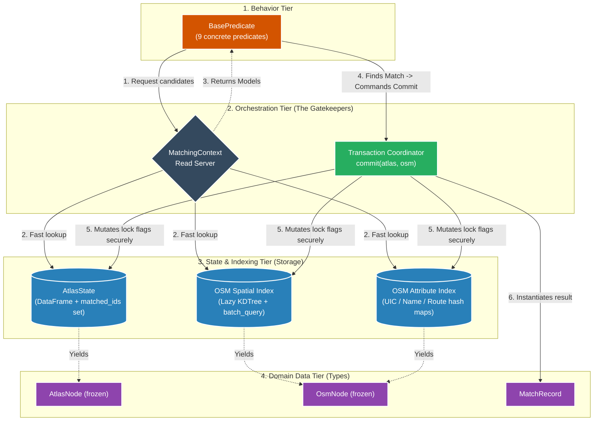
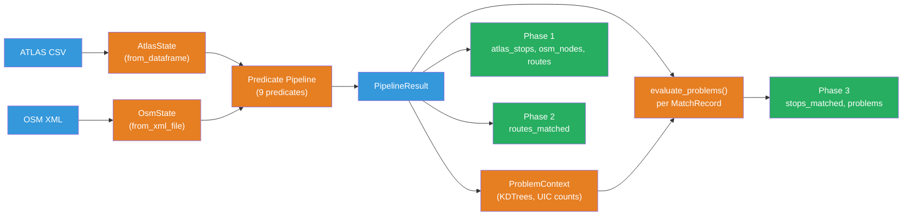

# Architecting the ATLAS ↔ OSM Matching System: A Deep Dive (Data-First Architecture)

This document provides a highly detailed, 360-degree architectural overview of the `matching_and_import_db` pipeline. It covers the complete lifecycle of data, starting from when the Docker container launches, traversing the strongly-typed domain models, illustrating predicate interactions and transactions, handling problem detection internally, and finally arriving at the database insertion logic.

It intentionally focuses on **data structures, strictly typed domain models, atomic transactional states, and encapsulation**, reflecting the modernized **Data-First Architecture.**

---

## 1. The Entrypoint & Trigger Flow

The journey begins in the system's `entrypoint.sh` script. Instead of running a persistent daemon, the matching pipeline is executed as an initialization step before the API server boots up.

### Triggering the Pipeline (`entrypoint.sh`)
```bash
# entrypoint.sh excerpt
if [ "$SKIP_DATA_IMPORT" != "true" ]; then
    echo "Running matching pipeline and importing to database..."
    python matching_and_import_db/database/importer.py
    echo "Finished importer.py"
fi

echo "Starting Flask application on port 5001..."
exec python backend/app.py
```

Notice that the entry point calls `matching_and_import_db/database/importer.py` directly. This acts as our "God script" that subsequently requests the data processing pipeline to execute in memory, and then orchestrates the insertion into PostGIS.

### Orchestrator Call
If we look at the very bottom of `importer.py` (when run as `__main__`), it triggers `run_matching()` from `orchestrator.py` to get the rigorously typed `PipelineResult`, and *then* imports them. Note that `import_to_database` receives **both** the `PipelineResult` and the `duplicate_sloid_map` as separate arguments, and a final stats export runs afterwards.

```python
# matching_and_import_db/database/importer.py (__main__ block)
if __name__ == "__main__":
    # ... parsing arguments ...

    print("Running the final pipeline to obtain base data...")
    result = run_matching()

    print("Importing data into the database...")
    no_nearby_sloids = import_to_database(
        result,
        result.duplicate_sloid_map,
        run_phase1=not args.skip_phase1,
        run_phase2=not args.skip_phase2,
        run_phase3=not args.skip_phase3
    )

    # Export statistics to data/stats.json
    export_stats_after_import(result, result.duplicate_sloid_map, no_nearby_sloids)
```

---

## 2. Strong Domain Models (The Data-First Paradigm)

The entire architecture is built upon python `dataclasses` that enforce strict schema constraints. This completely eliminates "Primitive Obsession" where generic, unpredictable dictionaries were previously used.

Both `AtlasNode` and `OsmNode` are `frozen=True`, making them immutable value objects once constructed.

```python
# matching_and_import_db/models.py
@dataclass(frozen=True)
class AtlasNode:
    sloid: str
    lat: float
    lon: float
    uic_ref: str
    designation: str
    designation_official: str
    business_org_abbr: str
    raw_data: dict[str, Any]  # Original dictionary for stray fields

@dataclass(frozen=True)
class OsmNode:
    node_id: str
    lat: float
    lon: float
    local_ref: Optional[str]
    name: Optional[str]
    uic_name: Optional[str]
    uic_ref: Optional[str]
    network: str
    operator: str
    public_transport: Optional[str]
    railway: Optional[str]
    amenity: Optional[str]
    aerialway: Optional[str]
    tags: dict[str, str]

    @property
    def is_station(self) -> bool:
        """Checks whether this node is a station-level entity (not a platform)."""
        return (
            self.public_transport == 'station' or
            self.railway == 'station' or
            self.aerialway == 'station'
        )
```

`MatchRecord` is the mutable join entity holding the match result plus its detected problems:

```python
@dataclass
class MatchRecord:
    atlas_node: AtlasNode
    osm_node: OsmNode
    match_type: str
    distance_m: float
    notes: str
    candidate_pool_size: int = 0
    problems: list[ProblemResult] = field(default_factory=list)

    def evaluate_problems(self, problem_ctx: ProblemContext, predicates: list) -> None:
        """
        Runs the given problem predicates against this match.
        Each predicate receives the MatchRecord directly (self) and returns
        a list of ProblemResult objects.
        """
        self.problems.clear()

        for predicate in predicates:
            try:
                self.problems.extend(predicate(problem_ctx, self))
            except Exception:
                logger.warning(
                    f"Problem Predicate {predicate.__name__} failed for MatchRecord "
                    f"{self.atlas_node.sloid} <-> {self.osm_node.node_id}",
                    exc_info=True
                )
```

Problem predicates are **polymorphic**: each accepts a union type `MatchRecord | AtlasNode | OsmNode` and uses `isinstance` checks internally to decide what to evaluate. For example, `distance_problem` only acts on `MatchRecord` (returning `[]` for bare nodes), while `unmatched_problem` only acts on bare `AtlasNode` or `OsmNode` records. This allows the same predicate list (`STOP_PROBLEM_PIPELINE`) to be used for both matched and unmatched records.

Each problem predicate returns `list[ProblemResult]`, a lightweight frozen value object decoupled from SQLAlchemy:

```python
# matching_and_import_db/problem_detection/result.py
@dataclass(frozen=True)
class ProblemResult:
    problem_type: str        # 'distance', 'attributes', 'unmatched', 'duplicates'
    priority: int            # 1 = P1, 2 = P2, 3 = P3
    has_atlas_duplicate: bool = False
    has_osm_duplicate: bool = False
```

Whenever a system component requests data, it gets these robust Data Classes. It no longer has to guess what keys exist.

---

## 3. In-Memory State & Spatial Architecture

Because iterating through databases iteratively to find nearest neighbors is prohibitively slow, the application pulls **everything** into RAM before doing heuristic matching.

To prevent utter chaos, the `run_matching` function organizes this data into strict, object-oriented State Managers: `AtlasState` and `OsmState`.

### 3.1 `AtlasState` (The Frame Mapper)

Data originating from ATLAS comes as a flat CSV. `AtlasState` acts as an isolation barrier over a `pandas.DataFrame`, yielding strictly typed `AtlasNode` entities. It is constructed via the `from_dataframe` class method, which also pre-computes duplicate SLOID groups automatically.

```python
# matching_and_import_db/state.py
class AtlasState:
    @classmethod
    def from_dataframe(cls, atlas_df: pd.DataFrame) -> 'AtlasState':
        """Builds AtlasState, computing duplicate sets automatically."""
        # ... duplicate detection logic ...
        return cls(atlas_df, duplicate_sloid_map)

    def get_unmatched_records(self) -> list[AtlasNode]:
        """Provides strongly-typed domain models representing unmatched records."""
        unmatched_df = self._df[~self._df['sloid'].isin(self.matched_ids)]
        return [self._to_atlas_node(row) for _, row in unmatched_df.iterrows()]
```

### 3.2 `OsmState` (The Spatial and Attribute Master)

OSM data is parsed from raw XML via `OsmState.from_xml_file()` and requires multiple access patterns:

*   **Spatial Index:** A `scipy.spatial.KDTree` built **lazily** on first use via `_ensure_spatial_index()`. Crucially, `used_ids` are filtered **at query time**, so the tree is not rebuilt after each match. Spatial queries are performed in batches via `batch_query_radius()`.
*   **Attribute Indexes:** Hash maps (`_uic_ref_dict`, `_name_index`) providing strictly typed `OsmNode` instances on-demand, automatically skipping nodes already locked.
*   **Route Direction Indexes:** Per-node direction strings (`name_dirs`, `uic_dirs`) extracted either from a sidecar CSV (`data/processed/osm_directions.csv`) or by parsing `<relation>` elements from the OSM XML.

During XML parsing, operator values are standardized via `standardize_operator()`, with the original value preserved in `tags['original_operator']`.

### 3.3 Why Index OSM and Not ATLAS?

The matching pipeline is intentionally **ATLAS-driven**. The core orchestration loop (in `pipeline.py` / `orchestrator.py`) requests the remaining unmatched ATLAS nodes (`ctx.atlas.get_unmatched_records()`), streams through them sequentially, and uses their properties as the search keys to dynamically query the `OsmState` indexes (e.g., `ctx.osm.get_by_uic(uic)`).

---

## 4. The Transactional Execution Context

To prevent predicates from arbitrarily manipulating raw data or causing massive race conditions during state mutation, the pipeline creates a **unified transactional wrapper**, `MatchingContext`.

```python
# matching_and_import_db/pipeline.py
@dataclass
class MatchingContext:
    """Robust, shared context referencing state managers for the pipeline run."""
    atlas: AtlasState
    osm: OsmState
    all_matches: list[MatchRecord] = field(default_factory=list)
    max_distance: float = 50.0

    def commit(self, atlas_node: AtlasNode, osm_node: OsmNode, match_type: str,
               distance_m: float, notes: str, candidate_pool_size: int = 0) -> None:
        """Atomically locks the resources securely to prevent collisions."""
        record = MatchRecord(
            atlas_node=atlas_node,
            osm_node=osm_node,
            match_type=match_type,
            distance_m=distance_m,
            notes=notes,
            candidate_pool_size=candidate_pool_size
        )
        self.all_matches.append(record)
        self.atlas.add_matched_sloid(atlas_node.sloid)
        # Guard: some predicates (e.g., ManualMatch) may commit with a synthetic 'NA' node
        if osm_node.node_id and osm_node.node_id != 'NA':
            self.osm.mark_used(osm_node.node_id)
```

The `commit()` method ensures atomic locking of nodes inside predicates instantly, replacing the buggy post-loop mutation mechanic. The guard on `osm_node.node_id` allows certain predicates (like manual matches) to commit records that don't correspond to a real OSM node.

---

## 5. Anatomy of a Predicate (`BasePredicate`)

All heuristic strategies inherit from `BasePredicate` ensuring consistency. The pipeline enforces these strict signatures.

```python
# matching_and_import_db/predicates/__init__.py
class BasePredicate(ABC):
    def __init__(self, name: Optional[str] = None, max_distance: float = 50.0):
        self._name = name or self.__class__.__name__
        self.max_distance = max_distance

    @abstractmethod
    def run(self, ctx: MatchingContext) -> None:
        """Executes the heuristic, calling ctx.commit() for each match found."""
        pass
```

The general predicate lifecycle is:

1.  It streams unmatched records from `ctx.atlas`.
2.  It evaluates candidates from `ctx.osm` (spatial, attribute, or route-based lookup).
3.  When an algorithmic condition passes, it calls `ctx.commit()` immediately executing the state mutation.

### Concrete Example: `NameMatchPredicate`

```python
# matching_and_import_db/predicates/name_matching.py
class NameMatchPredicate(BasePredicate):
    """Match ATLAS designationOfficial against OSM name / uic_name / gtfs:name."""

    def run(self, ctx: MatchingContext) -> None:
        for entry in ctx.atlas.get_unmatched_records():
            name = (entry.designation_official or '').strip()
            if not name:
                continue

            candidates = ctx.osm.get_by_name(name)  # Auto-skips used nodes!
            if not candidates:
                continue

            osm = None
            if len(candidates) == 1:
                osm = candidates[0]
            else:
                # Refine by designation == local_ref
                desig = (entry.designation or '').strip().lower()
                if desig:
                    for c in candidates:
                        if (c.local_ref or '').strip().lower() == desig:
                            osm = c
                            break

            if osm:
                dist = haversine_distance(entry.lat, entry.lon, osm.lat, osm.lon)
                ctx.commit(
                    atlas_node=entry,
                    osm_node=osm,
                    match_type='name',
                    distance_m=dist,
                    notes=f"Name index match ({len(candidates)} candidates)",
                    candidate_pool_size=len(candidates)
                )
```

### 5.1 The Full Predicate Pipeline

The pipeline runs **9 predicates** sequentially in `orchestrator.py`. Each successive predicate only sees ATLAS/OSM nodes that remain unmatched after all previous predicates:

```python
# matching_and_import_db/orchestrator.py
DEFAULT_PIPELINE = [
    ExactUicPredicate(),             # Exact UIC reference match
    NameMatchPredicate(),            # designationOfficial ↔ OSM name
    GroupProximityPredicate(),        # Group-based proximity matching
    LocalRefDistancePredicate(),     # local_ref + distance
    NearestDistancePredicate(),      # Pure nearest-neighbor
    RouteMatchPredicate(),           # Route-informed matching
    PostpassUniqueUicPredicate(),    # Unique UIC cleanup
    DuplicatePropagationPredicate(), # Duplicate group propagation
    ManualMatchPredicate(),          # Manual overrides from user input DB
]
```

---

## 6. The Abstract Architecture

The system is organized into four tiers, each with a clear responsibility boundary:

**Tier 1 - Behavior (Predicates):** The 9 concrete predicates (inheriting from `BasePredicate`) contain all matching heuristics. They never touch raw state directly; they only interact with the Orchestration Tier below.

**Tier 2 - Orchestration (`MatchingContext`):** Acts as the single gateway between predicates and data. It exposes read-only queries (delegating to `AtlasState` / `OsmState`) and a `commit()` method that atomically locks both the ATLAS and OSM nodes involved in a match. Predicates request candidate nodes through the context and submit matches back through it, but never mutate state themselves.

**Tier 3 - State & Indexing (`AtlasState`, `OsmState`):** Encapsulates all in-memory storage and fast-lookup structures. `AtlasState` wraps a pandas DataFrame and a `matched_ids` set. `OsmState` manages a lazy KDTree for spatial queries and hash-map indexes for attribute lookups (UIC ref, name, route directions). Both expose methods that automatically filter out already-matched nodes.

**Tier 4 - Domain Data (Models):** Immutable value objects (`AtlasNode`, `OsmNode`) flow upward from Tier 3 to Tier 1. The mutable `MatchRecord` is created by `commit()` and accumulates in `MatchingContext.all_matches`.

The data flow is: predicates request candidates (steps 1-3), then commit matches (steps 4-6). Reads flow upward through the tiers; mutations flow downward only through `commit()`.



---

## 7. Extracting and Hydrating Output via `PipelineResult`

Back in `orchestrator.py`, the pipeline aggregates the final execution artifacts into a perfectly typed container:

```python
# matching_and_import_db/models.py
@dataclass
class PipelineResult:
    matched: list[MatchRecord]
    unmatched_atlas: list[AtlasNode]
    unmatched_osm: list[OsmNode]
    duplicate_sloid_map: dict[str, list[str]]
    no_nearby_osm_sloids: set[str]
```

### 7.1 The Three-Phase Import

The importer (`importer.py`) organizes database insertion into three independently skippable phases, each behind its own `--skip-phaseN` flag:

| Phase | Tables | Content |
|-------|--------|---------|
| Phase 1 | `atlas_stops`, `osm_nodes`, `route_atlas_stops`, `route_osm_stops` | Raw detail records and route sequences |
| Phase 2 | `routes_matched` | Matched route pairs (ATLAS ↔ OSM routes) |
| Phase 3 | `stops_matched`, `problems` | Core match records and detected problems |

Each phase TRUNCATEs its tables with CASCADE before inserting (safe because the import DB is fully rebuilt each run).

### 7.2 Import Flow for Matched Records

For matched records, problem detection runs **inside** the domain model before DB insertion:

```python
# matching_and_import_db/database/importer.py (simplified)
from matching_and_import_db.problem_detection import ProblemContext, STOP_PROBLEM_PIPELINE

problem_ctx = ProblemContext.build(result)

for current_match in result.matched:
    # Problem detection runs natively within the MatchRecord.
    # The same STOP_PROBLEM_PIPELINE is passed in — predicates that don't
    # apply to MatchRecord (e.g. unmatched_problem) simply return [].
    current_match.evaluate_problems(problem_ctx, STOP_PROBLEM_PIPELINE)

    stop_record = StopsMatched(
        sloid=current_match.atlas_node.sloid,
        osm_node_id=current_match.osm_node.node_id,
        match_type=current_match.match_type,
        distance_m=current_match.distance_m,
        atlas_lat=current_match.atlas_node.lat,
        atlas_lon=current_match.atlas_node.lon,
        osm_lat=current_match.osm_node.lat,
        osm_lon=current_match.osm_node.lon,
        geom=make_point_geom(...)
    )

    # Problems are cascaded via helper
    apply_problem_results(stop_record, current_match.problems)
    session.add(stop_record)
```

For **unmatched** ATLAS and OSM records, the importer calls `run_problem_pipeline(STOP_PROBLEM_PIPELINE, problem_ctx, atlas_node)` directly, passing the bare `AtlasNode` or `OsmNode` instead of a `MatchRecord`. The same polymorphic predicates handle this: `unmatched_problem` and `duplicates_problem` activate for bare nodes, while `distance_problem` and `attributes_problem` return empty lists. The importer also computes isolation status (no OSM node within 50m) for unmatched ATLAS records.

Batched commits occur every `DB_IMPORT_BATCH_SIZE` (default 5000) records for performance.

### 7.3 End-to-End Data Flow



By abstracting all problem resolution into `MatchRecord.evaluate_problems()` and securing matching states atomically through `MatchingContext.commit()`, the Data-First Architecture heavily decreases complexity, reduces bug vectors, and achieves robust Type Safety across the pipeline.

---

## 8. Remaining Architecture Improvement Suggestions

The architecture has recently been overhauled to support native domain models in predicates, eliminate circular imports, and decompose the `import_to_database()` monolith. 

The following performance optimizations remain:

### 8.1 Implement `OsmNode` Instantiation Caching

**Current state:** The `OsmState` manager stores raw dictionaries internally. Whenever a predicate requests data (e.g., `get_by_uic()`, `get_by_name()`, or `batch_query_radius()`), it calls `_to_osm_node()` to dynamically instantiate a completely new `OsmNode` tracking object. Since predicates constantly query overlapping node IDs, the pipeline wastes memory and CPU time repeatedly creating and discarding identical immutable objects.

**Suggested improvement:** Because `OsmNode` objects are defined with `frozen=True` (immutable), they should be constructed exactly once and shared. Implement a lazily populated cache dictionary (`dict[str, OsmNode]` mapping `node_id` to `OsmNode`) inside `OsmState`. Once an `OsmNode` is built for the first time, all subsequent spatial or attribute queries for that node should return the exact same cached object reference in memory.

### 8.2 Optimize `get_unmatched_records()` Execution

**Current state:** Nine different predicates call `AtlasState.get_unmatched_records()` in sequence. Internally, this function iterates over an entire `pandas.DataFrame` using `.iterrows()` (an extremely slow operation in Pandas). For each row, it checks if the `sloid` is in `matched_ids`, and if not, instantiates a brand new `AtlasNode`. Thus, if there are 10,000 unmatched records, the pipeline slowly crawls the DataFrame and instantiates 10,000 `AtlasNode` items from scratch, 9 separate times.

**Suggested improvement:** In `AtlasState.from_dataframe()`, pre-compute and store a standard Python dictionary `self._all_nodes: dict[str, AtlasNode] = {}` that maps every `sloid` to its pre-built `AtlasNode`. Then, refactor `get_unmatched_records()` to execute a highly optimized list comprehension over the cached dictionary instead of using raw Pandas functions.

```python
# Proposed: cache all nodes at construction
class AtlasState:
    def __init__(self, atlas_df, duplicate_sloid_map):
        self._all_nodes = {str(row['sloid']): self._to_atlas_node(row)
                           for _, row in atlas_df.iterrows()}
        self.matched_ids: set[str] = set()

    def get_unmatched_records(self) -> list[AtlasNode]:
        # Fast, O(N) list comprehension avoiding .iterrows()
        return [n for sloid, n in self._all_nodes.items()
                if sloid not in self.matched_ids]
```

---

## 9. Deep Dive: Pre-grouping OSM Stops (`OsmStopGroup` Architecture)

**Context & Motivation:** Currently, `get_osm_data.py` only extracts `node` structures, meaning physical platforms mapped as lines/polygons (`way`) and complex multi-part stations grouped by relations (`stop_area`) are entirely missed. Consequently, the pipeline operates on fragmented point geometries. Predicates like `distance_matching.py` attempt to loosely group these backward by running twin spatial inquiries for `stop_positions` vs. generic nodes, which is redundant, error-prone, and adds excessive latency.

The rigorous Data-First architectural solution is to introduce a strict `OsmStopGroup` domain model upstream in `matching_and_import_db.models` and perform aggregation *before* any predicate operates.

### 9.1 Data Ingestion Upgrades (`get_osm_data.py`)
To incorporate full topological reality, the Overpass API query must be expanded:
*   **Ways (Lines/Polygons):** Query for `way(area.searchArea)["public_transport"~"platform|station"];` utilizing Overpass's native `out center;`. This effortlessly flattens physical geometries into synthetic singular centroid nodes that the existing coordinate math natively comprehends.
*   **Relations (`stop_area`):** Query for structural groupings using `relation(area.searchArea)["type"="public_transport"]["public_transport"="stop_area"];`, parsing out their recursive `<member>` subsets to understand which nodes and ways functionally constitute reality's "one station".

### 9.2 The Unified `OsmStopGroup` Domain Model
We replace treating every coordinate as an independent matching target with a holistic wrapper.

```python
# matching_and_import_db/models.py
@dataclass(frozen=True)
class OsmStopGroup:
    group_id: str                 # E.g., 'relation_12345' or synthetic 'group_A'
    lat: float                    # Averaged centroid of all constituents
    lon: float                    # Averaged centroid
    uic_ref: Optional[str]        # Unified if available
    name: Optional[str]           # Unified designation
    members: tuple[OsmNode, ...]  # The raw physical components
    
    @property
    def platforms(self) -> list[OsmNode]: ...
    @property
    def stop_positions(self) -> list[OsmNode]: ...
```

### 9.3 Upstream Construction Pipeline (`OsmState`)
Instead of `OsmState` storing a flat array of nodes, it evaluates the ingested XML into `OsmStopGroup` entities via a prioritized heuristic algorithm securely guarded behind the State Manager boundary:

1.  **Relation-based Clustering:** All nodes/ways explicitly referenced inside a standard OSM `stop_area` relation are bound into a single `OsmStopGroup`.
2.  **Explicit Standard ID Clustering:** Outstanding standalone elements pointing to identically matched `uic_ref` strings are fused. (The most robust geographic anchor available).
3.  **Spatial-Semantic Clustering:** Items carrying identical `name` strings laying within a tight spatial dependency radius (e.g., `<30m`) compose a group.
4.  **Singleton Wrap:** Finally, solitary unassociated assets are individually wrapped in 1-member `OsmStopGroup` shells ensuring pipeline uniformity.

### 9.4 Refactoring Predicates and Matching
This entirely dissolves the internal bipartite overhead natively inside `distance_matching.py`:

*   The `OsmState` manager projects its KDTree referencing the **Centroids** of `OsmStopGroup` objects.
*   `MatchingContext.osm` exclusively vends grouped objects to the heuristic algorithms.
*   The `GroupProximityPredicate` is massively streamlined. `MatchRecord` commits map one `AtlasNode` permanently to one `OsmStopGroup` umbrella, effortlessly linking all downstream geometries in one sweep.
