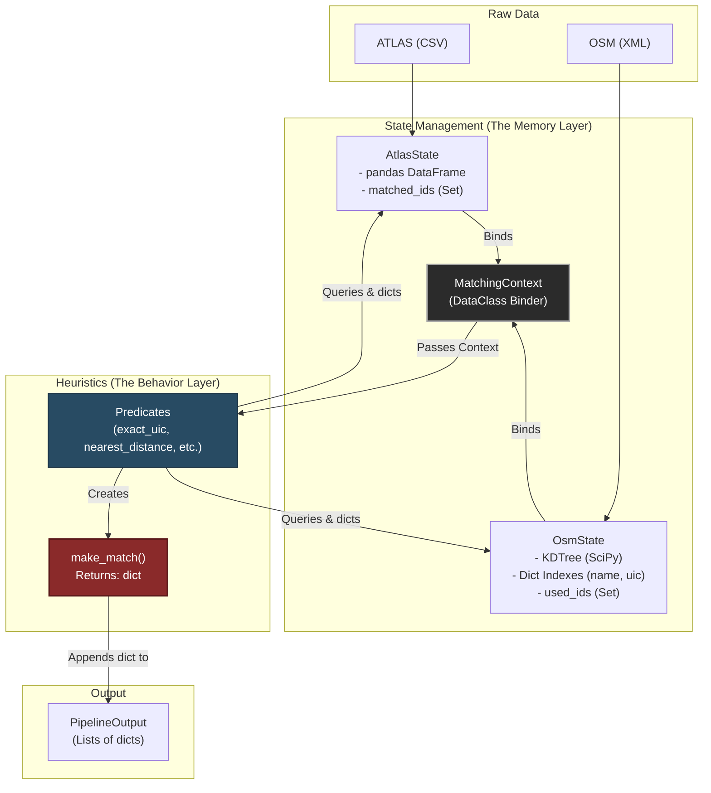

# Architecting the ATLAS ↔ OSM Matching System: A Deep Dive

This document provides a highly detailed, 360-degree architectural overview of the `matching_and_import_db` pipeline. It covers the complete lifecycle of data, starting from when the Docker container launches, traversing the in-memory state architecture, illustrating predicate interactions, problem detection, and finally arriving at the database insertion logic.

It intentionally steps away from merely listing stages and instead focuses on **how the system handles state, execution contexts, database hydration, and large-scale memory management**. This document contains abundant code snippets to facilitate a rapid ramp-up for deep-diving and debugging.

---

## 1. The Entrypoint & Trigger Flow

The journey begins in the system's `entrypoint.sh` script. Instead of running a persistent daemon, the matching pipeline is executed as an initialization step before the API server boots up. 

### Triggering the Pipeline (`entrypoint.sh`)
```bash
# entrypoint.sh excerpt
if [ "$SKIP_DATA_IMPORT" != "true" ]; then
    echo "🔄 Running matching pipeline and importing to database..."
    python matching_and_import_db/database/importer.py
    echo "Finished importer.py"
fi

echo "Starting Flask application on port 5001..."
exec python backend/app.py
```

Notice that the entry point calls `matching_and_import_db/database/importer.py` directly. This acts as our "God script" that subsequently requests the data processing pipeline to execute in memory, and then orchestrates the insertion into PostGIS.

### Orchestrator Call
If we look at the very bottom of `importer.py` (when run as `__main__`), it triggers `run_matching()` from `orchestrator.py` to get the raw data dicts, and *then* imports them.

```python
# matching_and_import_db/database/importer.py (__main__ block)
if __name__ == "__main__":
    # ... parsing arguments ...

    print("Running the final pipeline to obtain base data...")
    # Step 1: Run the raw heuristics engine (Returns primitive types: dicts, lists)
    base_data, duplicate_sloid_map_result = run_matching()
    
    print("Importing data into the database...")
    # Step 2: Inject primitives into the PostGIS / SQLAlchemy schema
    no_nearby_sloids = import_to_database(
        base_data, 
        duplicate_sloid_map_result, 
        run_phase1=not args.skip_phase1,
        run_phase2=not args.skip_phase2,
        run_phase3=not args.skip_phase3
    )
```

---

## 2. In-Memory State & Spatial Architecture

Because iterating through databases iteratively to find nearest neighbors is prohibitively slow, the application pulls **everything** into RAM before doing heuristic matching. 

To prevent utter chaos, the `run_matching` function organizes this data into strict, object-oriented State Managers: `AtlasState` and `OsmState`.

```python
# matching_and_import_db/orchestrator.py (Excerpt)
def run_matching():
    # ── Load data ────────────────────────────────────────────────────────
    atlas_csv_file = _locate_file('ATLAS_STOPS_CSV', 'data/raw/stops_ATLAS.csv', 'ATLAS')
    osm_xml_file = _locate_file('OSM_XML_FILE', 'data/raw/osm_data.xml', 'OSM')

    # Load raw CSV via Pandas
    atlas_df = pd.read_csv(atlas_csv_file, sep=";")
    
    # Custom XML Parsing logic
    osm_index = OsmState.from_xml_file(osm_xml_file)

    # ── Initialize State ─────────────────────
    atlas_state = AtlasState.from_dataframe(atlas_df)
    
    # ... Next we build the execution context ...
```

### 2.1 `AtlasState` (The Flat DataFrame Manager)

Data originating from ATLAS comes as a flat CSV. `AtlasState` simply acts as an isolation barrier over a `pandas.DataFrame`. It tracks which rows (identified by `sloid`) have been permanently locked to an OSM node.

```python
# matching_and_import_db/state.py
class AtlasState:
    """Manages the fully populated ATLAS dataset and provides unmatched records on demand."""
    
    @classmethod
    def from_dataframe(cls, atlas_df: pd.DataFrame) -> 'AtlasState':
        """
        Builds AtlasState directly from a DataFrame, computing duplicate sets automatically.
        """
        # Finds exact duplicate groups early to manage clustering edge-cases
        dup_mask = atlas_df.duplicated(subset=['number', 'designation'], keep=False)
        # ... logic ...
        return cls(atlas_df, duplicate_sloid_map)

    def __init__(self, atlas_df: pd.DataFrame, duplicate_sloid_map: dict):
        self._df = atlas_df
        self.duplicate_sloid_map = duplicate_sloid_map
        # THIS IS THE CRITICAL STATE MUTATION BARRIER:
        self.matched_ids: set[str] = set()
        
    def add_matched_sloid(self, sloid: str):
        self.matched_ids.add(sloid)
        
    def get_unmatched_records(self) -> list[dict]:
        """Provides raw dicts for unmatched ATLAS records cleanly."""
        unmatched_df = self._df[~self._df['sloid'].isin(self.matched_ids)]
        return unmatched_df.to_dict(orient="records")
```

### 2.2 `OsmState` (The Spatial and Attribute Master)

`OsmState` is vastly more complicated than `AtlasState`. OSM Data is hierarchical (Nodes, Ways, Relations) and intensely geospatial. The `OsmState` class builds hash map indexes for attributes, and a `scipy.spatial.KDTree` for radius searching.

```python
# matching_and_import_db/state.py
class OsmState:
    """Manages OSM indexing, queries (spatial and attribute), and matching exclusion capabilities."""
    
    @classmethod
    def from_xml_file(cls, xml_file: str) -> 'OsmState':
        # ... massive tree = ET.parse(xml_file) logic ...
        all_nodes: dict[tuple, dict] = {}
        uic_ref_dict: dict[str, list] = defaultdict(list)
        name_index: dict[str, list] = defaultdict(list)
        # ... builds dictionaries indexing nodes by UIC, Name, and raw coordinates ...
        return cls(all_nodes, uic_ref_dict, name_index, dict(name_dirs), dict(uic_dirs))

    def mark_used(self, node_id: str):
        """Once claimed by a predicate, the node is locked out forever."""
        self.used_ids.add(node_id)
        
    def get_by_uic(self, uic: str) -> list[dict]:
        """Gets matching nodes by UIC, skipping any that are already marked used."""
        return [
            c for c in self._uic_ref_dict.get(str(uic), [])
            if c['node_id'] not in self.used_ids and not is_osm_station(c)
        ]
```

**The Spatial Indexing (KDTree) Magic:**
Instead of computing Haversine distances for $N \times M$ rows, `OsmState` caches a KDTree that operates natively on Euclidean abstractions. It exposes a `batch_query_radius` function.

```python
    def batch_query_radius(self, coords_list, max_distance: float, include_stations: bool = False):
        """Query for matching nodes around a radius for multiple coordinates at once."""
        self._ensure_spatial_index(include_stations)
        # ...
        kd_radius = meters_to_unit_chord_radius(max_distance)
        points = batch_to_xyz(coords_list)
        
        # Super-fast C-native SCIPY querying across all given points at once
        indices_list = self._cached_tree.query_ball_point(points, r=kd_radius, workers=-1)
        # Filters out nodes inside self.used_ids on the fly ...
```

---

## 3. Understanding the Abstractions (OOP in the Matching Pipeline)

The codebase relies on a few core **abstractions** (implemented as Python classes and higher-order functions) to manage complexity. An abstraction hides complicated details behind a simple interface.

Here are the specific abstractions we use:

1. **State Managers (`AtlasState`, `OsmState`)**
   - **What they are:** Classes acting as localized, in-memory databases.
   - **Why we need them:** They abstract away the painful details of querying CSV files or raw XML trees. Predicates simply call `ctx.osm.get_by_uic()` without knowing *how* the lookup or spatial KDTree is implemented.
2. **The Context (`MatchingContext`)**
   - **What it is:** A Data Class that bundles the State Managers together.
   - **Why we need it:** It acts as a single "source of truth" passed to every predicate, avoiding the use of dangerous global variables.
3. **Predicates (e.g., `exact_uic`, `nearest_distance`)**
   - **What they are:** Standalone heuristic functions.
   - **Why we need them:** They encapsulate a specific algorithmic rule (a "heuristic strategy"). They all share the exact same signature: `def predicate_name(ctx: MatchingContext) -> list[dict]`.
4. **The Pipeline (`run_pipeline`)**
   - **What it is:** A sequential runner function.
   - **Why we need it:** It abstracts the control flow. It iterates through a list of predicates, executing them one by one, and handles the global state book-keeping automatically after each predicate finishes.

---

## 4. The Execution Context (`MatchingContext`)

To prevent predicates from arbitrarily manipulating raw data or referencing global variables, the pipeline creates an immutable context wrapper holding references to our states. Everything a predicate does **must** go through this context.

```python
# matching_and_import_db/pipeline.py
@dataclass
class MatchingContext:
    """Robust, immutable context referencing state managers for the pipeline run."""
    atlas: 'AtlasState'
    osm: 'OsmState'
    all_matches: list = field(default_factory=list)
    max_distance: float = 50.0
```

### Flow of execution in `pipeline.py`:
The `run_pipeline` function takes `DEFAULT_PIPELINE` (a list of function pointers), iterates through them, and updates the `ctx.all_matches`.

```python
# matching_and_import_db/pipeline.py
def run_pipeline(predicates: list, ctx: MatchingContext) -> PipelineOutput:
    for predicate in predicates:
        # Each predicate is just a function that accepts `ctx`
        matches = predicate(ctx)

        # --- Book-keeping ---
        # The predicate returns raw dictionaries of matched pairs.
        # We must commit them globally here so the NEXT predicate doesn't see them.
        for m in matches:
            ctx.all_matches.append(m)
            sloid = m.get('sloid')
            if sloid:
                ctx.atlas.add_matched_sloid(sloid)
            osm_id = m.get('osm_node_id')
            if osm_id and osm_id != 'NA':
                ctx.osm.mark_used(osm_id)

    # Gather leftovers
    return PipelineOutput(
        matched=ctx.all_matches,
        unmatched_atlas=ctx.atlas.get_unmatched_records(),
        unmatched_osm=ctx.osm.get_unmatched_nodes(),
    )
```

**Architectural Note / Bug Vector:** 
There is a known architectural pattern here where `ctx.osm.mark_used(osm_id)` happens strictly *after* the entire predicate runs (`for m in matches:` block). 
If a predicate evaluates *two* ATLAS nodes inside its execution, both might attempt to match to the *same* OSM Node, because `ctx.osm.is_used` returns `False` during the predicate's runtime. The state is only reconciled afterwards. Predicates must manually manage `ctx.osm.mark_used()` internally to avoid internal collisions safely. That's why inside predicates, you'll sometimes see `ctx.osm.mark_used()` called manually.

---

## 5. Anatomy of a Predicate

Instead of listing all predicates, let us look at the structure of a single predicate (`exact_matching.py`) to understand *how* the heuristics operate against the Context Architecture.

1. First, request all available ATLAS entries (`ctx.atlas.get_unmatched_records`).
2. Do heavy grouping or querying (e.g., query `ctx.osm.get_by_uic`).
3. Whenever a candidate acts dynamically, use the standard `make_match` utility.
4. Call `ctx.osm.mark_used` to secure it mid-loop.
5. Append and return it.

```python
# matching_and_import_db/predicates/exact_matching.py
def exact_uic(ctx: MatchingContext) -> list[dict]:
    matches: list[dict] = []

    # 1. Fetch available ATLAS context cleanly
    atlas_by_uic: dict[str, list[dict]] = {}
    for rec in ctx.atlas.get_unmatched_records():
        atlas_by_uic.setdefault(str(rec.get("number")), []).append(rec)

    for uic, entries in sorted(atlas_by_uic.items()):
        # 2. Fetch purely available OSM context natively via indexed attribute
        available = ctx.osm.get_by_uic(uic)
        if not available:
            continue

        if len(available) == 1:
            osm = available[0]
            for entry in entries:
                # 3. Create the standard match dictionary payload
                matches.append(make_match(
                    entry, osm, 'exact',
                    "Single OSM node for this UIC reference",
                    pool_size=1,
                ))
            # 4. MUTATE THE STATE IMMEDIATELY. This is crucial for internal loops.
            ctx.osm.mark_used(osm['node_id'])
            continue

        # ... handle collisions ...
    return matches
```

---

## 6. Exiting the Pipeline Matrix

Back in `orchestrator.py` we take the `PipelineOutput` and convert it into a simple monolithic dictionary tree:

```python
base_data = {
    "matched": output.matched,
    "unmatched_atlas": output.unmatched_atlas,
    "unmatched_osm": output.unmatched_osm,
}
return base_data, duplicate_sloid_map
```

This massive dictionary holds the entirety of our transit data payload. No objects, no fancy getters or setters, purely atomic JSON-serializable dictionaries.

---

## 7. Real-World Database Insertion & Problem Detection

`importer.py` takes the monolithic `base_data` structure and carefully transforms it into PostgreSQL representations.
Before inserting into SQLAlchemy, it builds a secondary abstract structure: the **`ProblemContext`**. This context allows the system to determine if there's any anomaly with a match (e.g., coordinates too far apart, attribute disagreement) natively on the fly, immediately marking database lines as "Problematic".

### Database Truncation (Phases)
The importer aggressively wipes database tables. It uses cascades. It guarantees an absolutely clean state.

```python
# matching_and_import_db/database/importer.py (Phase control architecture)
if run_phase1:
    session.execute(text("TRUNCATE TABLE atlas_stops, osm_nodes, route_atlas_stops, route_osm_stops CASCADE"))
if run_phase2:
    session.execute(text("TRUNCATE TABLE routes_matched CASCADE"))
if run_phase3:
    session.execute(text("TRUNCATE TABLE problems, stops_matched CASCADE"))
session.commit()
```

### Entity Hydration (The SQLAlchemy Loop)

The most important part of `importer.py` is its extraction and insertion of matches into the polymorphic schema (`StopsMatched`, `AtlasStop`, `OsmNode`). 

In the database:
- `AtlasStop` records the raw ATLAS info.
- `OsmNode` records the raw OSM info.
- `StopsMatched` acts as the junction table that connects an `AtlasStop` (`sloid`) to an `OsmNode` (`osm_node_id`). It stores both `atlas_lat` and `osm_lat`.

```python
# matching_and_import_db/database/importer.py
for rec in matched_records:
    # Safely extract values avoiding NaN exceptions
    atlas_lat, atlas_lon = validate_coordinates(...)
    sloid = safe_value(rec.get('sloid'))
    osm_node_id = safe_value(rec.get('osm_node_id'))

    # Build the matching junction first
    stop_record = StopsMatched(
        sloid=sloid,
        stop_type='matched',
        match_type=safe_value(rec.get('match_type')),
        atlas_lat=atlas_lat,
        atlas_lon=atlas_lon,
        osm_node_id=osm_node_id,
        osm_lat=osm_lat,
        osm_lon=osm_lon,
        distance_m=safe_value(rec.get('distance_m')),
        geom=make_point_geom(atlas_lat, atlas_lon)
    )

    # Run side-system problem heuristic, attaching Problem flags back to stop_record.
    apply_problem_results(stop_record, run_problem_pipeline(STOP_PROBLEM_PIPELINE, problem_ctx, rec))
    
    # Store directly in session batched
    session.add(stop_record)

    # Insert individual atomic Atlas Data
    if run_phase1 and sloid not in processed_sloids:
        atlas_record = AtlasStop(
            sloid=sloid,
            uic_ref=safe_value(rec.get('number'), ""),
            atlas_designation=safe_value(rec.get('csv_designation'), ""),
            # ...
        )
        session.add(atlas_record)
        processed_sloids.add(sloid)

    # Insert individual atomic OSM Data
    if run_phase1 and osm_node_id not in processed_osm_node_ids:
        osm_record = OsmNode(
            osm_node_id=osm_node_id,
            osm_name=safe_value(rec.get('osm_name')),
            # ...
        )
        session.add(osm_record)
        processed_osm_node_ids.add(osm_node_id)
```

**Memory Safety in the Importer Engine:**
To avoid overwhelming Python's memory with SQLAlchemy instances, the backend uses aggressive transaction batching:

```python
# Batching mechanism in importer.py
inserted += 1
if BATCH_SIZE > 0 and (inserted % BATCH_SIZE) == 0:
    session.commit()
    # Expunge all flushes objects from the SQLAlchemy identity map, preventing RAM leaks!
    session.expunge_all() 
```

### Route Indexing

After inserting spatial data and matches, the `importer.py` loads transit routing lines. It utilizes `RouteAtlasStops` and `RouteOsmStops` to link individual `StopsMatched` sequentially. This is essential, as the order of node visits in a transit system matters immensely.

```python
# Route hydration inside importer.py
for (osm_route_id, direction_id), osm_data in osm_route_dir_to_nodes.items():
    if run_phase1:
        # Insert Sequential Route Ordering Data
        for i, node_id in enumerate(osm_data['nodes']):
            routes_to_insert.append(RouteOsmStops(
                osm_route_id=osm_route_id, 
                direction_id=direction_id, 
                osm_node_id=node_id, 
                stop_sequence=i
            ))
```
Finally `session.bulk_save_objects(routes_to_insert)` commits it rapidly without instantiating full ORM relationship structures.

---

## 8. Critique of Current Abstractions

Looking at the system through the lens of Linus Torvalds’ philosophy—*"Bad programmers worry about the code. Good programmers worry about data structures and their relationships"*—reveals exactly where this pipeline currently struggles.

Currently, the pipeline is too focused on **behavior** (predicates, helper functions, and pipelines) and has neglected **strict data contracts**, leading to "Primitive Obsession" and state-synchronization bugs.

### Visualization of the Current Architecture

Currently, the core data structures are `AtlasState` and `OsmState`, which are wrapped by the `MatchingContext`. These states consume raw files and export **untyped dictionaries** to the predicates.



### Abstraction Weaknesses & Leakages

While the `MatchingContext` and `State` classes are a step in the right direction to avoid global variables, they suffer from two major architectural flaws that violate Torvalds' rule:

#### A. Primitive Obsession (Untyped Dictionaries)

```python
def make_match(atlas_entry: dict, osm_node: dict, match_type: str, notes: str, pool_size: int = 0) -> dict:
   dist = haversine_distance(
       atlas_entry['wgs84North'], atlas_entry['wgs84East'], ...
   )
```
*   **The Flaw:** The system relies entirely on standard Python string-keyed dictionaries (`dict`) to represent complex domain entities. When `ctx.atlas.get_unmatched_records()` is called, it returns `list[dict]`. 
*   **Why it's bad:** There is no *data structure contract*. The predicate must guess or hope that keys like `wgs84North` or `sloid` exist. `make_match` blindly accepts `**kwargs` and manipulates arbitrary keys. If the raw data shape changes, the code crashes deep inside a heuristic rather than failing safely at the data boundary.

#### B. The "Batch State Mutation" Bug (Leaky State Machine)

```python
# from pipeline.py
for m in matches:
    ctx.all_matches.append(m)
    sloid = m.get('sloid')
    if sloid: ctx.atlas.add_matched_sloid(sloid)
    osm_id = m.get('osm_node_id')
    if osm_id and osm_id != 'NA': ctx.osm.mark_used(osm_id)
```
*   **The Flaw:** The pipeline delegates the responsibility of state mutation (`mark_used`, `add_matched_sloid`) to the *orchestrator loop*, rather than providing atomic transactions. As noted in `pipeline.py`, the orchestrator iterates and updates the state *after* the predicate finishes.
*   **Why it's bad:** A single predicate might evaluate two ATLAS stops and match them *both* to the same OSM node during its loop, returning a collision. Predicates are thereby forced to know about internal state mechanics and often have to manually call `ctx.osm.mark_used()` themselves to prevent internal collisions.  The `MatchingContext` fails to protect its own data integrity.

---

## 9. Proposed Improvements (Data-First Architecture)

To fix this, we must shift our focus from **how** the matching happens to **what** data structures are involved. 

### Improvement 1: Strong Domain Entities (Dataclasses / Pydantic)
Stop using `dict`. We need strict, predictable data models describing an `AtlasNode`, an `OsmNode`, and a `MatchRecord`. 
By doing this, the `KDTree` and predicates interact with strictly typed objects carrying their own validation logic.

```python
@dataclass(frozen=True)
class AtlasNode:
    sloid: str
    lat: float
    lon: float
    uic_ref: Optional[str]
    designation: str

@dataclass
class MatchTransaction:
    atlas_node: AtlasNode
    osm_node: OsmNode
    match_type: str
    distance_m: float
```

### Improvement 2: A Mutating Transaction Manager
Instead of `Predicate -> returns list -> Pipeline -> updates states`, the Context itself should handle transactions atomically. The `MatchingContext` should expose a `.commit()` method. If a predicate finds a match, it immediately commits it. The Context then updates both `AtlasState` and `OsmState` simultaneously, ensuring 0% chance of double-booking nodes.

### Improvement 3: Decoupling Spatial Indexing from State
Right now, `OsmState` is doing too much: XML parsing, holding the spatial KDTree, managing attribute dictionaries, and tracking "used" flags. The Spatial Index should be its own dedicated, immutable Data Structure, while `OsmState` simply handles the read/write tracking pointers.

---

### Visualization of the Improved Architecture

If we redesign the system focusing purely on data structures and strict transactions, the architecture becomes significantly more robust:

```mermaid
flowchart TD
    subgraph "Domain Models (Strict Contracts)"
        AtlasNode["AtlasNode (Dataclass)"]
        OsmNode["OsmNode (Dataclass)"]
        MatchRecord["MatchRecord (Dataclass)"]
    end

    subgraph "Data Structures & Indexing"
        AtlasDS["Atlas Repository\n(Dict by SLOID)"]
        SpatialDS["Spatial Index\n(KDTree strictly for OsmNodes)"]
        AttrDS["Attribute Index\n(Hash maps by UIC, Name)"]
    end

    subgraph "Transactional State Manager"
        Context["MatchingContext"]
        Commit["commit(atlas_node, osm_node)"]
    end

    subgraph "Behavior (Predicates)"
        Rules["Heuristics Pipeline"]
    end

    %% Data flow
    AttrDS & SpatialDS -->|Returns List[OsmNode]| Context
    AtlasDS -->|Returns List[AtlasNode]| Context

    Rules -->|1. Requests Candidates| Context
    Context -->|2. Yields typed Models| Rules
    
    Rules -->|3. Identifies Match| Commit
    Commit -->|4. Atomically Locks| SpatialDS
    Commit -->|4. Atomically Locks| AtlasDS
    Commit -->|5. Instantiates| MatchRecord

    style Commit fill:#2b8a3e,stroke:#186226,stroke-width:2px,color:#fff
    style MatchRecord fill:#e67e22,stroke:#d35400,stroke-width:2px,color:#fff
    style Rules fill:#284b63,stroke:#1a303f,color:#fff
```

### Summary of the Shift
By making these adjustments:
1. **You eliminate KeyErrors:** Because `wgs84North` and `lon` are merged into standard `lat/lon` fields upfront in the Domain Model.
2. **You eliminate the pipeline bug:** Because `ctx.commit(atlas, osm)` modifies the locked-node sets instantly *before* the next iteration of the predicate's loop.
3. **You adhere to the Linus principle:** The developer no longer has to mentally trace dictionary keys or worry about *when* an OSM node is locked. They simply query strongly typed data structures and issue transactional commits to the manager.

